<style>
.small-code pre code {
  font-size: 1em;
}
</style>


PROGRAMACIÓN Y DATA SCIENCE CON R
========================================================
author: Nestor Montaño
date: Octubre.2017
autosize: true
transition: rotate
<small> 
Vicerrectorado de Formación Académica y Profesional    
Universidad de Guayaquil
</small>


Estadística Descriptiva
========================================================
type: sub-section


Importar Data
========================================================
class: small-code
Importar los datos a utilizar

```r
# Cargar paquete
library("openxlsx")
# Leer data
data_banco <- read.xlsx("Data/Data_Banco.xlsx", sheet = "Data")
# Revisar los tipos de datos de las columnas
str(data_banco)
```

```
'data.frame':	24299 obs. of  7 variables:
 $ Sucursal           : num  62 62 62 62 62 62 62 62 62 62 ...
 $ Cajero             : num  4820 4820 4820 4820 4820 4820 4820 4820 4820 4820 ...
 $ ID_Transaccion     : num  2 2 2 2 2 2 2 2 2 2 ...
 $ Transaccion        : chr  "Cobro/Pago (Cta externa)" "Cobro/Pago (Cta externa)" "Cobro/Pago (Cta externa)" "Cobro/Pago (Cta externa)" ...
 $ Tiempo_Servicio_seg: num  41 41 41 41 41 42 42 42 42 42 ...
 $ Satisfaccion       : chr  "Muy Bueno" "Malo" "Regular" "Regular" ...
 $ Monto              : num  4571 2838 4021 2816 2538 ...
```


Tipo de Datos
========================================================

El Banco del Pacífico requiere mejorar los tiempos de atención al cliente en ventanilla, para ello ha recolectado esta información anónimamente para cada cajero y transacción realizada, se tiene Sucursal, Cajero, ID_Transaccion, Transaccion, Tiempo_Servicio_seg, Nivel de satisfacción, Monto de la transaccion y aparte otro conjunto que indica si en la sucursal se ha puesto o no el nuevo sistema.

Analizar los datos


Tipo de Datos
========================================================
class: small-code
Modificar las columnas que sean necesarias
- Verificar las columnas caracter/factor
  - Transformar de caracter a factor o viceversa según corresponda
- Verificar columnas que deben ser tipo date
  - Transformar de caracter a date
- Verificar tipo numérico
  - Transformar de caracter a número
  


Tipo de Datos
========================================================
class: small-code
Modificar las columnas que sean necesarias


```r
# La Satisfaccion es una variable categórica ordinal
data_banco$Satisfaccion <- factor(data_banco$Satisfaccion, levels= c('Muy Malo', 'Malo', 'Regular', 'Bueno', 'Muy Bueno'))
# La Sucursal y el Cajero deben ser categórica nominales
data_banco$Sucursal <- as.character(data_banco$Sucursal)
data_banco$Cajero <- as.character(data_banco$Cajero)
```


Tipo de Datos
========================================================
class: small-code
Revisar los tipos de datos de las columnas
  

```r
# Revisar los tipos de datos de las columnas
str(data_banco)
```

```
'data.frame':	24299 obs. of  7 variables:
 $ Sucursal           : chr  "62" "62" "62" "62" ...
 $ Cajero             : chr  "4820" "4820" "4820" "4820" ...
 $ ID_Transaccion     : num  2 2 2 2 2 2 2 2 2 2 ...
 $ Transaccion        : chr  "Cobro/Pago (Cta externa)" "Cobro/Pago (Cta externa)" "Cobro/Pago (Cta externa)" "Cobro/Pago (Cta externa)" ...
 $ Tiempo_Servicio_seg: num  41 41 41 41 41 42 42 42 42 42 ...
 $ Satisfaccion       : Factor w/ 5 levels "Muy Malo","Malo",..: 5 2 3 3 5 4 3 4 5 5 ...
 $ Monto              : num  4571 2838 4021 2816 2538 ...
```


Medias de Tendencia Central
========================================================
Media.- Promedio de los valores  
- Se la puede entender como el punto de equilibrio 
- Muy sensible a valores aberrantes
- En R: mean(x, na.rm= TRUE)


Media Acotada.- Promedio de los valores, pero quitando un porcentaje de valores extremos.
- Es menos sensible a valores aberrantes
- Se puede perder información importante
- En R: mean(x, na.rm= TRUE, trim)


Medias de Tendencia Central
========================================================
Mediana.- Punto medio de los valores una vez que se han ordenado de menor a mayor o de mayor a menor.
- Valor importante pero poco usado
- No es sensible a valores aberrantes
- En R: median(x, na.rm= TRUE)


Media Ponderada.- Promedio de los valores, pero asignando un peso diferente a cada valor.
- Normalmente se utiliza cuando se tiene datos agrupados
- Es también sensible a valores aberrantes
- En R: weighted.mean(x, w, ..., na.rm = TRUE)


Medias de Tendencia Central
========================================================
Entendiendo media vs mediana


Medias de Tendencia Central
========================================================
Moda.- Valor de la observación que aparece con mayor frecuencia.
- Mejor análisis se obtiene con una tabla de frecuencias
- En R:
  - library('modeest')
  - mlv(x)


Medias de Tendencia Central
========================================================
class: small-code
Calcular las medidas de Tendencia central para la data de Banco 


```r
# Media
mean(data_banco$Tiempo_Servicio_seg, na.rm = TRUE)
```

```
[1] 58.3282
```

```r
# Media acotada al 10%
mean(data_banco$Tiempo_Servicio_seg, trim = 0.05, na.rm = TRUE)
```

```
[1] 54.58918
```

```r
# Mediana
median(data_banco$Tiempo_Servicio_seg, na.rm = TRUE)
```

```
[1] 51
```


Medias de Tendencia Central
========================================================
Calcular las medidas de Tendencia central para la data de Banco 


```r
# Cargar paquete
library('modeest')
# Moda
mlv(data_banco$Tiempo_Servicio_seg)
```

```
Mode (most likely value): 45.08568 
Bickel's modal skewness: 0.3415367 
Call: mlv.default(x = data_banco$Tiempo_Servicio_seg) 
```


Medias de Posición
========================================================
- Min y Max
  - En R, min(x, na.rm = TRUE), max(x, na.rm = TRUE)
- Cuartiles.- Dividen a un conjunto de observaciones en cuatro partes iguales
  - El segundo cuartil es la mediana
  - En R quantile(x , probs = c(0.25, 0.50, 0.75))
- Deciles.- Dividen al conjunto de observaciones en diez partes iguales
  - El quinto decil sería igual a la mediana
  - En R quantile(x , probs = seq(from = 0.1, to = 1, by = 0.1))
- Centiles.- Dividen a un conjunto de observaciones en cien partes iguales
  - El quincuagésimo centil es la mediana
  - En R quantile(x, probs )


Medias de Posición
========================================================
Entendiendo los cuartiles


Medias de Posición
========================================================
class: small-code
Calcular las medidas de Tendencia central para la data de Banco 


```r
# Minimo y Máximo
min(data_banco$Tiempo_Servicio_seg, na.rm = TRUE)
```

```
[1] 33
```

```r
max(data_banco$Tiempo_Servicio_seg, na.rm = TRUE)
```

```
[1] 297
```

```r
# Cuartiles
quantile(data_banco$Tiempo_Servicio_seg , probs = c(0.25, 0.50, 0.75))
```

```
25% 50% 75% 
 43  51  63 
```


Medias de Posición
========================================================
class: small-code
Calcular las medidas de Tendencia central para la data de Banco 


```r
# Deciles
quantile(data_banco$Tiempo_Servicio_seg , probs = seq(from = 0.1, to = 1, by = 0.1))
```

```
 10%  20%  30%  40%  50%  60%  70%  80%  90% 100% 
  39   42   45   48   51   55   60   67   83  297 
```

```r
# Centil 5% y 95%
quantile(data_banco$Tiempo_Servicio_seg , probs = c(0.05, 0.95))
```

```
 5% 95% 
 37 105 
```


Medias de Posición - Boxplot
========================================================
class: small-code
Boxplot.- Muestra gráficamente las medidas de posición


```r
# Un primer Boxplot
boxplot(data_banco$Tiempo_Servicio_seg)
```

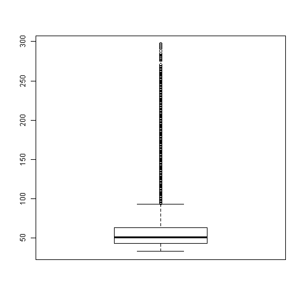


Medias de Posición - Boxplot
========================================================
class: small-code
Boxplot.- Muestra gráficamente las medidas de posición


```r
boxplot(data_banco$Tiempo_Servicio_seg, main= "Boxplot para Tiempo de Servicio (seg)", ylab= "Tiempo")
```

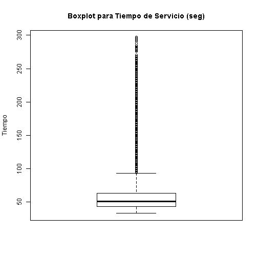


Medias de Posición - Boxplot
========================================================
class: small-code
Boxplot.- Muestra gráficamente las medidas de posición


```r
library("ggplot2")
ggplot(data = data_banco, aes(x = "", y = Tiempo_Servicio_seg)) + 
  geom_boxplot() 
```


Medias de Posición - Boxplot
========================================================
class: small-code
Boxplot.- Muestra gráficamente las medidas de posición


```r
# Cortar el gráfico (outliers)
ggplot(data = data_banco, aes(x = "", y = Tiempo_Servicio_seg)) + 
  geom_boxplot() +
  coord_cartesian(ylim = c(0, 120))
```

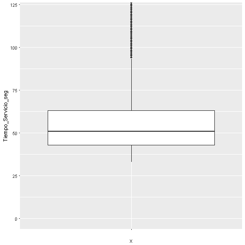


Medias de Posición - Boxplot
========================================================
class: small-code
Boxplot.- Muestra gráficamente las medidas de posición


```r
# Gráfico de forma horizontal y titulo
ggplot(data = data_banco, aes(x = "", y = Tiempo_Servicio_seg)) + 
  geom_boxplot() +
  coord_flip(ylim = c(20, 120)) +
  labs(title= 'Boxplot para Tiempo de Servicio (seg)', y= "Tiempo")
```

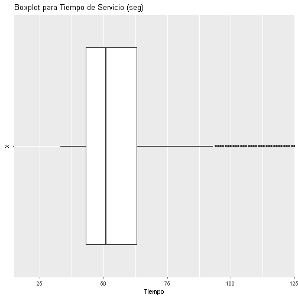


Medias de Dispersión
========================================================
- Varianza.- Media aritmética de las desviaciones de la media elevadas al cuadrado
  - $s^2 = \frac {\sum (x - \bar{x})^2}{n-1}$
  - En R: var(x, na.rm = TRUE)
- Desviación Estándar.- Raíz cuadrada de la varianza.
  - Esta medida se utiliza frecuentemente para realizar comparaciones entre dos conjuntos de datos
  - $s =  \sqrt{\frac {\sum (x - \bar{x})^2}{n-1}}$
  - En R: sd(x, na.rm = TRUE)
- Rango intercuartil.- Distancia entre el cuartil 1 y 3
  - En R IQR(x, na.rm = TRUE)
- Rango.- Diferencia entre maximo y minimo valor de los datos
  - En R range(x, na.rm = TRUE)


Medias de Dispersión
========================================================
class: small-code
Boxplot.- Muestra gráficamente las medidas de posición


```r
# Varianza
var(data_banco$Tiempo_Servicio_seg, na.rm = TRUE)
```

```
[1] 711.0764
```

```r
# Desviacion
sd(data_banco$Tiempo_Servicio_seg, na.rm = TRUE)
```

```
[1] 26.66602
```

```r
# Rango intercuartil
IQR(data_banco$Tiempo_Servicio_seg, na.rm = TRUE)
```

```
[1] 20
```

```r
# Rango
range(data_banco$Tiempo_Servicio_seg, na.rm = TRUE)
```

```
[1]  33 297
```


Tablas de Frecuencia
========================================================
- Agrupación de datos en clases mutuamente excluyentes, que muestra el número de observaciones que hay en cada clase.
  - Se agrupa en Intervalos si la variable es cuantitativa.
  - Se cuenta cada elemento si la variable es cualitativa.
  - Se lo muestra gráficamente con un histograma o gráfico de barras


Tablas de Frecuencia - Variable Cuantitativa
========================================================
class: small-code
- Calcular tabla de frecuencias
  - library('fdth')
  - fdt( data , breaks="Sturges" )
  - fdt( data , start, end, h, right = FALSE) 


Tablas de Frecuencia - Variable Cuantitativa
========================================================
class: small-code
- Calcular tabla de frecuencias


```r
library('fdth')
tabl_frec <- fdt( data_banco$Tiempo_Servicio_seg , breaks="Sturges" )
tabl_frec
```

```
 Class limits     f   rf rf(%)    cf  cf(%)
  [32.7,49.4) 11136 0.46 45.83 11136  45.83
  [49.4,66.1)  8080 0.33 33.25 19216  79.08
  [66.1,82.8)  2584 0.11 10.63 21800  89.72
  [82.8,99.5)  1092 0.04  4.49 22892  94.21
   [99.5,116)   508 0.02  2.09 23400  96.30
    [116,133)   285 0.01  1.17 23685  97.47
    [133,150)   179 0.01  0.74 23864  98.21
    [150,166)   125 0.01  0.51 23989  98.72
    [166,183)    89 0.00  0.37 24078  99.09
    [183,200)    46 0.00  0.19 24124  99.28
    [200,216)    58 0.00  0.24 24182  99.52
    [216,233)    43 0.00  0.18 24225  99.70
    [233,250)    25 0.00  0.10 24250  99.80
    [250,267)    30 0.00  0.12 24280  99.92
    [267,283)    11 0.00  0.05 24291  99.97
    [283,300)     8 0.00  0.03 24299 100.00
```


Tablas de Frecuencia - Variable Cuantitativa
========================================================
class: small-code
- Histograma


```r
hist( data_banco$Tiempo_Servicio_seg , breaks="Sturges" , main = "Histograma para la variable Tiempo de respuesta")
```

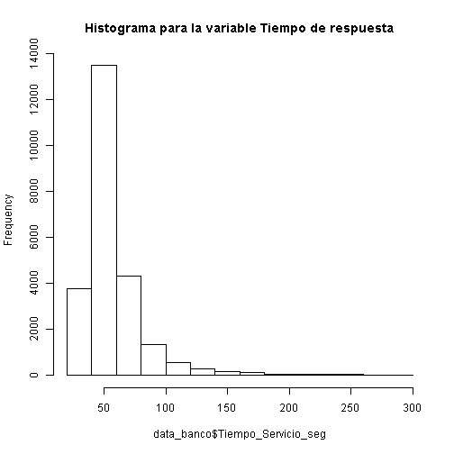


Tablas de Frecuencia - Variable Cuantitativa
========================================================
class: small-code
- Calcular tabla de frecuencias


```r
# Definiendo nosotros mismos los rangos
tabl_frec <- fdt(data_banco$Tiempo_Servicio_seg, start = 30, end = 170, h = 20, right = FALSE) 
tabl_frec
```

```
 Class limits     f   rf rf(%)    cf cf(%)
      [30,50) 11136 0.46 45.83 11136 45.83
      [50,70)  8790 0.36 36.17 19926 82.00
      [70,90)  2406 0.10  9.90 22332 91.91
     [90,110)   909 0.04  3.74 23241 95.65
    [110,130)   392 0.02  1.61 23633 97.26
    [130,150)   231 0.01  0.95 23864 98.21
    [150,170)   147 0.01  0.60 24011 98.81
```

Tablas de Frecuencia - Variable Cuantitativa
========================================================
class: small-code
- Histograma


```r
hist( x = data_banco$Tiempo_Servicio_seg, 
	seq( from = tabl_frec$breaks[1], to= 310,
	         by= tabl_frec$breaks[3]) )
```

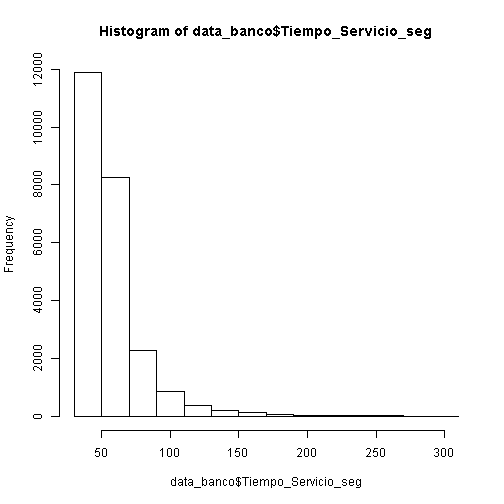


Tablas de Frecuencia - Variable Cuantitativa
========================================================
class: small-code
- Histograma


```r
# Con ggplot2
ggplot(data = data_banco, aes(x= Tiempo_Servicio_seg)) + 
  geom_histogram( aes(y= ..count..)) +
  labs(title= 'Histograma para Tiempo de Servicio (seg)', y= "Cantidad", x= "Tiempo")
```

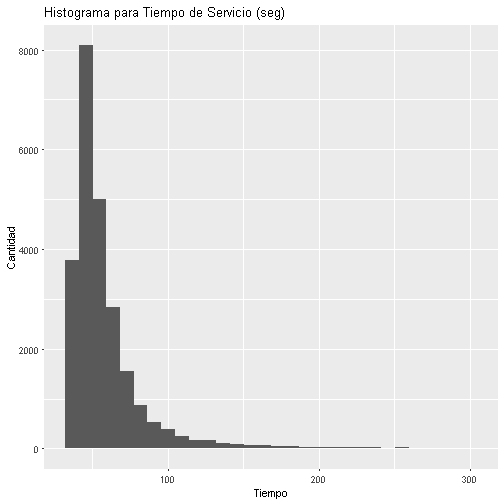


Tablas de Frecuencia - Variable Cualitativa
========================================================
- Calcular tabla de frecuencias
  - En R, comando table()
  - Se representa con gráficos de barra
  - barplot( table( data ))
  - barplot( table( data), horiz = TRUE)


Tablas de Frecuencia - Variable Cualitativa
========================================================
class: small-code
- Frecuencia para la transacción que se está realizando y para nivel de satisfacción


```r
# Table
table(data_banco$Transaccion)
```

```

Cobrar cheque (Cta del Bco)    Cobro/Pago (Cta externa) 
                       5407                        3005 
                   Deposito 
                      15887 
```

```r
table(data_banco$Satisfaccion)
```

```

 Muy Malo      Malo   Regular     Bueno Muy Bueno 
     3009      4474      4639      5915      6262 
```


Tablas de Frecuencia - Variable Cualitativa
========================================================
class: small-code
- Frecuencia para la transacción que se está realizando y para nivel de satisfacción


```r
# Gráfico Vertical
barplot( table( data_banco$Transaccion ))
```

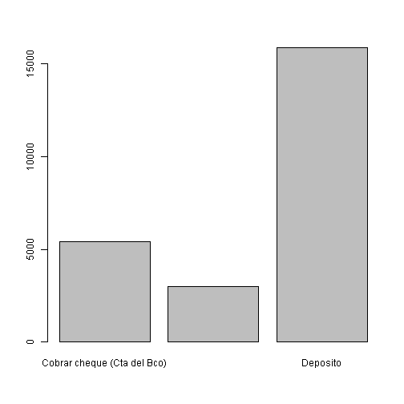

```r
# Gráfico Horizontal
barplot( table( data_banco$Transaccion), horiz = TRUE)
```

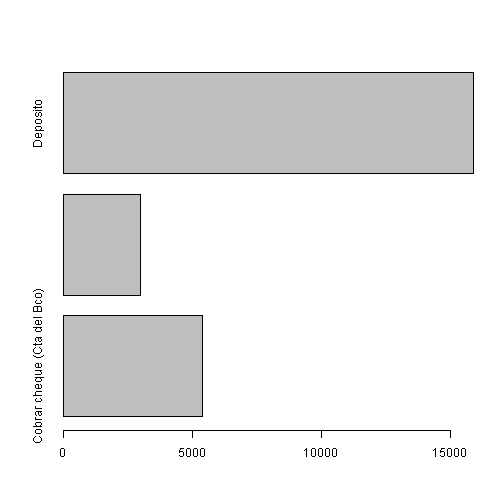


Tablas de Frecuencia - Variable Cualitativa
========================================================
class: small-code
- Frecuencia para la transacción que se está realizando y para nivel de satisfacción


```r
par(las=2) # Poner horizontal los labels
par(mar=c(5,12,4,2)) # Aumentar margen
barplot( table( data_banco$Transaccion ), horiz = TRUE )
```

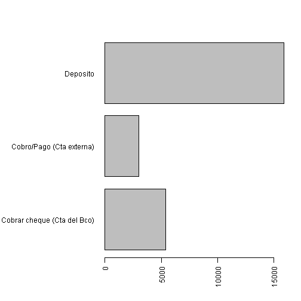


Tablas de Frecuencia - Variable Cualitativa
========================================================
class: small-code
- Frecuencia para la transacción que se está realizando y para nivel de satisfacción


```r
# Gráfico Vertical
barplot( table( data_banco$Satisfaccion ))
```

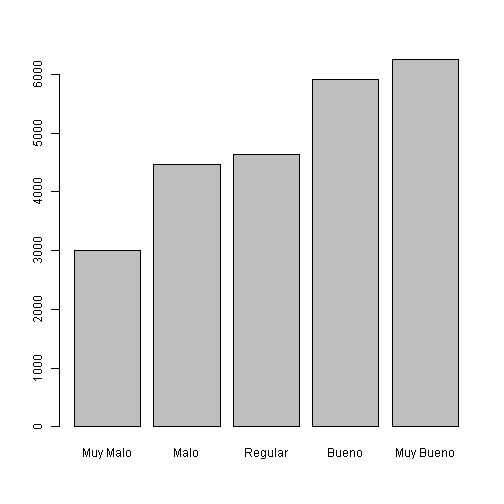

```r
# Gráfico Horizontal
barplot( table( data_banco$Satisfaccion), horiz = TRUE)
```

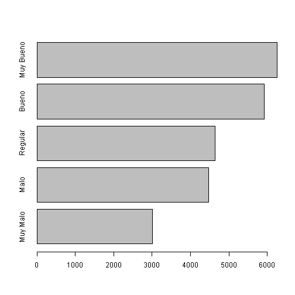


Tablas de Frecuencia - Variable Cualitativa
========================================================
class: small-code
- Frecuencia para la transacción que se está realizando y para nivel de satisfacción


```r
# Con ggplot2
ggplot(data = data_banco, aes(x= Satisfaccion)) + 
  geom_bar( ) +
  labs(title= 'Grafico de barra para Nivel de Satisfaccion', y= "Cantidad", x= "Nivel de Satisfaccion")
```


Tablas de Frecuencia - Variable Cualitativa
========================================================
class: small-code
- Frecuencia para la transacción que se está realizando y para nivel de satisfacción


```r
# Con ggplot2
ggplot(data = data_banco, aes(x= Satisfaccion)) + 
  geom_bar( ) +
  coord_flip() +
  labs(title= 'Grafico de barra para Nivel de Satisfaccion', y= "Cantidad", x= "Nivel de Satisfaccion")
```

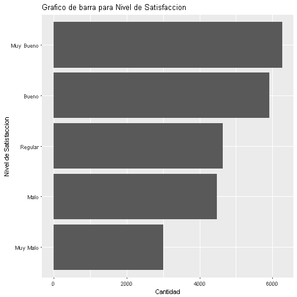


Descriptivas - Summary
========================================================
class: small-code
Obtiene las siguientes estadísticas descriptivas:
- Variables Numéricas: Min, Max, Cuartiles y Media 
- Variables carácter: El total de datos
- Variables factor: frecuencias
- summary()


```r
summary( data_banco$Tiempo_Servicio_seg)
```

```
   Min. 1st Qu.  Median    Mean 3rd Qu.    Max. 
  33.00   43.00   51.00   58.33   63.00  297.00 
```


Descriptivas - Summary
========================================================
class: small-code


```r
summary( data_banco)
```

```
   Sucursal            Cajero          ID_Transaccion   Transaccion       
 Length:24299       Length:24299       Min.   : 2.000   Length:24299      
 Class :character   Class :character   1st Qu.: 3.000   Class :character  
 Mode  :character   Mode  :character   Median : 3.000   Mode  :character  
                                       Mean   : 4.434                     
                                       3rd Qu.: 3.000                     
                                       Max.   :10.000                     
 Tiempo_Servicio_seg    Satisfaccion      Monto     
 Min.   : 33.00      Muy Malo :3009   Min.   :  20  
 1st Qu.: 43.00      Malo     :4474   1st Qu.: 953  
 Median : 51.00      Regular  :4639   Median :2778  
 Mean   : 58.33      Bueno    :5915   Mean   :2985  
 3rd Qu.: 63.00      Muy Bueno:6262   3rd Qu.:4770  
 Max.   :297.00                       Max.   :7000  
```


Descriptivas - PrettyR
========================================================
class: small-code
describe() Puede ser más completo que summmary


```r
library(prettyR)
describe( data_banco, num.desc = c("mean", "sd", "median", "min",
"max", "valid.n"))
```

```
Description of data_banco 
```

```

 Numeric 
                       mean      sd median min  max valid.n
ID_Transaccion         4.43    3.00      3   2   10   24299
Tiempo_Servicio_seg   58.33   26.67     51  33  297   24299
Monto               2984.58 2095.56   2778  20 7000   24299

 Factor 
            
Satisfaccion Muy Bueno   Bueno Regular    Malo Muy Malo
     Count     6262.00 5915.00 4639.00 4474.00  3009.00
     Percent     25.77   24.34   19.09   18.41    12.38
Mode Muy Bueno 
         
Sucursal        85     443    267      62     586
  Count   12044.00 4190.00 3329.0 2838.00 1898.00
  Percent    49.57   17.24   13.7   11.68    7.81
Mode 85 
         
Cajero       3983     472    3678     357    2503    4208    3732    2958
  Count   4280.00 2764.00 1962.00 1832.00 1578.00 1471.00 1339.00 1327.00
  Percent   17.61   11.37    8.07    7.54    6.49    6.05    5.51    5.46
         
Cajero       4796    4820    5286     56   5211   2556    70    299   4837
  Count   1084.00 1067.00 1049.00 832.00 675.00 667.00 656.0 597.00 550.00
  Percent    4.46    4.39    4.32   3.42   2.78   2.74   2.7   2.46   2.26
         
Cajero      2623  4424    63  2230  3023  5174  3327  4353   87  321
  Count   182.00 94.00 81.00 53.00 51.00 47.00 37.00 14.00 7.00 3.00
  Percent   0.75  0.39  0.33  0.22  0.21  0.19  0.15  0.06 0.03 0.01
Mode 3983 
           
Transaccion Deposito Cobrar cheque (Cta del Bco) Cobro/Pago (Cta externa)
    Count   15887.00                     5407.00                  3005.00
    Percent    65.38                       22.25                    12.37
Mode Deposito 
```


Descriptivas - PrettyR
========================================================
class: small-code
describe() Puede ser más completo que summmary


```r
Q25 <- function(x, na.rm=TRUE){quantile(as.numeric(x), 0.25, na.rm = na.rm, 
names = FALSE)} 
Q75 <- function(x, na.rm=TRUE){quantile(as.numeric(x), 0.75, na.rm = na.rm, 
names = FALSE)} 
describe(data_banco, num.desc=c("mean", "median", "sd", "min", "max",
"Q25", "Q75","valid.n")) 
```

```
Description of data_banco 
```

```

 Numeric 
                       mean median      sd min  max Q25  Q75 valid.n
ID_Transaccion         4.43      3    3.00   2   10   3    3   24299
Tiempo_Servicio_seg   58.33     51   26.67  33  297  43   63   24299
Monto               2984.58   2778 2095.56  20 7000 953 4770   24299

 Factor 
            
Satisfaccion Muy Bueno   Bueno Regular    Malo Muy Malo
     Count     6262.00 5915.00 4639.00 4474.00  3009.00
     Percent     25.77   24.34   19.09   18.41    12.38
Mode Muy Bueno 
         
Sucursal        85     443    267      62     586
  Count   12044.00 4190.00 3329.0 2838.00 1898.00
  Percent    49.57   17.24   13.7   11.68    7.81
Mode 85 
         
Cajero       3983     472    3678     357    2503    4208    3732    2958
  Count   4280.00 2764.00 1962.00 1832.00 1578.00 1471.00 1339.00 1327.00
  Percent   17.61   11.37    8.07    7.54    6.49    6.05    5.51    5.46
         
Cajero       4796    4820    5286     56   5211   2556    70    299   4837
  Count   1084.00 1067.00 1049.00 832.00 675.00 667.00 656.0 597.00 550.00
  Percent    4.46    4.39    4.32   3.42   2.78   2.74   2.7   2.46   2.26
         
Cajero      2623  4424    63  2230  3023  5174  3327  4353   87  321
  Count   182.00 94.00 81.00 53.00 51.00 47.00 37.00 14.00 7.00 3.00
  Percent   0.75  0.39  0.33  0.22  0.21  0.19  0.15  0.06 0.03 0.01
Mode 3983 
           
Transaccion Deposito Cobrar cheque (Cta del Bco) Cobro/Pago (Cta externa)
    Count   15887.00                     5407.00                  3005.00
    Percent    65.38                       22.25                    12.37
Mode Deposito 
```


 Descriptivas - PrettyR
========================================================
class: small-code


```r
# Sólo columnas numéricas
describe( data_banco[, sapply(data_banco, is.numeric)], num.desc = c("mean", "sd", "median", "min",
"max", "valid.n"))
```

```
Description of data_banco[, sapply(data_banco, is.numeric)] 
```

```

 Numeric 
                       mean      sd median min  max valid.n
ID_Transaccion         4.43    3.00      3   2   10   24299
Tiempo_Servicio_seg   58.33   26.67     51  33  297   24299
Monto               2984.58 2095.56   2778  20 7000   24299
```


Descriptivas - Datos agrupados
========================================================
class: small-code

- Media wt.mean(x, wt)
- Varianza  wt.var(x, wt)
- Desviación estándar wt.sd(x, wt)


