<style>
.small-code pre code {
  font-size: 1em;
}
</style>


PROGRAMACIÓN Y DATA SCIENCE CON R
========================================================
author: Nestor Montaño
date: Octubre.2017
autosize: true
transition: rotate
<small> 
Vicerrectorado de Formación Académica y Profesional    
Universidad de Guayaquil
</small>


Relaciones entre variables cualitativas
========================================================
type: sub-section


Tablas de contingencia
========================================================
class: small-code
<small>Es una tabulación cruzada que muestra la distribución de frecuencia de dos variables categóricas de interés.
- Resume la interacción de las variables
- Por ejemplo, en la imagen, C[1, 2] sería el número de observaciones que tienen el Nivel 1 para la Variable 1 y el Nivel 2 para la variable 2
</small>


Tablas de contingencia
========================================================
class: small-code
Digamos que se tiene un presupuesto para mejora de satisfacción al clientes y le han pedido indicar dónde enfocar dicho presupuesto.   
Vamos a analizar el nivel de satisfacción en función de la sucursal del Banco.


Importar Data
========================================================
class: small-code

Importar los datos a utilizar y cambiar los tipos de datos (como en el capitulo 4)


```r
# Cargar paquete
library("openxlsx")
# Leer data
data_banco <- read.xlsx("Data/Data_Banco.xlsx", sheet = "Data")
# La Satisfaccion es una variable categórica ordinal
data_banco$Satisfaccion <- factor(data_banco$Satisfaccion, levels= c('Muy Malo', 'Malo', 'Regular', 'Bueno', 'Muy Bueno'))
# La Sucursal y el Cajero deben ser categórica nominales
data_banco$Sucursal <- as.character(data_banco$Sucursal)
data_banco$Cajero <- as.character(data_banco$Cajero)
```


Tablas de contingencia
========================================================
class: small-code
Vamos a analizar el nivel de satisfacción en función de la sucursal del Banco.


```r
## Tabla de contingencia - Banco Sucursal
table(data_banco$Sucursal, data_banco$Satisfaccion)
```

```
     
      Muy Malo Malo Regular Bueno Muy Bueno
  267      539  848     642   707       593
  443      461  673     823  1044      1189
  586      335  381     345   386       451
  62       431  604     520   684       599
  85      1243 1968    2309  3094      3430
```


Tablas de contingencia
========================================================
class: small-code
Vamos a analizar el nivel de satisfacción en función de la sucursal del Banco.


```r
## Tabla de contingencia – Con los márgenes
tb_conting_obs <- table(data_banco$Sucursal, data_banco$Satisfaccion)
tb_conting_obs
```

```
     
      Muy Malo Malo Regular Bueno Muy Bueno
  267      539  848     642   707       593
  443      461  673     823  1044      1189
  586      335  381     345   386       451
  62       431  604     520   684       599
  85      1243 1968    2309  3094      3430
```

```r
addmargins(tb_conting_obs)
```

```
     
      Muy Malo  Malo Regular Bueno Muy Bueno   Sum
  267      539   848     642   707       593  3329
  443      461   673     823  1044      1189  4190
  586      335   381     345   386       451  1898
  62       431   604     520   684       599  2838
  85      1243  1968    2309  3094      3430 12044
  Sum     3009  4474    4639  5915      6262 24299
```


Tablas de contingencia
========================================================
class: small-code
Vamos a analizar el nivel de satisfacción en función de la sucursal del Banco.


```r
## Tabla de contingencia - Porcentajes
tb_conting_rel<- prop.table(tb_conting_obs)
addmargins(tb_conting_rel)*100
```

```
     
        Muy Malo       Malo    Regular      Bueno  Muy Bueno        Sum
  267   2.218198   3.489856   2.642084   2.909585   2.440430  13.700152
  443   1.897197   2.769661   3.386971   4.296473   4.893205  17.243508
  586   1.378658   1.567966   1.419812   1.588543   1.856043   7.811021
  62    1.773736   2.485699   2.140006   2.814931   2.465122  11.679493
  85    5.115437   8.099099   9.502449  12.733034  14.115807  49.565826
  Sum  12.383226  18.412280  19.091321  24.342566  25.770608 100.000000
```


Tablas de contingencia
========================================================
class: small-code
Vamos a analizar el nivel de satisfacción en función de la sucursal del Banco.


```r
## Probabilidad Condicional - en funcion de las filas (dado un valor de la fila)
prop.table( tb_conting_obs, 1)*100
```

```
     
      Muy Malo     Malo  Regular    Bueno Muy Bueno
  267 16.19105 25.47312 19.28507 21.23761  17.81316
  443 11.00239 16.06205 19.64200 24.91647  28.37709
  586 17.65016 20.07376 18.17703 20.33720  23.76185
  62  15.18675 21.28259 18.32276 24.10148  21.10641
  85  10.32049 16.34009 19.17137 25.68914  28.47891
```

```r
addmargins( prop.table( tb_conting_obs, 1) ) * 100
```

```
     
       Muy Malo      Malo   Regular     Bueno Muy Bueno       Sum
  267  16.19105  25.47312  19.28507  21.23761  17.81316 100.00000
  443  11.00239  16.06205  19.64200  24.91647  28.37709 100.00000
  586  17.65016  20.07376  18.17703  20.33720  23.76185 100.00000
  62   15.18675  21.28259  18.32276  24.10148  21.10641 100.00000
  85   10.32049  16.34009  19.17137  25.68914  28.47891 100.00000
  Sum  70.35084  99.23161  94.59824 116.28189 119.53742 500.00000
```


Tablas de contingencia
========================================================
class: small-code
Vamos a analizar el nivel de satisfacción en función de la sucursal del Banco.


```r
## Probabilidad Condicional - en funcion de las columnas  (dado un valor de la columna)
prop.table( tb_conting_obs, 2)*100
```

```
     
       Muy Malo      Malo   Regular     Bueno Muy Bueno
  267 17.912928 18.953956 13.839189 11.952663  9.469818
  443 15.320705 15.042468 17.740892 17.650042 18.987544
  586 11.133267  8.515869  7.436948  6.525782  7.202172
  62  14.323696 13.500224 11.209312 11.563821  9.565634
  85  41.309405 43.987483 49.773658 52.307692 54.774832
```

```r
addmargins( prop.table( tb_conting_obs, 2) ) * 100
```

```
     
        Muy Malo       Malo    Regular      Bueno  Muy Bueno        Sum
  267  17.912928  18.953956  13.839189  11.952663   9.469818  72.128554
  443  15.320705  15.042468  17.740892  17.650042  18.987544  84.741651
  586  11.133267   8.515869   7.436948   6.525782   7.202172  40.814038
  62   14.323696  13.500224  11.209312  11.563821   9.565634  60.162686
  85   41.309405  43.987483  49.773658  52.307692  54.774832 242.153071
  Sum 100.000000 100.000000 100.000000 100.000000 100.000000 500.000000
```


Tablas de contingencia - Explorar gráficamente
========================================================
class: small-code
Explorar gráficamente el nivel de satisfacción en función de la sucursal del Banco.


```r
## Grafico de barras de Sucursal vs Satisfaccion
plot( tb_conting_obs, xlab = "Sucursal", ylab = "Satisfaccion", main= "Grafico de barras de Sucursal vs Satisfaccion")
```

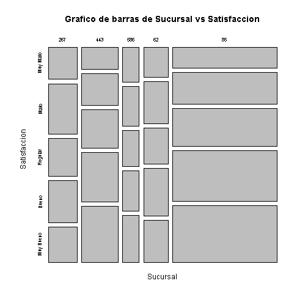


Tablas de contingencia - Explorar gráficamente
========================================================
class: small-code
Explorar gráficamente el nivel de satisfacción en función de la sucursal del Banco.


```r
## Grafico de barras de Sucursal vs Satisfaccion
plot(as.factor(data_banco$Sucursal), as.factor(data_banco$Satisfaccion), xlab = "Sucursal", ylab = "Satisfaccion", main= "Grafico de barras de Sucursal vs Satisfaccion")
```

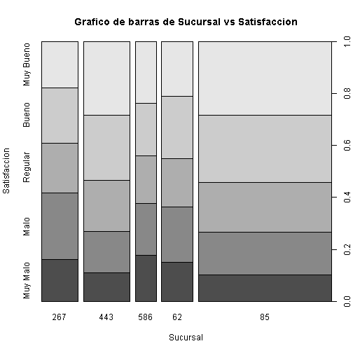


Tablas de contingencia - Explorar gráficamente
========================================================
class: small-code
Explorar gráficamente el nivel de satisfacción en función de la sucursal del Banco.


```r
## Activar ggplot2
library(ggplot2)
## Grafico de barras de Sucursal vs Satisfaccion
ggplot(data = data_banco, aes(x= Satisfaccion)) + 
  geom_bar( ) + facet_wrap(~Sucursal)
```

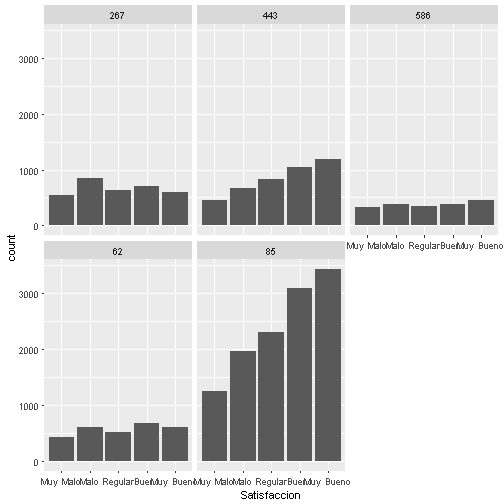


Tablas de contingencia - Explorar gráficamente
========================================================
class: small-code
Explorar gráficamente el nivel de satisfacción en función de la sucursal del Banco.


```r
## Grafico de barras de Sucursal vs Satisfaccion
ggplot(data = data_banco, aes(x= Satisfaccion)) + 
  geom_bar( ) + facet_grid(~Sucursal)
```


Tablas de contingencia - Explorar gráficamente
========================================================
class: small-code
Explorar gráficamente el nivel de satisfacción en función de la sucursal del Banco.


```r
## Grafico de barras de Sucursal vs Satisfaccion
ggplot(data = data_banco, aes(x= Satisfaccion)) + 
  geom_bar( ) + facet_grid(Sucursal~.)
```

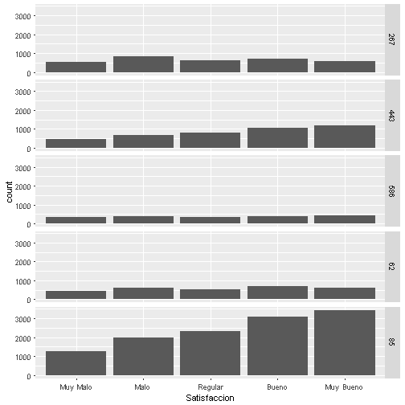


Tablas de contingencia - Explorar gráficamente
========================================================
class: small-code
Explorar gráficamente el nivel de satisfacción en función de la sucursal del Banco.


```r
## Grafico de barras de Sucursal vs Satisfaccion
ggplot(data = data_banco, aes(x= Sucursal, fill= Satisfaccion)) + 
  geom_bar( ) 
```

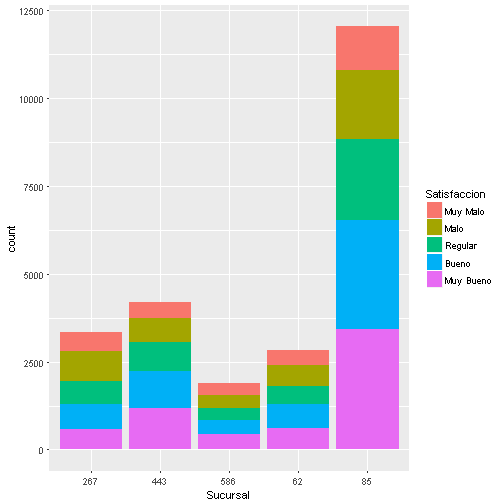


Tablas de contingencia - Explorar gráficamente
========================================================
class: small-code
Explorar gráficamente el nivel de satisfacción en función de la sucursal del Banco.


```r
## Grafico de barras de Sucursal vs Satisfaccion
ggplot(data = data_banco, aes(x= Sucursal, fill= Satisfaccion)) + 
  geom_bar( position = "fill" ) 
```

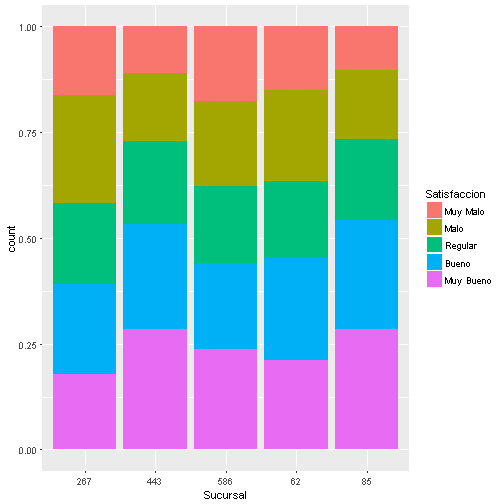


Tablas de contingencia
========================================================

**Problema.-** Se tiene un presupuesto para mejora de satisfacción al clientes, le han pedido indicar dónde enfocar dicho presupuesto.   
**Análisis.-** Para responder la pregunta se debe utilizar la probabilidad condicional a nivel de sucursales (por filas)


Relacion entre una variable cuantitativa y otra cualitativa 
========================================================
Boxplot de los Tiempo de servicio en funcion de las sucursales


```r
## Boxplot de los Tiempo de servicio
## En funcion de las sucursales
plot( Tiempo_Servicio_seg ~ as.factor(Sucursal),
      data= data_banco)
```

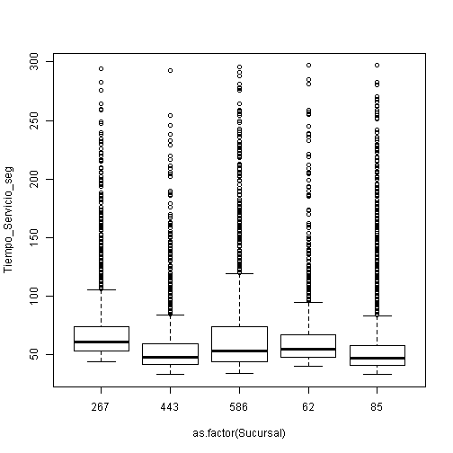


Relacion entre una variable cuantitativa y otra cualitativa 
========================================================
Boxplot de los Tiempo de servicio en funcion de las sucursales


```r
## Boxplot de los Tiempo de servicio
## En funcion de las sucursales
ggplot(data = data_banco, aes(x = as.factor(Sucursal),
                       y = Tiempo_Servicio_seg)) +
  geom_boxplot( ) +
  scale_y_continuous(breaks = seq(from= 30, to=300, by=30))
```

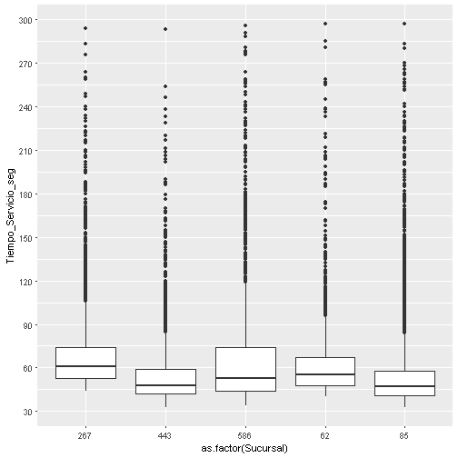


Relacion entre una variable cuantitativa y otra cualitativa 
========================================================
Histograma para Tiempo de Servicio (seg) por sucursal


```r
ggplot(data = data_banco, aes(x= Tiempo_Servicio_seg)) + 
  geom_histogram( aes(y= ..count..)) +
  facet_wrap(~Sucursal) +
  labs(title= 'Histograma para Tiempo de Servicio (seg)', y= "Cantidad", x= "Tiempo")
```

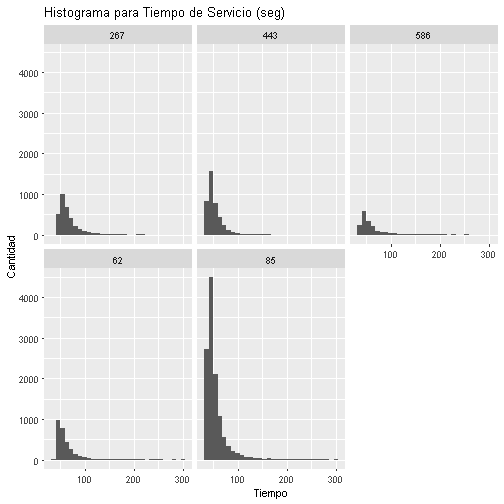


Relacion entre una variable cuantitativa y otra cualitativa 
========================================================
Histograma para Tiempo de Servicio (seg) por sucursal


```r
ggplot(data = data_banco, aes(x= Tiempo_Servicio_seg)) + 
  geom_histogram( aes(y= ..count..)) +
  facet_grid(Sucursal~.) +
  labs(title= 'Histograma para Tiempo de Servicio (seg)', y= "Cantidad", x= "Tiempo")
```

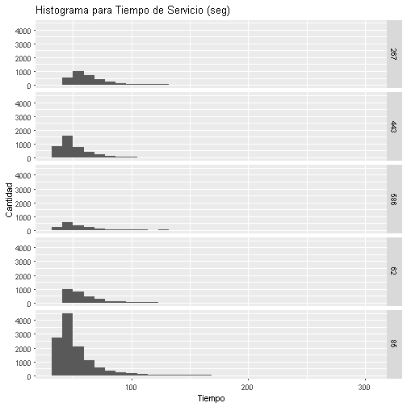


Relacion entre una variable cuantitativa y otra cualitativa 
========================================================
Histograma para Tiempo de Servicio (seg) por sucursal


```r
ggplot(data = data_banco, aes(x= Tiempo_Servicio_seg, fill= Sucursal)) + 
  geom_histogram( aes(y= ..count..)) +
  labs(title= 'Histograma para Tiempo de Servicio (seg)', y= "Cantidad", x= "Tiempo")
```

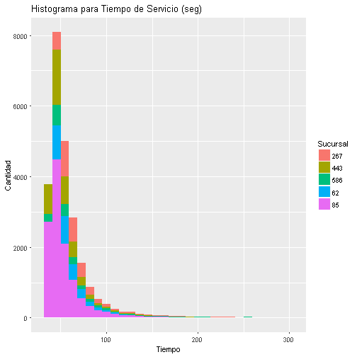


Relacion entre una variable cuantitativa y otra cualitativa 
========================================================
Gráfico de lineas para Tiempo de Servicio (seg) por sucursal


```r
ggplot(data = data_banco, aes(x= Tiempo_Servicio_seg, colour= Sucursal)) + 
  geom_freqpoly(binwidth = 20) +
  labs(title= 'Gráfico de lineas para Tiempo de Servicio (seg)', y= "Cantidad", x= "Tiempo")
```

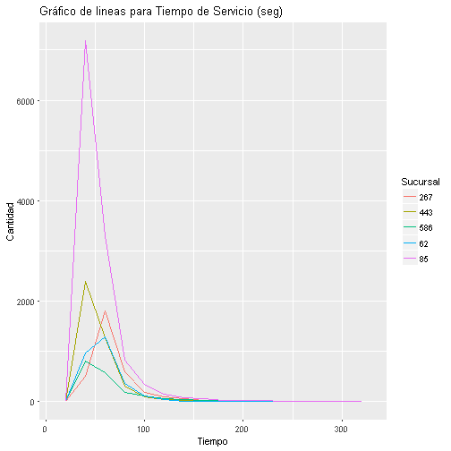


Relacion entre una variable cuantitativa y otra cualitativa 
========================================================
Gráfico de densidad para Tiempo de Servicio (seg) por sucursal


```r
ggplot(data = data_banco, aes(x= Tiempo_Servicio_seg, y= ..density.., colour= Sucursal)) + 
  geom_freqpoly(binwidth= 20) +
  labs(title= 'Gráfico de lineas para Tiempo de Servicio (seg)', y= "Cantidad", x= "Tiempo")
```

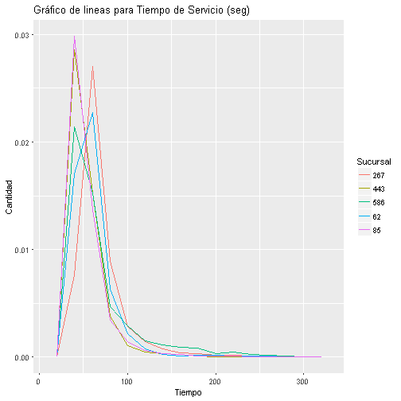


Relacion entre una variable cuantitativa y otra cualitativa 
========================================================
Numéricamente este tipo de relaciones se cuantifican utilizando ANOVA, que lo veremos más adelante


Relacion entre dos variable cualitativa y una cuantitativa  
========================================================
type: sub-section


Relacion entre dos variable cualitativa y una cuantitativa  
========================================================
Gráfico de interaccion

```r
with(data_banco ,
     interaction.plot(Sucursal, Transaccion, Tiempo_Servicio_seg) )
```

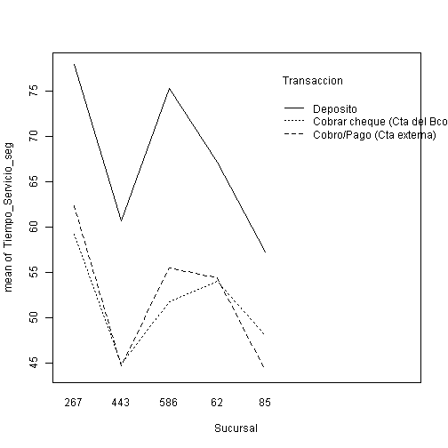


Relacion entre dos variable cualitativa y una cuantitativa  
========================================================
Gráfico de interaccion

```r
with(data_banco ,
     interaction.plot( Transaccion, Sucursal, Tiempo_Servicio_seg) )
```

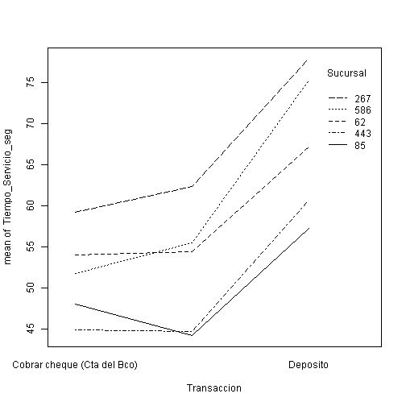


Relacion entre dos variable cualitativa y una cuantitativa  
========================================================
Gráfico de interaccion

```r
ggplot(data = data_banco, aes(x = as.factor(Sucursal),
                       y = Tiempo_Servicio_seg)) +
  geom_boxplot( ) + facet_grid(Transaccion~.)
```

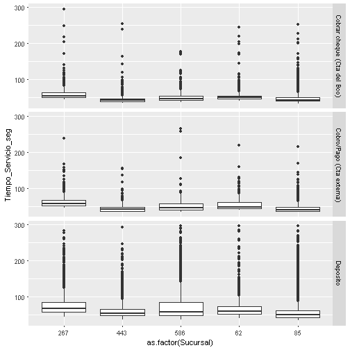

```r
scale_y_continuous(breaks = seq(from= 30, to=300, by=30))
```

```
<ScaleContinuousPosition>
 Range:  
 Limits:    0 --    1
```


Relacion entre dos variable cualitativa y una cuantitativa  
========================================================
Gráfico de interaccion

```r
ggplot(data = data_banco, aes(x = as.factor(Sucursal),
                       y = Tiempo_Servicio_seg,
                       fill = Transaccion)) +
  geom_boxplot( ) +
  scale_y_continuous(breaks = seq(from= 30, to=300, by=30))
```

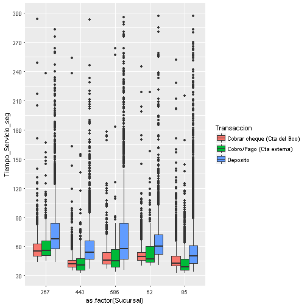


Relaciones entre variables cuantitativas
========================================================
type: sub-section


Coeficiente de Correlación de Pearson
========================================================
El coeficiente de correlación de Pearson es una forma de medir la relación de dos variables cuantitativas   

- En R, comando cor()


Coeficiente de Correlación de Pearson
========================================================

- Si $\rho=1$ significa que hay correlación perfecta positiva entre *x* y *y*   
- Si $\rho=-1$ significa que hay correlación perfecta negativa entre *x* y *y*


Problema - Gasto en Publicidad
========================================================

<small>La empresa textil DePrati S.A. tiene un 2% de presupuesto para publicidad, por lo que semanalmente pauta en medios. Se tiene la información desglosada de dólares invertidos en cada tipo de medio, la semana correspondiente y la venta semanal.   
¿Se puede detectar alguna relación entre la venta y el gasto en publicidad?   
¿Qué medio tiene mayor correlación con la venta?</small>


Problema - Gasto en Publicidad
========================================================

<small>Importar data</small>

```r
# Importacion de datos ----------------------------------------------------
## Data de venta
data_venta_publicidad <- read.xlsx(xlsxFile = "Data/Venta_vs_Publicidad.xlsx", detectDates = TRUE)  
str(data_venta_publicidad)
```

```
'data.frame':	79 obs. of  8 variables:
 $ SEMANAS         : Date, format: "2015-01-05" "2015-01-12" ...
 $ VENTA           : num  151034 186849 133808 135690 199173 ...
 $ PUBLICIDAD_TOTAL: num  1200 1750 1450 1700 1900 1550 1150 2400 650 2000 ...
 $ TV              : num  300 612 450 544 722 ...
 $ RADIO           : num  276 473 493 289 361 ...
 $ PERIODICO       : num  624 473 218 408 209 ...
 $ REDES           : num  0 192 290 459 608 ...
 $ USA_FAMOSO      : chr  "NO" "NO" "NO" "NO" ...
```


Coeficiente de Correlación de Pearson
========================================================
Calcular el coeficiente de Correlación de Pearson entre dos variables


```r
## Correlacion
cor(data_venta_publicidad$VENTA, data_venta_publicidad$PUBLICIDAD_TOTAL)
```

```
[1] 0.8532059
```

Se puede ver que existe una alta correlación positiva entre la venta y el gasto en publicidad, **ojo, esto no implica que mayor gasto en publicidad causa mayor venta**


Gráfico de dispersión
========================================================
Gráfico de dispersión para explorar relación entre variables cuantitativa


```r
## Explorar variables
ggplot(data_venta_publicidad, aes(VENTA, PUBLICIDAD_TOTAL)) + 
  geom_point()
```

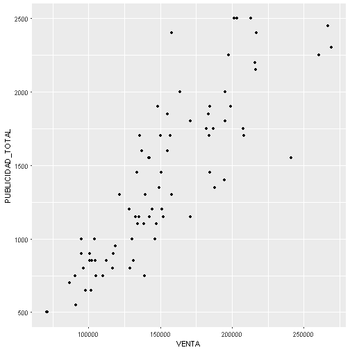


Gráfico de dispersión
========================================================
Gráfico de dispersión para explorar relación entre variables cuantitativa


```r
## Explorar variables
ggplot(data_venta_publicidad, aes(VENTA, PUBLICIDAD_TOTAL)) + 
  geom_point() +
  geom_smooth()
```

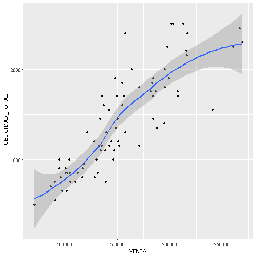


Gráfico de dispersión
========================================================
Gráfico de dispersión para explorar relación entre variables cuantitativa


```r
## Explorar variables
ggplot(data_venta_publicidad, aes(VENTA, PUBLICIDAD_TOTAL)) + 
  geom_point() +
  geom_smooth(method=lm)
```


Matriz de correlación
========================================================
Matriz que resume la correlación de varias variables


Matriz de correlación
========================================================
Matriz que resume la correlación de varias variables


```r
matriz_corr <- cor(data_venta_publicidad[, sapply(data_venta_publicidad, is.numeric)])
matriz_corr
```

```
                     VENTA PUBLICIDAD_TOTAL        TV     RADIO  PERIODICO
VENTA            1.0000000        0.8532059 0.7896370 0.7841954  0.4928412
PUBLICIDAD_TOTAL 0.8532059        1.0000000 0.8990184 0.8317669  0.6919737
TV               0.7896370        0.8990184 1.0000000 0.7544444  0.5413200
RADIO            0.7841954        0.8317669 0.7544444 1.0000000  0.4936464
PERIODICO        0.4928412        0.6919737 0.5413200 0.4936464  1.0000000
REDES            0.3611704        0.4231371 0.2501810 0.1024494 -0.0903944
                      REDES
VENTA             0.3611704
PUBLICIDAD_TOTAL  0.4231371
TV                0.2501810
RADIO             0.1024494
PERIODICO        -0.0903944
REDES             1.0000000
```


Matriz de correlación - Graficamente
========================================================
La matriz de correlación se puede graficar así


```r
# Sólo columnas numéricas
plot( data_venta_publicidad[, sapply(data_venta_publicidad, is.numeric)])
```

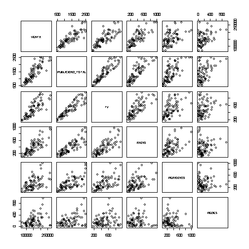


Matriz de correlación - Graficamente
========================================================
La matriz de correlación se puede graficar así


```r
# Sólo columnas numéricas
heatmap(matriz_corr, col = gray(seq(1, 0, length = 16)))
```

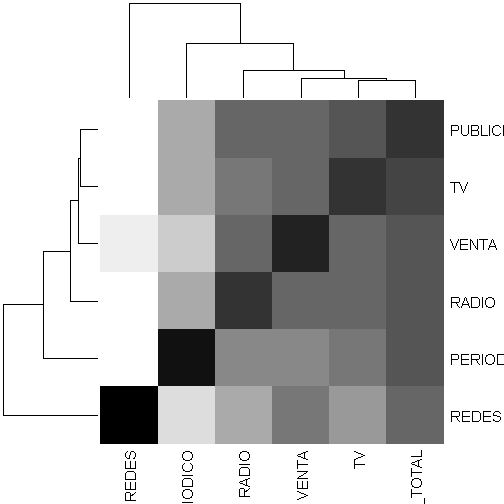


Matriz de correlación - Graficamente
========================================================
La matriz de correlación se puede graficar así


```r
# Activar paquete GGally
library('GGally')
# Sólo columnas numéricas
ggscatmat(data_venta_publicidad)
```

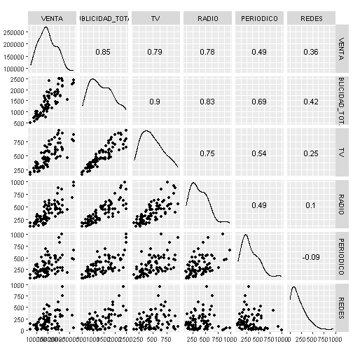


Un último gráfico
========================================================
class: small-code
<small>ggpairs resume los cruces entre variables en un sólo gráfico</small>


```r
ggpairs(data_venta_publicidad)
```

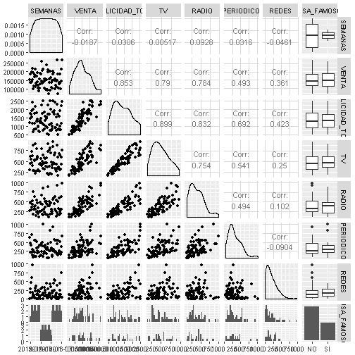


Problema - Gasto en Publicidad
========================================================

<small>La empresa textil DePrati S.A. tiene un 2% de presupuesto para publicidad, por lo que semanalmente pauta en medios. Se tiene la información desglosada de dólares invertidos en cada tipo de medio, la semana correspondiente y la venta semanal.   
¿Se puede detectar alguna relación entre la venta y el gasto en publicidad?   
¿Qué medio tiene mayor correlación con la venta?</small>

**¿Qué respondería?**
