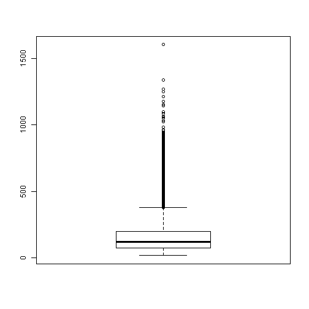

<style>
.small-code pre code {
  font-size: 1em;
}
</style>


PROGRAMACIÓN Y DATA SCIENCE CON R - INTERMEDIO
========================================================
author: Nestor Montaño
date: Noviembre.2017
autosize: true
transition: rotate
<small> 
Vicerrectorado de Formación Académica y Profesional    
Universidad de Guayaquil
</small>


Introducción a los análisis estadísticos
========================================================
type: sub-section


Workflow de un análisis estadístico
========================================================


<small>
- Import: Obtener y entender los datos para luego importarlos correctamente al software
- Tidy: Ordenar los datos de tal manera que sea sencillo transformarlos, sumarizarlo, visualizarlos o realizar un modelo con ellos
- Transform: Manipular los datos hasta obtener el input que el análisis o técnica estadística necesita
- Visualise: Realizar el análisis exploratorio de datos
- Model: Aplicar técnicas estadísticas para el entendimiento del problema o tomar decisiones
- Comunicate: Tratar de mostrar los resultados de tal forma que el resto del mundo los entienda, usando reportes, gráficos, visualizaciones interactivas, integración con herramientas de BI, web apps, etc. 
</small>


Workflow de un análisis estadístico
========================================================


<small>
- Import
- Tidy    
**Repetir mientras sea necesario**    
__________________________________________________________________________
- **Transform: Manipular los datos hasta obtener el input que el análisis o técnica estadística necesita**
- **Visualise: Realizar el análisis exploratorio de datos**
- **Model: Aplicar técnicas estadísticas para el entendimiento del problema o tomar decisiones**
__________________________________________________________________________ 
- Comunicate
</small>


Workflow de un análisis estadístico
========================================================

- Si bien R puede manejar vectores, matrices, listas, imágenes, información geográfica, etc, a lo largo del presente curso nos centraremos en los objetos de tipo data.frame, puesto que en la mayoría de los casos, se parte de un archivo de excel o spss, query de base de datos, etc para hacer la información.


Importar Datos
========================================================
type: sub-section


Importar Datos
========================================================

En el curso Básico aprendimos cómo importar, recordaremos brevemente lo visto


Importar csv
========================================================

- Desde RStudio  
  Import Dataset > From Text File > Escoger archivo > Abrir > Escribir nombre a la variable > Import
- Con comando    
  read.csv( file, sep = "," , dec = "," , stringsAsFactors= FALSE)
- Para grandes volúmenes de datos usar paquete data.table   
  fread()


Importar desde excel
========================================================

- Copiando desde un archivo de excel abierto  
  read.table("clipboard", sep="\t", header=TRUE)
- Desde RStudio  
  Rstudio > Import Dataset > From Excel > Escoger archivo > Abrir > Escribir nombre a la variable > Import
- Usando el paquete `openxlsx`  
  read.xlsx(xlsxFile , sheet , startRow , colNames , skipEmptyRows, rowNames)  
  data_tiempo_espera <- read.xlsx(xlsxFile = 'Data/Data_Banco.xlsx')  
- Otros paquetes  
  `excel.link`, `XLConnect`, `xlsx`, `readxl`, `rio`


Importar desde excel - Openxlsx
========================================================

- Descargar [Rtools] (https://cran.r-project.org/bin/windows/Rtools/)
- Instalar Rtools
  - Se debe escoger "agregar al path"
  - Si la computadora ya tiene CYGWIN, se tiene un tratamiento especial
- Instalar el paquete `openxlsx`  
- Activar el paquete `openxlsx`  
- Para leer se usa el comando read.xlsx(xlsxFile , sheet , startRow , colNames , skipEmptyRows, rowNames)  
  - Considerar que luego de importado el archivo se debe verificar los tipos de datos
  
  
  

Exportar a excel
========================================================

- Usando el paquete `openxlsx`  
  write.xlsx(x, file, asTable = FALSE, ...)
- Se puede usar los paquetes `XLConnect`, `xlsx`, etc.
  


Importar desde SPSS, SAS, Stata, etc
========================================================

- Desde RStudio  
  Rstudio > Import Dataset > From SPSS/SAS/STATA
- Usando el paquete `foreign`  
  SAS: read.xport()  
  SPSS: read.spss()  
  Stata: read.dta()  
  Soporta otros formatos
- Usango el paquete `haven`  
  SAS: read_sas() y read_xpt()   
  SPSS: read_sav() y read_por()  
  Stata: read_dta()   
- Se puede usar el paquerte `rio`  
  


Exportar a SPSS, SAS, Stata, etc
========================================================

- Usango el paquete `foreign`    
  write.foreign(df, datafile, codefile, package = c("SPSS", "Stata", "SAS"), ...)
- Usango el paquete `haven`  
  SAS: write_sas()  
  SPSS: write_sav()  
  Stata: write_dta()  
- Se puede usar el paquerte `rio`


Interacción con Bases de Datos
========================================================

- Utilizando ODBC `RODBC`   
  (Recomendado para Microsoft SQL)
- Utilizando JDBC `RJDBC`   
  (Usa java DBC)
- Paquetes para bases específicas  
  RMySQL, ROracle, RPostgreSQL, RSQLite, mongolite, RMongo, MonetDB.R, rmongodb


 
Otros
========================================================

- GIS sistemas de información geográfica con `rgal` y `raster`
- GoogleSpreadSheets con `googlesheets`
- Archivos Open Document Spreadsheets con `readODS`
- JSON data con `rjson` o `jsonlite` o `RJSONIO`


Ejemplo: Data de transacciones bancarias
========================================================

El Banco del Pacífico requiere mejorar los tiempos de atención al cliente en ventanilla, para ello ha recolectado esta información anónimamente para cada cajero y transacción realizada.   

Le suministran un excel con dos hojas:   

1. Tiene los datos de las transacciones, columnas: Sucursal, Cajero, ID_Transaccion, Transaccion, Tiempo_Servicio_seg, Nivel de satisfacción, Monto de la transaccion. 
2. Otra hoja que indica si en la sucursal se ha puesto o no el nuevo sistema.


Ejemplo: Data de transacciones bancarias
========================================================

**Revisar archivo de excel: Data_Banco.xlsx**   

Crear un proyecto en RStudio, con las carpetas Data, Exports, etc    

Poner en la carpeta Data, el excel suministrado


Importar - Ejemplo
========================================================


```r
# Cargar la libreria a utilizar
library(openxlsx)
# Leer el archivo de excel y asignarlo al objeto data_banco
data_banco <- read.xlsx(xlsxFile = "Data/Data_Banco.xlsx", sheet = "Data")
data_sucursal <- read.xlsx(xlsxFile = "Data/Data_Banco.xlsx", sheet = "Data_Sucursal")
```


Entender los datos
========================================================
type: sub-section


Entender los datos
========================================================

- ¿Qué representa cada columna?
- ¿Qué tipo de dato debería tener cada columna?
- ¿Qué granularidad o atomicidad tiene la data?
- Si es que se tiene varios conjuntos de datos ¿Cómo se relacionan los datos?
- A qué periodo de tiempo corresponde la data
- Muchas veces se obtiene la información desde una base de datos y por tanto toca entender la base y el query que genera los datos


Entender los datos - Ejemplo
========================================================

Podríamos ver las primeras filas

```r
# ver las primeras 5 filas
head(data_sucursal, n = 5)
```

```
  ID_Sucursal      Sucursal Nuevo_Sistema
1          62 Riocentro Sur            No
2          85        Centro            Si
3         267      Alborada            Si
4         443  Mall del Sol            Si
5         586     Via Daule            No
```


Entender los datos - Ejemplo
========================================================

Podríamos ver las primeras filas

```r
# ver las primeras 5 filas
head(data_sucursal, n = 5)
```

```
  ID_Sucursal      Sucursal Nuevo_Sistema
1          62 Riocentro Sur            No
2          85        Centro            Si
3         267      Alborada            Si
4         443  Mall del Sol            Si
5         586     Via Daule            No
```


Entender los datos - Ejemplo
========================================================

Listar los nombres de las columnas 

```r
# Listar los nombres de las columnas 
names(data_banco)
```

```
[1] "Sucursal"            "Cajero"              "ID_Transaccion"     
[4] "Transaccion"         "Tiempo_Servicio_seg" "Satisfaccion"       
[7] "Monto"              
```

```r
names(data_sucursal)
```

```
[1] "ID_Sucursal"   "Sucursal"      "Nuevo_Sistema"
```


Entender los datos - Ejemplo
========================================================

Ver la estructura del data.frame

```r
# Ver la estructura del data.frame
str(data_banco)
```

```
'data.frame':	24299 obs. of  7 variables:
 $ Sucursal           : chr  "62" "62" "62" "62" ...
 $ Cajero             : chr  "4820" "4820" "4820" "4820" ...
 $ ID_Transaccion     : num  2 2 2 2 2 2 2 2 2 2 ...
 $ Transaccion        : chr  "Cobro/Pago (Cta externa)" "Cobro/Pago (Cta externa)" "Cobro/Pago (Cta externa)" "Cobro/Pago (Cta externa)" ...
 $ Tiempo_Servicio_seg: num  311 156 248 99 123 172 140 247 183 91 ...
 $ Satisfaccion       : chr  "Muy Bueno" "Malo" "Regular" "Regular" ...
 $ Monto              : num  2889 1671 3172 1765 1836 ...
```


Entender los datos - Ejemplo
========================================================

Ver la estructura del data.frame

```r
# Ver la estructura del data.frame
str(data_sucursal)
```

```
'data.frame':	5 obs. of  3 variables:
 $ ID_Sucursal  : num  62 85 267 443 586
 $ Sucursal     : chr  "Riocentro Sur" "Centro" "Alborada" "Mall del Sol" ...
 $ Nuevo_Sistema: chr  "No" "Si" "Si" "Si" ...
```


Manipulacion de datos
========================================================
type: sub-section


Manipulacion de datos
========================================================

En el curso Básico se vió la forma estándar de R para manipular datos, acá veremos como hacerlo con el paquete dplyr (y magrittr) que están dentro del llamado tidyverse, lo cual es mucho más sencillo para entender, enseñar y aplicar


```r
# Cargar la librería
library(tidyverse)
```


tibbles (un dataframe mejorado): 			
========================================================
class: small-code
Tibble es un objeto del paquete dplyr, entre las mejoras que da es que no imprime todo el objeto en pantalla, sino un resumen del mismo.


```r
# Convertir el data_banco a un tibble
data_banco <- tbl_df( data_banco) 
# Muestra data_banco
data_banco
```

```
# A tibble: 24,299 x 7
   Sucursal Cajero ID_Transaccion              Transaccion
 *    <chr>  <chr>          <dbl>                    <chr>
 1       62   4820              2 Cobro/Pago (Cta externa)
 2       62   4820              2 Cobro/Pago (Cta externa)
 3       62   4820              2 Cobro/Pago (Cta externa)
 4       62   4820              2 Cobro/Pago (Cta externa)
 5       62   4820              2 Cobro/Pago (Cta externa)
 6       62   4820              2 Cobro/Pago (Cta externa)
 7       62   4820              2 Cobro/Pago (Cta externa)
 8       62   4820              2 Cobro/Pago (Cta externa)
 9       62   4820              2 Cobro/Pago (Cta externa)
10       62   4820              2 Cobro/Pago (Cta externa)
# ... with 24,289 more rows, and 3 more variables:
#   Tiempo_Servicio_seg <dbl>, Satisfaccion <chr>, Monto <dbl>
```


Seleccionar columnas: 	select()
========================================================
class: small-code

Seleccionar las columnas Transaccion, Tiempo_Servicio_seg del data.frame data_banco

```r
# Seleccionar las columnas Transaccion, Tiempo_Servicio_seg del data.frame data_banco
# Note que como no se asignó, R evalúa la expresión y presenta el resultado
select( data_banco, Transaccion, Tiempo_Servicio_seg) 
```

```
# A tibble: 24,299 x 2
                Transaccion Tiempo_Servicio_seg
 *                    <chr>               <dbl>
 1 Cobro/Pago (Cta externa)                 311
 2 Cobro/Pago (Cta externa)                 156
 3 Cobro/Pago (Cta externa)                 248
 4 Cobro/Pago (Cta externa)                  99
 5 Cobro/Pago (Cta externa)                 123
 6 Cobro/Pago (Cta externa)                 172
 7 Cobro/Pago (Cta externa)                 140
 8 Cobro/Pago (Cta externa)                 247
 9 Cobro/Pago (Cta externa)                 183
10 Cobro/Pago (Cta externa)                  91
# ... with 24,289 more rows
```


Operador Pipe: %>%
========================================================
class: small-code

El operador Pipe %>% del paquete magrittr permiten que el código sea más legible porque:

- Permite secuencias estructurantes de operaciones de datos de izquierda a derecha (a diferencia de dentro y fuera),
- Evitando llamadas a funciones anidadas,
- Minimiza la necesidad de variables locales y definiciones de funciones
- Facilita agregar pasos en cualquier lugar de la programación


Operador Pipe: %>%
========================================================
class: small-code

Funciona así:
- `x %>% f` es equivalente a `f(x)`
- `x %>% f(y)` es equivalente a `f(x, y)`
- `x %>% f %>% g %>% h` es equivalente a `h(g(f(x)))`
- `x %>% f(y = nrow(.), z = ncol(.))` es equivalente a `f(x, y = nrow(x), z = ncol(x))`
- `x %>% {f(y = nrow(.), z = ncol(.))}` is equivalent to `f(y = nrow(x), z = ncol(x))`
- `%$%` permite seleccionar columas


Operador Pipe: %>%
========================================================
class: small-code


```r
library(magrittr)
data_banco %>% names
```

```
[1] "Sucursal"            "Cajero"              "ID_Transaccion"     
[4] "Transaccion"         "Tiempo_Servicio_seg" "Satisfaccion"       
[7] "Monto"              
```

```r
data_banco %>% dim
```

```
[1] 24299     7
```

```r
data_banco %>% names %>% length 
```

```
[1] 7
```

```r
length(names(data_banco)) # equivalencia del código anterior
```

```
[1] 7
```


Operador Pipe: %>%
========================================================
class: small-code


```r
data_banco %>% head(, n= 5)
```

```
# A tibble: 5 x 7
  Sucursal Cajero ID_Transaccion              Transaccion
     <chr>  <chr>          <dbl>                    <chr>
1       62   4820              2 Cobro/Pago (Cta externa)
2       62   4820              2 Cobro/Pago (Cta externa)
3       62   4820              2 Cobro/Pago (Cta externa)
4       62   4820              2 Cobro/Pago (Cta externa)
5       62   4820              2 Cobro/Pago (Cta externa)
# ... with 3 more variables: Tiempo_Servicio_seg <dbl>,
#   Satisfaccion <chr>, Monto <dbl>
```


Seleccionar columnas: 	select()
========================================================
class: small-code
Seleccionar las columnas Transaccion, Tiempo_Servicio_seg del data.frame data_banco pero usando `%>%`, lo que permite programar como si se escribiese "del data_banco, selecciona las columnas Transaccion y Tiempo_Servicio_seg"


```r
# Seleccionar las columnas Transaccion, Tiempo_Servicio_seg del data.frame data_banco
# Note que como no se asignó, R evalúa la expresión y presenta el resultado
# Se lee, del data_banco, selecciona las columnas Transaccion y Tiempo_Servicio_seg
data_banco %>% select( Transaccion, Tiempo_Servicio_seg) 
```

```
# A tibble: 24,299 x 2
                Transaccion Tiempo_Servicio_seg
 *                    <chr>               <dbl>
 1 Cobro/Pago (Cta externa)                 311
 2 Cobro/Pago (Cta externa)                 156
 3 Cobro/Pago (Cta externa)                 248
 4 Cobro/Pago (Cta externa)                  99
 5 Cobro/Pago (Cta externa)                 123
 6 Cobro/Pago (Cta externa)                 172
 7 Cobro/Pago (Cta externa)                 140
 8 Cobro/Pago (Cta externa)                 247
 9 Cobro/Pago (Cta externa)                 183
10 Cobro/Pago (Cta externa)                  91
# ... with 24,289 more rows
```


Seleccionar columnas y aplicar una función
========================================================
class: small-code
Seleccionar la columna Tiempo_Servicio_seg y obtener un boxplot


```r
# Seleccionar la columna Tiempo_Servicio_seg y obtener un boxplot
data_banco %>% select(Tiempo_Servicio_seg)  %>% boxplot
```




Seleccionar columnas y aplicar una función
========================================================

Seleccionar la columna Tiempo_Servicio_seg y obtener los fivenumbers de Tukey


```r
# Seleccionar la columna Tiempo_Servicio_seg y obtener los fivenumbers de Tukey
data_banco %$% fivenum(Tiempo_Servicio_seg, na.rm= TRUE)
```

```
[1]   18.13177   75.69119  122.45229  197.73046 1602.69832
```


Seleccionar columnas y aplicar una función
========================================================

Obtener la correlación entre las columnas Tiempo_Servicio_seg y Monto 


```r
# Obtener la correlación entre las columnas Tiempo_Servicio_seg y Monto 
data_banco %$% cor(Tiempo_Servicio_seg, as.numeric(Sucursal)) #Ojo, esto es incorrecto puesto que la sucursal no es una variable numérica
```

```
[1] -0.02097228
```


Seleccionar columnas: 	select()
========================================================

Seleccionar y ver en el visor de datos de RStudio


```r
# Seleccionar y ver en el visor de datos de RStudio
data_banco %>% select( Transaccion, Tiempo_Servicio_seg) %>% View
```


Seleccionar columnas: 	select()
========================================================

Seleccionar todas las columnas menos Cajero


```r
# Seleccionar todas las columnas menos Cajero
data_banco %>% select( -Cajero) %>% View
```


Seleccionar columnas: 	select()
========================================================

Seleccionar según nombre de la columna/variable


```r
# Seleccionar todas las columnas cuyo nombre contenga el texto "Tra"
data_banco %>% select( contains("Tra")) %>% View
# Seleccionar todas las columnas cuyo nombre inicie con "S"
data_banco %>% select( starts_with("S")) %>% View
# Seleccionar todas las columnas cuyo nombre finalice con "on"
data_banco %>% select( ends_with("on")) %>% View
# Seleccionar todas las columnas cuyo nombre contenga una "r" o un "sa"
data_banco %>% select( matches("r?sa")) %>% View
```


Filtrar/Seleccionar filas: 	filter()
========================================================

Filtrar las filas según las condiciones dadas en filter()

```r
# Filtrar las filas correspondientes a la sucursal 62
data_banco %>% filter( Sucursal== 62 ) %>% View
# Filtrar las filas correspondientes a la sucursal 62 y hayan durado más de 120 segundos
data_banco %>% filter( Sucursal== 62 & Tiempo_Servicio_seg > 120 ) %>% View
# Filtrar las filas correspondientes a la sucursal 62,  hayan durado 
# más de 120 segundos y la evaluación a la satisfacción sea Bueno
data_banco %>% filter( Sucursal== 62 & Tiempo_Servicio_seg > 120 & Satisfaccion== "Muy Bueno") %>% View
```


Filtrar filas y seleccionar
========================================================


```r
# Con el data banco
# Filtrar las filas correspondientes a la sucursal 85
# calcular la correlacion entre Tiempo_Servicio_seg y Monto
data_banco %>% # Operador pipe total
  filter( Sucursal== 85 ) %$%  # Operador pipe para seleccion de columnas
  cor(Tiempo_Servicio_seg, as.numeric(Monto))
```

```
[1] 0.5339392
```


Ordenar las filas: 		arrange()
========================================================
Ordenar las filas según lo expresado en arrange()


```r
# Ordenar por la satisfaccion
data_banco %>% arrange( Satisfaccion ) %>% View
# Ordenar cada Transaccion y dentro de cada transaccion de mayor a menor por tiempo de servicio
data_banco %>% arrange( Transaccion, desc(Tiempo_Servicio_seg) ) %>% View
```


Crear o modificar columnas/variables  		mutate()
========================================================
Crear una nueva columna con el tiempo en minutos


```r
# Crear una nueva columna con el tiempo en minutos
data_banco %>% mutate(Tiempo_Servicio_Min= Tiempo_Servicio_seg/60)
```

```
# A tibble: 24,299 x 8
   Sucursal Cajero ID_Transaccion              Transaccion
      <chr>  <chr>          <dbl>                    <chr>
 1       62   4820              2 Cobro/Pago (Cta externa)
 2       62   4820              2 Cobro/Pago (Cta externa)
 3       62   4820              2 Cobro/Pago (Cta externa)
 4       62   4820              2 Cobro/Pago (Cta externa)
 5       62   4820              2 Cobro/Pago (Cta externa)
 6       62   4820              2 Cobro/Pago (Cta externa)
 7       62   4820              2 Cobro/Pago (Cta externa)
 8       62   4820              2 Cobro/Pago (Cta externa)
 9       62   4820              2 Cobro/Pago (Cta externa)
10       62   4820              2 Cobro/Pago (Cta externa)
# ... with 24,289 more rows, and 4 more variables:
#   Tiempo_Servicio_seg <dbl>, Satisfaccion <chr>, Monto <dbl>,
#   Tiempo_Servicio_Min <dbl>
```


Crear o modificar columnas/variables  		mutate()
========================================================
Crear una nueva columna con el tiempo en minutos


```r
# Crear una nueva columna con el tiempo en minutos
data_banco %>% mutate(Tiempo_Servicio_Min= Tiempo_Servicio_seg/60)
```

```
# A tibble: 24,299 x 8
   Sucursal Cajero ID_Transaccion              Transaccion
      <chr>  <chr>          <dbl>                    <chr>
 1       62   4820              2 Cobro/Pago (Cta externa)
 2       62   4820              2 Cobro/Pago (Cta externa)
 3       62   4820              2 Cobro/Pago (Cta externa)
 4       62   4820              2 Cobro/Pago (Cta externa)
 5       62   4820              2 Cobro/Pago (Cta externa)
 6       62   4820              2 Cobro/Pago (Cta externa)
 7       62   4820              2 Cobro/Pago (Cta externa)
 8       62   4820              2 Cobro/Pago (Cta externa)
 9       62   4820              2 Cobro/Pago (Cta externa)
10       62   4820              2 Cobro/Pago (Cta externa)
# ... with 24,289 more rows, and 4 more variables:
#   Tiempo_Servicio_seg <dbl>, Satisfaccion <chr>, Monto <dbl>,
#   Tiempo_Servicio_Min <dbl>
```

**Nótese que no se asignó, el objeto data_banco no tiene la columna Tiempo_Servicio_Min**


Crear o modificar columnas/variables  		mutate()
========================================================
class: small-code
Crear una nueva columna con el tiempo en minutos


```r
# Crear una nueva columna con el tiempo en minutos
data_banco <- data_banco %>%
  mutate(Tiempo_Servicio_Min= Tiempo_Servicio_seg/60)
# Mostrar
data_banco
```

```
# A tibble: 24,299 x 8
   Sucursal Cajero ID_Transaccion              Transaccion
      <chr>  <chr>          <dbl>                    <chr>
 1       62   4820              2 Cobro/Pago (Cta externa)
 2       62   4820              2 Cobro/Pago (Cta externa)
 3       62   4820              2 Cobro/Pago (Cta externa)
 4       62   4820              2 Cobro/Pago (Cta externa)
 5       62   4820              2 Cobro/Pago (Cta externa)
 6       62   4820              2 Cobro/Pago (Cta externa)
 7       62   4820              2 Cobro/Pago (Cta externa)
 8       62   4820              2 Cobro/Pago (Cta externa)
 9       62   4820              2 Cobro/Pago (Cta externa)
10       62   4820              2 Cobro/Pago (Cta externa)
# ... with 24,289 more rows, and 4 more variables:
#   Tiempo_Servicio_seg <dbl>, Satisfaccion <chr>, Monto <dbl>,
#   Tiempo_Servicio_Min <dbl>
```


Nuevas columnas transmute()
========================================================
class: small-code
Para conservar sólamente las nuevas columnas se usa  transmute()

```r
# Crear una nueva columna con el tiempo en minutos
data_banco %>%
  transmute(Tiempo_Servicio_Min= Tiempo_Servicio_seg/60)
```

```
# A tibble: 24,299 x 1
   Tiempo_Servicio_Min
                 <dbl>
 1            5.183333
 2            2.600000
 3            4.133333
 4            1.650000
 5            2.050000
 6            2.866667
 7            2.333333
 8            4.116667
 9            3.050000
10            1.516667
# ... with 24,289 more rows
```


Manipulacion de datos - Ejemplo
========================================================

Lo primero que necesitamos es corregir los tipos de datos. Notar que las funciones usadas en R Básico eran as.character, as.numeric y factor, ahora se usan otras correspondientes al tidyverse.


```r
data_banco <- data_banco %>%
  mutate(Sucursal= parse_character(Sucursal),
         Cajero = parse_character(Cajero),
         Satisfaccion = parse_factor(Satisfaccion, levels= c('Muy Malo', 'Malo', 'Regular', 'Bueno', 'Muy Bueno')),
         Monto= parse_double(Monto, locale = locale(decimal_mark = ","))
  )
```


Crear resúmenes 			summarise()
========================================================
summarise() permite aplicar funciones a nuestro data.frame, como se hacía con tapply, ddply aprendido en el curso Básico.


```r
# Obtener la media del tiempo de servicio
data_banco %>% 
  summarise( 
    MEDIA= mean(Tiempo_Servicio_seg, na.rm=TRUE), 
    MEDIA_ACOT= mean(Tiempo_Servicio_seg, na.rm = TRUE, trim = 0.05),
		CANTIDAD= n()
  )
```

```
# A tibble: 1 x 3
   MEDIA MEDIA_ACOT CANTIDAD
   <dbl>      <dbl>    <int>
1 155.58   141.9233    24299
```


Crear resúmenes 			summarise()
========================================================
summarise_at() para escoger la variable a utilizar en los cálculos


```r
# Obtener la media del tiempo de servicio
data_banco %>% 
  summarise_at( vars(Tiempo_Servicio_seg), 
                funs (
                  MEDIA= mean(., na.rm=TRUE), 
                  MEDIA_ACOT= mean(., na.rm = TRUE, trim = 0.05),
                  CANTIDAD= n()
                )
  )
```

```
# A tibble: 1 x 3
   MEDIA MEDIA_ACOT CANTIDAD
   <dbl>      <dbl>    <int>
1 155.58   141.9233    24299
```


Crear resúmenes 			summarise()
========================================================
summarise_at() permite escoger varias variables


```r
# Obtener la media del tiempo de servicio y el Monto
data_banco %>% 
  summarise_at( vars(Tiempo_Servicio_seg, Monto), 
                funs (
                  MEDIA= mean(., na.rm=TRUE), 
                  MEDIA_ACOT= mean(., na.rm = TRUE, trim = 0.05),
                  CANTIDAD= n()
                )
  ) %>% View
```


Crear resúmenes para datos agrupados
========================================================
Obtener medidas de tendencia central para el tiempo de servicio para cada Transaccion


```r
# Obtener medidas de tendencia central para el tiempo de servicio para cada Sucursal
data_banco %>% 
  group_by(Transaccion) %>%
  summarise_at( vars(Tiempo_Servicio_seg), 
                funs (
                  MEDIA= mean(., na.rm=TRUE), 
                  MEDIA_ACOT= mean(., na.rm = TRUE, trim = 0.05),
                  CANTIDAD= n()
                )
  )
```


Crear resúmenes para datos agrupados
========================================================
Obtener medidas de tendencia central para el tiempo de servicio para cada Transaccion


```
# A tibble: 3 x 4
                  Transaccion    MEDIA MEDIA_ACOT CANTIDAD
                        <chr>    <dbl>      <dbl>    <int>
1 Cobrar cheque (Cta del Bco) 185.8652   175.4744     5407
2    Cobro/Pago (Cta externa) 301.4282   285.0487     3005
3                    Deposito 117.6857   111.6726    15887
```


Crear resúmenes para datos agrupados
========================================================
Obtener medidas de tendencia central para el tiempo de servicio para cada Transaccion y Nivel de Satisfaccion


```r
# Obtener medidas de tendencia central para el tiempo de servicio para cada Sucursal
data_banco %>% 
  group_by(Transaccion, Satisfaccion) %>%
  summarise_at( vars(Tiempo_Servicio_seg), 
                funs (
                  MEDIA= mean(., na.rm=TRUE), 
                  MEDIA_ACOT= mean(., na.rm = TRUE, trim = 0.05),
                  CANTIDAD= n()
                )
  )
```


Crear resúmenes para datos agrupados
========================================================
class: small-code
Obtener medidas de tendencia central para el tiempo de servicio para cada Transaccion y Nivel de Satisfaccion


```
# A tibble: 15 x 5
# Groups:   Transaccion [?]
                   Transaccion Satisfaccion    MEDIA MEDIA_ACOT CANTIDAD
                         <chr>       <fctr>    <dbl>      <dbl>    <int>
 1 Cobrar cheque (Cta del Bco)     Muy Malo 185.5638   174.5519      505
 2 Cobrar cheque (Cta del Bco)         Malo 183.1208   174.3792      840
 3 Cobrar cheque (Cta del Bco)      Regular 187.7485   177.4777     1046
 4 Cobrar cheque (Cta del Bco)        Bueno 185.0631   174.4883     1423
 5 Cobrar cheque (Cta del Bco)    Muy Bueno 186.8878   176.0936     1593
 6    Cobro/Pago (Cta externa)     Muy Malo 272.4263   260.2165      238
 7    Cobro/Pago (Cta externa)         Malo 289.6272   270.7570      403
 8    Cobro/Pago (Cta externa)      Regular 307.2590   293.1665      556
 9    Cobro/Pago (Cta externa)        Bueno 308.6103   292.0812      851
10    Cobro/Pago (Cta externa)    Muy Bueno 303.8363   287.0131      957
11                    Deposito     Muy Malo 113.4064   107.5796     2266
12                    Deposito         Malo 116.1537   110.0563     3231
13                    Deposito      Regular 119.9076   113.3128     3037
14                    Deposito        Bueno 118.1021   111.9966     3641
15                    Deposito    Muy Bueno 119.4053   114.0244     3712
```


Crear resúmenes para datos agrupados y filtrados
========================================================
class: small-code
Para la Sucursal 62, obtener medidas de tendencia central para el tiempo de servicio para cada Transaccion y Nivel de Satisfaccion


```r
# Obtener medidas de tendencia central para el tiempo de servicio para cada Sucursal
data_banco %>% 
  filter( Sucursal== 62) %>%
  group_by(Transaccion, Satisfaccion) %>%
  summarise_at( vars(Tiempo_Servicio_seg), 
                funs (
                  MEDIA= mean(., na.rm=TRUE), 
                  MEDIA_ACOT= mean(., na.rm = TRUE, trim = 0.05),
                  CANTIDAD= n()
                )
  )
```


Crear resúmenes para datos agrupados y filtrados
========================================================
class: small-code
Para la Sucursal 62, obtener medidas de tendencia central para el tiempo de servicio para cada Transaccion y Nivel de Satisfaccion


```
# A tibble: 15 x 5
# Groups:   Transaccion [?]
                   Transaccion Satisfaccion     MEDIA MEDIA_ACOT CANTIDAD
                         <chr>       <fctr>     <dbl>      <dbl>    <int>
 1 Cobrar cheque (Cta del Bco)     Muy Malo 101.77647   98.97403       85
 2 Cobrar cheque (Cta del Bco)         Malo 116.73770  114.07273      122
 3 Cobrar cheque (Cta del Bco)      Regular 104.47899  101.28440      119
 4 Cobrar cheque (Cta del Bco)        Bueno 108.15183  105.39884      191
 5 Cobrar cheque (Cta del Bco)    Muy Bueno 101.94152   98.43871      171
 6    Cobro/Pago (Cta externa)     Muy Malo 161.03704  157.76000       54
 7    Cobro/Pago (Cta externa)         Malo 151.91250  146.41667       80
 8    Cobro/Pago (Cta externa)      Regular 170.75676  165.36765       74
 9    Cobro/Pago (Cta externa)        Bueno 164.67961  159.06452      103
10    Cobro/Pago (Cta externa)    Muy Bueno 166.69892  163.17647       93
11                    Deposito     Muy Malo  67.16438   65.43182      292
12                    Deposito         Malo  64.08209   62.22099      402
13                    Deposito      Regular  63.66055   62.25085      327
14                    Deposito        Bueno  65.82308   64.30966      390
15                    Deposito    Muy Bueno  67.07463   65.37624      335
```


Tidy: Ordenar los datos
========================================================
type: sub-section


Tidy: Ordenar los datos
========================================================
Suponga que se quiere evaluar los casos de cierta enfermedad en un conjunto de países, nosotros normalmente deseamos tener los datos de esta manera:

```r
table1
```

```
# A tibble: 6 x 4
      country  year  cases population
        <chr> <int>  <int>      <int>
1 Afghanistan  1999    745   19987071
2 Afghanistan  2000   2666   20595360
3      Brazil  1999  37737  172006362
4      Brazil  2000  80488  174504898
5       China  1999 212258 1272915272
6       China  2000 213766 1280428583
```


Tidy: Ordenar los datos
========================================================
Sin embargo nos lo pueden dar así

```r
table2
```

```
# A tibble: 12 x 4
       country  year       type      count
         <chr> <int>      <chr>      <int>
 1 Afghanistan  1999      cases        745
 2 Afghanistan  1999 population   19987071
 3 Afghanistan  2000      cases       2666
 4 Afghanistan  2000 population   20595360
 5      Brazil  1999      cases      37737
 6      Brazil  1999 population  172006362
 7      Brazil  2000      cases      80488
 8      Brazil  2000 population  174504898
 9       China  1999      cases     212258
10       China  1999 population 1272915272
11       China  2000      cases     213766
12       China  2000 population 1280428583
```


Tidy: Ordenar los datos
========================================================
O 

```r
table3
```

```
# A tibble: 6 x 3
      country  year              rate
*       <chr> <int>             <chr>
1 Afghanistan  1999      745/19987071
2 Afghanistan  2000     2666/20595360
3      Brazil  1999   37737/172006362
4      Brazil  2000   80488/174504898
5       China  1999 212258/1272915272
6       China  2000 213766/1280428583
```

Tidy: Ordenar los datos
========================================================
O 

```r
table4a
```

```
# A tibble: 3 x 3
      country `1999` `2000`
*       <chr>  <int>  <int>
1 Afghanistan    745   2666
2      Brazil  37737  80488
3       China 212258 213766
```


Tidy: Ordenar los datos
========================================================
O así

```r
table4b
```

```
# A tibble: 3 x 3
      country     `1999`     `2000`
*       <chr>      <int>      <int>
1 Afghanistan   19987071   20595360
2      Brazil  172006362  174504898
3       China 1272915272 1280428583
```


Tidy: Ordenar los datos
========================================================
En la mayoría de los casos, antes de realizar nuestros análisis debemos reordenar los datos en algún software como excel para cumplir lo siguiente

- Que cada columna sea una variable
- Que cada fila sea una observación (granularidad)
- Que cada celda sea el valor de la variable para la observación


Tidy: Ordenar los datos
========================================================
En el conjunto  `table1` se puede ver que la granularidad de la información es País, Año, mientras que las variables son: Casos y Población.


```r
table1
```

```
# A tibble: 6 x 4
      country  year  cases population
        <chr> <int>  <int>      <int>
1 Afghanistan  1999    745   19987071
2 Afghanistan  2000   2666   20595360
3      Brazil  1999  37737  172006362
4      Brazil  2000  80488  174504898
5       China  1999 212258 1272915272
6       China  2000 213766 1280428583
```


Tidy: Ordenar los datos
========================================================
Datos ordenados nos permiten trabajar fácilmente con ellos


```r
# Calcular un ratio por cada 10 mil habitantes
table1 %>% 
  mutate(rate = cases / population * 10000) 
```

```
# A tibble: 6 x 5
      country  year  cases population     rate
        <chr> <int>  <int>      <int>    <dbl>
1 Afghanistan  1999    745   19987071 0.372741
2 Afghanistan  2000   2666   20595360 1.294466
3      Brazil  1999  37737  172006362 2.193930
4      Brazil  2000  80488  174504898 4.612363
5       China  1999 212258 1272915272 1.667495
6       China  2000 213766 1280428583 1.669488
```


Tidy: Ordenar los datos
========================================================
Datos ordenados nos permiten trabajar fácilmente con ellos


```r
# Calcular casos por año
table1 %>% 
  count(year, wt = cases)
```

```
# A tibble: 2 x 2
   year      n
  <int>  <int>
1  1999 250740
2  2000 296920
```


Tidy: Ordenar los datos
========================================================
Spread- Se lo usa cuando una observación está en diferentes filas


```r
table2 
```

```
# A tibble: 12 x 4
       country  year       type      count
         <chr> <int>      <chr>      <int>
 1 Afghanistan  1999      cases        745
 2 Afghanistan  1999 population   19987071
 3 Afghanistan  2000      cases       2666
 4 Afghanistan  2000 population   20595360
 5      Brazil  1999      cases      37737
 6      Brazil  1999 population  172006362
 7      Brazil  2000      cases      80488
 8      Brazil  2000 population  174504898
 9       China  1999      cases     212258
10       China  1999 population 1272915272
11       China  2000      cases     213766
12       China  2000 population 1280428583
```


Tidy: Ordenar los datos
========================================================
Comparando `table2` con `table1`

- ¿Qué columna tiene los nombres de las columnas?
- ¿Qué columna contiene los valores observados?

```r
table2 
```

```
# A tibble: 12 x 4
       country  year       type      count
         <chr> <int>      <chr>      <int>
 1 Afghanistan  1999      cases        745
 2 Afghanistan  1999 population   19987071
 3 Afghanistan  2000      cases       2666
 4 Afghanistan  2000 population   20595360
 5      Brazil  1999      cases      37737
 6      Brazil  1999 population  172006362
 7      Brazil  2000      cases      80488
 8      Brazil  2000 population  174504898
 9       China  1999      cases     212258
10       China  1999 population 1272915272
11       China  2000      cases     213766
12       China  2000 population 1280428583
```
 
 
 
 
Tidy: Ordenar los datos
========================================================
Comparando `table2` con `table1`

- ¿Qué columna tiene los nombres de las columnas? **type**   
- ¿Qué columna contiene los valores observados? **count**

```r
table2 
```

```
# A tibble: 12 x 4
       country  year       type      count
         <chr> <int>      <chr>      <int>
 1 Afghanistan  1999      cases        745
 2 Afghanistan  1999 population   19987071
 3 Afghanistan  2000      cases       2666
 4 Afghanistan  2000 population   20595360
 5      Brazil  1999      cases      37737
 6      Brazil  1999 population  172006362
 7      Brazil  2000      cases      80488
 8      Brazil  2000 population  174504898
 9       China  1999      cases     212258
10       China  1999 population 1272915272
11       China  2000      cases     213766
12       China  2000 population 1280428583
```
 
 
 
Tidy: Ordenar los datos
========================================================
Para convertir `table2` en datos ordenados se usa spread()


```r
# Aplicar spread a table2
spread(table2, key = type, value = count)
```

```
# A tibble: 6 x 4
      country  year  cases population
*       <chr> <int>  <int>      <int>
1 Afghanistan  1999    745   19987071
2 Afghanistan  2000   2666   20595360
3      Brazil  1999  37737  172006362
4      Brazil  2000  80488  174504898
5       China  1999 212258 1272915272
6       China  2000 213766 1280428583
```


Tidy: Ordenar los datos
========================================================
spread() transforma el 'key' en columnas y el 'value' en el valor de la observación


Tidy: Ordenar los datos
========================================================
Gather- Se lo usa cuando se tiene datos parecidos a tablas cruzadas


```r
table4a
```

```
# A tibble: 3 x 3
      country `1999` `2000`
*       <chr>  <int>  <int>
1 Afghanistan    745   2666
2      Brazil  37737  80488
3       China 212258 213766
```


Tidy: Ordenar los datos
========================================================
¿Qué variables parece que se están cruzando en el table4a?
¿Qué valor ha tomado como dato para la tabla cruzada?


```r
table4a
```

```
# A tibble: 3 x 3
      country `1999` `2000`
*       <chr>  <int>  <int>
1 Afghanistan    745   2666
2      Brazil  37737  80488
3       China 212258 213766
```


Tidy: Ordenar los datos
========================================================
¿Qué variables parece que se están cruzando en el table4a? **País y Año**    
¿Qué valor ha tomado como dato para la tabla cruzada? **Casos**


```r
table4a
```

```
# A tibble: 3 x 3
      country `1999` `2000`
*       <chr>  <int>  <int>
1 Afghanistan    745   2666
2      Brazil  37737  80488
3       China 212258 213766
```


Tidy: Ordenar los datos
========================================================
Para convertir `table4a` en datos ordenados se usa gather()


```r
table4a %>% 
  gather(`1999`, `2000`, key = "year", value = "cases")
```

```
# A tibble: 6 x 3
      country  year  cases
        <chr> <chr>  <int>
1 Afghanistan  1999    745
2      Brazil  1999  37737
3       China  1999 212258
4 Afghanistan  2000   2666
5      Brazil  2000  80488
6       China  2000 213766
```


Tidy: Ordenar los datos
========================================================
gather() transforma los nombres de columnas dados como la nueva columna "key" y los valores de las celdas pasan a la columna "value".


Tidy: Ordenar los datos
========================================================
Separate() Permite disociar alguna columna que esté concatenada  


```r
table3
```

```
# A tibble: 6 x 3
      country  year              rate
*       <chr> <int>             <chr>
1 Afghanistan  1999      745/19987071
2 Afghanistan  2000     2666/20595360
3      Brazil  1999   37737/172006362
4      Brazil  2000   80488/174504898
5       China  1999 212258/1272915272
6       China  2000 213766/1280428583
```


Tidy: Ordenar los datos
========================================================
¿Qué columna parece estar concatenada?


```r
table3
```

```
# A tibble: 6 x 3
      country  year              rate
*       <chr> <int>             <chr>
1 Afghanistan  1999      745/19987071
2 Afghanistan  2000     2666/20595360
3      Brazil  1999   37737/172006362
4      Brazil  2000   80488/174504898
5       China  1999 212258/1272915272
6       China  2000 213766/1280428583
```


Tidy: Ordenar los datos
========================================================
¿Qué columna parece estar concatenada? **rate**


```r
table3
```

```
# A tibble: 6 x 3
      country  year              rate
*       <chr> <int>             <chr>
1 Afghanistan  1999      745/19987071
2 Afghanistan  2000     2666/20595360
3      Brazil  1999   37737/172006362
4      Brazil  2000   80488/174504898
5       China  1999 212258/1272915272
6       China  2000 213766/1280428583
```


Tidy: Ordenar los datos
========================================================
separate() Permite disociar alguna columna que esté concatenada  


```r
table3 %>% 
  separate(rate, into = c("cases", "population"), sep = "/")
```

```
# A tibble: 6 x 4
      country  year  cases population
*       <chr> <int>  <chr>      <chr>
1 Afghanistan  1999    745   19987071
2 Afghanistan  2000   2666   20595360
3      Brazil  1999  37737  172006362
4      Brazil  2000  80488  174504898
5       China  1999 212258 1272915272
6       China  2000 213766 1280428583
```


Tidy: Ordenar los datos
========================================================
Con convert= TRUE se transforma a número


```r
table3 %>% 
  separate(rate, into = c("cases", "population"), sep = "/", convert = TRUE)
```

```
# A tibble: 6 x 4
      country  year  cases population
*       <chr> <int>  <int>      <int>
1 Afghanistan  1999    745   19987071
2 Afghanistan  2000   2666   20595360
3      Brazil  1999  37737  172006362
4      Brazil  2000  80488  174504898
5       China  1999 212258 1272915272
6       China  2000 213766 1280428583
```


Tidy: Ordenar los datos
========================================================
Cuando nos pasan información procedentes de tablas dinámicas puede pasar que se nombra el primer valor y lo de abajo se asume es lo mismo


```r
treatment <- tribble(
  ~ person,           ~ treatment, ~response,
  "Derrick Whitmore", 1,           7,
  NA,                 2,           10,
  NA,                 3,           9,
  "Katherine Burke",  1,           4
)
```


Tidy: Ordenar los datos
========================================================
Con fill se pueden llenar los NA


```r
treatment
```

```
# A tibble: 4 x 3
            person treatment response
             <chr>     <dbl>    <dbl>
1 Derrick Whitmore         1        7
2             <NA>         2       10
3             <NA>         3        9
4  Katherine Burke         1        4
```


Tidy: Ordenar los datos
========================================================
Con fill se pueden llenar los NA


```r
treatment %>% 
  fill(person)
```

```
# A tibble: 4 x 3
            person treatment response
             <chr>     <dbl>    <dbl>
1 Derrick Whitmore         1        7
2 Derrick Whitmore         2       10
3 Derrick Whitmore         3        9
4  Katherine Burke         1        4
```


Crear resúmenes: Ejemplos
========================================================
<small> Obtener la media del tiempo de servicio y del monto pero mostrar las variables como filas </small> 

```r
# Obtener la media del tiempo de servicio y del monto
# Pero mostrar las variables como filas
# Se debe tener cuidado con los nombres
data_banco %>% 
  rename(TiempoServicioSeg= Tiempo_Servicio_seg) %>%
  summarise_at( vars(TiempoServicioSeg, Monto), 
                funs (
                  Media= mean(., na.rm=TRUE), 
                  MediaAcot= mean(., na.rm = TRUE, trim = 0.05),
                  Cantidad = n()
                )
  ) %>%
  gather %>% 
  separate(key, c("Var","Medida"), sep = "_") %>% 
  spread(Medida, value)
```


Crear resúmenes: Ejemplos
========================================================
<small> Obtener la media del tiempo de servicio y del monto pero mostrar las variables como filas </small> 

```
# A tibble: 2 x 4
                Var Cantidad    Media MediaAcot
*             <chr>    <dbl>    <dbl>     <dbl>
1             Monto    24299 2060.742 2051.3412
2 TiempoServicioSeg    24299  155.580  141.9233
```


Crear resúmenes: Ejemplos
========================================================
<small> Obtener la media del tiempo de servicio y del monto pero mostrar las variables como filas </small> 

```r
# Obtener la media del tiempo de servicio y del monto
# Pero mostrar las variables como filas
# Se debe tener cuidado con los nombres
data_banco %>% 
  rename(TiempoServicioSeg= Tiempo_Servicio_seg) %>%
  summarise_at( vars(TiempoServicioSeg, Monto), 
                funs (
                  Media= mean(., na.rm=TRUE), 
                  MediaAcot= mean(., na.rm = TRUE, trim = 0.05),
                  Cantidad = n()
                )
  ) %>%
  gather %>% 
  separate(key, c("Var","Medida"), sep = "_") %>% 
  spread(Var, value)
```


Crear resúmenes: Ejemplos
========================================================
<small> Obtener la media del tiempo de servicio y del monto pero mostrar las variables como filas </small> 

```
# A tibble: 3 x 3
     Medida     Monto TiempoServicioSeg
*     <chr>     <dbl>             <dbl>
1  Cantidad 24299.000        24299.0000
2     Media  2060.742          155.5800
3 MediaAcot  2051.341          141.9233
```


Unir Datos
========================================================
type: sub-section


Unir Datos
========================================================
class: small-code


```r
# Crear un Data frame
df_1  <- data.frame( 
  Nombre= c('Ana', 'Berni', 'Carlos', 'Daniel', 'Ericka'), 
  Edad = c(20,19,20,19,18), 
  Ciudad= factor(c('Gye', 'Uio', 'Cue', 'Gye', 'Cue')) )
df_1
```

```
  Nombre Edad Ciudad
1    Ana   20    Gye
2  Berni   19    Uio
3 Carlos   20    Cue
4 Daniel   19    Gye
5 Ericka   18    Cue
```


Unir Datos
========================================================
class: small-code


```r
# Crear  un Data frame
df_2  <- data.frame( 
  Nombre= c('Fulton', 'Gilda'), 
  Ciudad= factor(c('Mach', 'Gye')) ,
  Edad = c(21,18) 
  )
df_2
```

```
  Nombre Ciudad Edad
1 Fulton   Mach   21
2  Gilda    Gye   18
```


Unir Datos
========================================================
class: small-code


```r
# Crear  un Data frame
df_3  <- data.frame( 
  Estado_Civil= c('S', 'D', "S", "C", "D")
  )
df_3
```

```
  Estado_Civil
1            S
2            D
3            S
4            C
5            D
```


Unir filas
========================================================
class: small-code
Para unir filas se usa bind_rows

```r
# Aumentar filas
bind_rows(df_1, df_2)
```

```
  Nombre Edad Ciudad
1    Ana   20    Gye
2  Berni   19    Uio
3 Carlos   20    Cue
4 Daniel   19    Gye
5 Ericka   18    Cue
6 Fulton   21   Mach
7  Gilda   18    Gye
```


Unir filas
========================================================
class: small-code

Para unir filas se usa bind_rows


```r
# Aumentar filas
bind_rows(df_1, df_3)
```

```
   Nombre Edad Ciudad Estado_Civil
1     Ana   20    Gye         <NA>
2   Berni   19    Uio         <NA>
3  Carlos   20    Cue         <NA>
4  Daniel   19    Gye         <NA>
5  Ericka   18    Cue         <NA>
6    <NA>   NA   <NA>            S
7    <NA>   NA   <NA>            D
8    <NA>   NA   <NA>            S
9    <NA>   NA   <NA>            C
10   <NA>   NA   <NA>            D
```

```r
# rbind(df_1, df_3) #ERROR
```


Unir filas
========================================================
class: small-code

Aumentar columna que indica origen de la fila

```r
# Aumentar columna que indica origen de la fila
bind_rows(list(df_1, df_2), .id = "id")
```

```
  id Nombre Edad Ciudad
1  1    Ana   20    Gye
2  1  Berni   19    Uio
3  1 Carlos   20    Cue
4  1 Daniel   19    Gye
5  1 Ericka   18    Cue
6  2 Fulton   21   Mach
7  2  Gilda   18    Gye
```


Unir filas
========================================================
class: small-code

Aumentar columna que indica origen de la fila


```r
# Aumentar columna que indica origen de la fila
bind_rows(list(df_1= df_1, df_2= df_2), .id = "DF_ORIGEN")
```

```
  DF_ORIGEN Nombre Edad Ciudad
1      df_1    Ana   20    Gye
2      df_1  Berni   19    Uio
3      df_1 Carlos   20    Cue
4      df_1 Daniel   19    Gye
5      df_1 Ericka   18    Cue
6      df_2 Fulton   21   Mach
7      df_2  Gilda   18    Gye
```


Unir filas
========================================================
class: small-code
Bind más de dos dataframes


```r
# Bind más de dos dataframes
bind_rows(list(df_1= df_1, df_2= df_2, df_3= df_3), .id = "DF_ORIGEN")
```

```
   DF_ORIGEN Nombre Edad Ciudad Estado_Civil
1       df_1    Ana   20    Gye         <NA>
2       df_1  Berni   19    Uio         <NA>
3       df_1 Carlos   20    Cue         <NA>
4       df_1 Daniel   19    Gye         <NA>
5       df_1 Ericka   18    Cue         <NA>
6       df_2 Fulton   21   Mach         <NA>
7       df_2  Gilda   18    Gye         <NA>
8       df_3   <NA>   NA   <NA>            S
9       df_3   <NA>   NA   <NA>            D
10      df_3   <NA>   NA   <NA>            S
11      df_3   <NA>   NA   <NA>            C
12      df_3   <NA>   NA   <NA>            D
```


Unir columnas
========================================================
class: small-code
Para unir columnas se usa bind_cols   


```r
# Bind más de dos dataframes
bind_cols(df_1, df_3)
```

```
  Nombre Edad Ciudad Estado_Civil
1    Ana   20    Gye            S
2  Berni   19    Uio            D
3 Carlos   20    Cue            S
4 Daniel   19    Gye            C
5 Ericka   18    Cue            D
```


Unir columnas
========================================================
class: small-code
Para unir columnas se usa bind_cols, se requiere que los datos tengan el mismo largo


```r
# Bind más de dos dataframes
bind_cols(df_1, df_2) #ERROR
```


Unir datos - Merge|Join|Buscarv
========================================================

- Se tienen dos data.frames con columnas o variables que hacen las veces de “key” o “id” de los mismos
- Se desea agregar al primer conjunto el contenido del segundo conjunto de datos si y sólo si el “key” o “id” del segundo conjunto corresponde con el “key” o “id” del primer conjunto de datos. 
- Parecido al Buscarv y Vlookup de excel
- Equivalente al Join de Bases de datos


Unir datos - Merge|Join|Buscarv
========================================================

Entendiendo los tipos de Join


Unir datos - Merge|Join|Buscarv
========================================================

Nuevo data.frame

```r
df_6 <- data.frame(A= c('Ana', 'Daniel','Jose'), B= c(100,200,300))
df_6
```

```
       A   B
1    Ana 100
2 Daniel 200
3   Jose 300
```
}


Unir datos - Merge|Join|Buscarv
========================================================
class: small-code
Recordando base R, se usaba el comando Merge 

```r
# Inner Join
merge(x= df_1, y= df_6, by.x= 'Nombre', by.y= 'A')
# Right Join
merge(x= df_1, y= df_6, by.x= 'Nombre', by.y= 'A', all.x= TRUE)
# Left Join
merge(x= df_1, y= df_6, by.x= 'Nombre', by.y= 'A', all.y= TRUE)
# Full Join
merge(x= df_1, y= df_6, by.x= 'Nombre', by.y= 'A', all= TRUE)
```

Unir datos - Inner Join
========================================================
class: small-code


```r
df_1 %>% inner_join(df_6, by = c("Nombre"="A")) 
```

```
  Nombre Edad Ciudad   B
1    Ana   20    Gye 100
2 Daniel   19    Gye 200
```


Unir datos - Left Join
========================================================
class: small-code


```r
df_1 %>% left_join(df_6, by = c("Nombre"="A")) 
```

```
  Nombre Edad Ciudad   B
1    Ana   20    Gye 100
2  Berni   19    Uio  NA
3 Carlos   20    Cue  NA
4 Daniel   19    Gye 200
5 Ericka   18    Cue  NA
```


Unir datos - Right Join
========================================================
class: small-code


```r
df_1 %>% right_join(df_6, by = c("Nombre"="A")) 
```

```
  Nombre Edad Ciudad   B
1    Ana   20    Gye 100
2 Daniel   19    Gye 200
3   Jose   NA   <NA> 300
```


Unir datos - Full Join
========================================================
class: small-code


```r
df_1 %>% full_join(df_6, by = c("Nombre"="A")) 
```

```
  Nombre Edad Ciudad   B
1    Ana   20    Gye 100
2  Berni   19    Uio  NA
3 Carlos   20    Cue  NA
4 Daniel   19    Gye 200
5 Ericka   18    Cue  NA
6   Jose   NA   <NA> 300
```


Unir datos - Merge|Join|Buscarv
========================================================

Vamos a duplicar un Valor en df_6 y a replicar los Joins para revisar qué sucede cuando se tiene "key" no únicos

```r
df_6 <- data.frame(A= c('Ana', 'Daniel','Jose', 'Ana'), B= c(100,200,300, 110))
df_6
```

```
       A   B
1    Ana 100
2 Daniel 200
3   Jose 300
4    Ana 110
```

Unir datos - Inner Join
========================================================
class: small-code
Nótese la repetición de "Ana"

```r
df_1 %>% inner_join(df_6, by = c("Nombre"="A")) 
```

```
  Nombre Edad Ciudad   B
1    Ana   20    Gye 100
2    Ana   20    Gye 110
3 Daniel   19    Gye 200
```


Unir datos - Left Join
========================================================
class: small-code
Nótese la repetición de "Ana"

```r
df_1 %>% left_join(df_6, by = c("Nombre"="A")) 
```

```
  Nombre Edad Ciudad   B
1    Ana   20    Gye 100
2    Ana   20    Gye 110
3  Berni   19    Uio  NA
4 Carlos   20    Cue  NA
5 Daniel   19    Gye 200
6 Ericka   18    Cue  NA
```


Unir datos - Right Join
========================================================
class: small-code
Nótese la repetición de "Ana"

```r
df_1 %>% right_join(df_6, by = c("Nombre"="A")) 
```

```
  Nombre Edad Ciudad   B
1    Ana   20    Gye 100
2 Daniel   19    Gye 200
3   Jose   NA   <NA> 300
4    Ana   20    Gye 110
```


Unir datos - Full Join
========================================================
class: small-code
Nótese la repetición de "Ana"

```r
df_1 %>% full_join(df_6, by = c("Nombre"="A")) 
```

```
  Nombre Edad Ciudad   B
1    Ana   20    Gye 100
2    Ana   20    Gye 110
3  Berni   19    Uio  NA
4 Carlos   20    Cue  NA
5 Daniel   19    Gye 200
6 Ericka   18    Cue  NA
7   Jose   NA   <NA> 300
```


Unir datos 
========================================================
class: small-code
Y ¿si repetimos "Ana" en el df_1?


Unir datos 
========================================================
class: small-code
Y si repetimos "Ana" en el df_1?

```r
df_1 %>% 
  bind_rows( data.frame(Nombre="Ana", Edad= 42, Ciudad= 'Cue')) %>%
  full_join(df_6, by = c("Nombre"="A")) 
```

```
  Nombre Edad Ciudad   B
1    Ana   20    Gye 100
2    Ana   20    Gye 110
3  Berni   19    Uio  NA
4 Carlos   20    Cue  NA
5 Daniel   19    Gye 200
6 Ericka   18    Cue  NA
7    Ana   42    Cue 100
8    Ana   42    Cue 110
9   Jose   NA   <NA> 300
```


Filterin Joins
========================================================
class: small-code
semi_join (x, y) da todas las observaciones en x que tienen al menos una coincidencia en y.


```r
df_1 %>% semi_join(df_6, by = c("Nombre"="A")) 
```

```
  Nombre Edad Ciudad
1    Ana   20    Gye
2 Daniel   19    Gye
```

Filterin Joins
========================================================
class: small-code
anti_join (x, y) da todas las observaciones en x que NO tienen coincidencia en y.


```r
df_1 %>% anti_join(df_6, by = c("Nombre"="A")) 
```

```
  Nombre Edad Ciudad
1 Ericka   18    Cue
2  Berni   19    Uio
3 Carlos   20    Cue
```


Join - Ejemplo transacciones bancarias
========================================================

¿Qué join necesitamos realizar con nuestros datos?

```r
View(data_banco)
View(data_sucursal)
```


Join - Ejemplo transacciones bancarias
========================================================

Esto nos dará error, ¿Qué falta?

```r
data_banco %>%
  left_join(data_sucursal, by= c("Sucursal"= "ID_Sucursal"))
```


Join - Ejemplo transacciones bancarias
========================================================

Esto nos dará error, ¿Qué falta?

```r
data_sucursal <- data_sucursal %>%
  mutate(ID_Sucursal= parse_character(ID_Sucursal))
```


Join - Ejemplo transacciones bancarias
========================================================

Nótese el problema con el nombre "Sucursal"

```r
data_banco %>%
  left_join(data_sucursal, by= c("Sucursal"= "ID_Sucursal"))
```


Join - Ejemplo transacciones bancarias
========================================================

Cambiamos el nombre y ya reemplazamos el data_banco con este resultado

```r
data_banco <- data_banco %>%
  rename("ID_Sucursal"="Sucursal") %>%
  left_join(data_sucursal, by= c("ID_Sucursal"))
```


Ejemplo: Venta de empresa retail
========================================================
Vamos a armar la estructura de datos típica en los análisis de empresas de retail


```r
set.seed(123)
df_1 <- data.frame(
  ALMACEN= rep(c("Mall del Sol", "Riocentro"), each= 6),
  PRODUCTO= paste("Prod", LETTERS[1:6], sep="_"),
  PERIODO= rep(seq.Date(from=as.Date("2015-01-01"), to=as.Date("2017-06-01"), by="month"), each=12),
  VTA= runif(n = 360, min = 1000, max= 7000),
  MARGEN= rnorm(n = 360, mean = 30, sd= 6)/100,
  PPTO= runif(n = 360, min = 1000, max= 7000),
  stringsAsFactors = FALSE
)
df_1 %<>% mutate(VTA_COSTO=VTA*(1-MARGEN))
df_1 <- tbl_df(df_1)
```


Funciones para rangos de filas
========================================================
Ramking mensual de productos más vendidos por almacén


```r
df_1 %>%
  arrange(ALMACEN, PERIODO) %>%
  group_by(ALMACEN, PERIODO) %>%
  mutate(Prod_rank = min_rank(desc(VTA)))
```

```
# A tibble: 360 x 8
# Groups:   ALMACEN, PERIODO [60]
        ALMACEN PRODUCTO    PERIODO      VTA    MARGEN     PPTO VTA_COSTO
          <chr>    <chr>     <date>    <dbl>     <dbl>    <dbl>     <dbl>
 1 Mall del Sol   Prod_A 2015-01-01 2725.465 0.2362004 3353.988 2081.7091
 2 Mall del Sol   Prod_B 2015-01-01 5729.831 0.3757911 2031.621 3576.6113
 3 Mall del Sol   Prod_C 2015-01-01 3453.862 0.2790210 2917.853 2490.1617
 4 Mall del Sol   Prod_D 2015-01-01 6298.104 0.2480692 3481.330 4735.7385
 5 Mall del Sol   Prod_E 2015-01-01 6642.804 0.2858232 5556.014 4744.1361
 6 Mall del Sol   Prod_F 2015-01-01 1273.339 0.2881694 2631.341  906.4016
 7 Mall del Sol   Prod_A 2015-02-01 5065.424 0.3056750 1692.024 3517.0503
 8 Mall del Sol   Prod_B 2015-02-01 4435.800 0.2462782 1776.498 3343.3595
 9 Mall del Sol   Prod_C 2015-02-01 1617.548 0.2213519 5432.491 1259.5007
10 Mall del Sol   Prod_D 2015-02-01 6398.950 0.4198328 5542.591 3712.4608
# ... with 350 more rows, and 1 more variables: Prod_rank <int>
```


Funciones para rangos de filas
========================================================
Porcentaje de venta menor a la venta del producto, para cada almacén y mes


```r
df_1 %>%
  arrange(ALMACEN, PERIODO) %>%
  group_by(ALMACEN, PERIODO) %>%
  mutate(Porc = percent_rank(VTA))
```

```
# A tibble: 360 x 8
# Groups:   ALMACEN, PERIODO [60]
        ALMACEN PRODUCTO    PERIODO      VTA    MARGEN     PPTO VTA_COSTO
          <chr>    <chr>     <date>    <dbl>     <dbl>    <dbl>     <dbl>
 1 Mall del Sol   Prod_A 2015-01-01 2725.465 0.2362004 3353.988 2081.7091
 2 Mall del Sol   Prod_B 2015-01-01 5729.831 0.3757911 2031.621 3576.6113
 3 Mall del Sol   Prod_C 2015-01-01 3453.862 0.2790210 2917.853 2490.1617
 4 Mall del Sol   Prod_D 2015-01-01 6298.104 0.2480692 3481.330 4735.7385
 5 Mall del Sol   Prod_E 2015-01-01 6642.804 0.2858232 5556.014 4744.1361
 6 Mall del Sol   Prod_F 2015-01-01 1273.339 0.2881694 2631.341  906.4016
 7 Mall del Sol   Prod_A 2015-02-01 5065.424 0.3056750 1692.024 3517.0503
 8 Mall del Sol   Prod_B 2015-02-01 4435.800 0.2462782 1776.498 3343.3595
 9 Mall del Sol   Prod_C 2015-02-01 1617.548 0.2213519 5432.491 1259.5007
10 Mall del Sol   Prod_D 2015-02-01 6398.950 0.4198328 5542.591 3712.4608
# ... with 350 more rows, and 1 more variables: Porc <dbl>
```


Funciones para rangos de filas
========================================================
Para el almacén y producto, la venta acumulada a cada cierre de mes empezando desde enero 


```r
df_1 %>%
  arrange(ALMACEN, PRODUCTO, PERIODO) %>%
  group_by(ALMACEN, PRODUCTO, ANIO=lubridate::year(PERIODO)) %>%
  mutate(VTA_ACUM = cumsum(VTA)) 
```

```
# A tibble: 360 x 9
# Groups:   ALMACEN, PRODUCTO, ANIO [36]
        ALMACEN PRODUCTO    PERIODO      VTA    MARGEN     PPTO VTA_COSTO
          <chr>    <chr>     <date>    <dbl>     <dbl>    <dbl>     <dbl>
 1 Mall del Sol   Prod_A 2015-01-01 2725.465 0.2362004 3353.988 2081.7091
 2 Mall del Sol   Prod_A 2015-02-01 5065.424 0.3056750 1692.024 3517.0503
 3 Mall del Sol   Prod_A 2015-03-01 4934.235 0.2751396 6199.922 3576.6314
 4 Mall del Sol   Prod_A 2015-04-01 5550.757 0.2735302 3530.861 4032.4575
 5 Mall del Sol   Prod_A 2015-05-01 2595.836 0.3530790 1706.622 1679.3006
 6 Mall del Sol   Prod_A 2015-06-01 4990.691 0.2526827 5990.742 3729.6299
 7 Mall del Sol   Prod_A 2015-07-01 5261.094 0.2793650 5497.643 3791.3289
 8 Mall del Sol   Prod_A 2015-08-01 1617.188 0.4375847 1712.142  909.5311
 9 Mall del Sol   Prod_A 2015-09-01 5693.766 0.3104882 5320.303 3925.9189
10 Mall del Sol   Prod_A 2015-10-01 3464.139 0.2868570 5157.482 2470.4263
# ... with 350 more rows, and 2 more variables: ANIO <dbl>, VTA_ACUM <dbl>
```


Funciones para rangos de filas
========================================================
Para el almacén y producto, el promedio de venta mensual del año a cada cierre de mes empezando desde enero y el promedio de los últimos 3 meses


```r
library(RcppRoll)
df_1 %>%
  arrange(ALMACEN, PRODUCTO, PERIODO) %>%
  group_by(ALMACEN, PRODUCTO, ANIO=lubridate::year(PERIODO)) %>%
  mutate(PROM_ESTE_ANIO = cummean(VTA) ) %>% 
  group_by(ALMACEN, PRODUCTO) %>%
  mutate(PROM_ULT_TRIM = roll_mean(VTA, n = 3, fill= NA, align = "right" ) ) %>% 
  View
```


Funciones para rangos de filas
========================================================
Para el almacén y producto, el promedio de venta mensual del año a cada cierre de mes empezando desde enero y el promedio de los últimos 3 meses


```r
library(RcppRoll)
df_1 %>%
  arrange(ALMACEN, PRODUCTO, PERIODO) %>%
  group_by(ALMACEN, PRODUCTO, ANIO=lubridate::year(PERIODO)) %>%
  mutate(PROM_ESTE_ANIO = cummean(VTA) ) %>% 
  group_by(ALMACEN, PRODUCTO) %>%
  mutate(PROM_ULT_TRIM = roll_mean(VTA, n = 3, fill= NA, align = "right" ) ) %>% 
  View
```


Funciones para rangos de filas
========================================================
Ahora lo mismo pero también, para cada producto-almacén, la diferencia de la venta del mes versus el mes anterior


```r
library(RcppRoll)
df_1 %>%
  arrange(ALMACEN, PRODUCTO, PERIODO) %>%
  group_by(ALMACEN, PRODUCTO, ANIO=lubridate::year(PERIODO)) %>%
  mutate(PROM_ESTE_ANIO = cummean(VTA) ) %>% 
  group_by(ALMACEN, PRODUCTO) %>%
  mutate(PROM_ULT_TRIM = roll_mean(VTA, n = 3, fill= NA, align = "right" ) ,
         DIFF_VS_MES_ANT= VTA - lag(VTA),
         PORC_DIFF_VS_MES_ANT= (VTA - lag(VTA))/lag(VTA)
         ) %>% 
  View
```


Aplicar funciones a las columnas
========================================================
Con summarise aplicábamos funciones a las columnas, con las funciones del paquete purrr (parte del tidyverse) se extienden dichas carácterísticas

- map() resulta en una lista.
- map_lgl() devuelve un vector de tipo logical.
- map_int() devuelve un vector de tipo integer.
- map_dbl() devuelve un vector de tipo double.
- map_chr() devuelve un vector de tipo character.
- map_dfr () y map_dfc () devuelven data.frame creadas unión de fila o columna respectivamente.


Aplicar funciones a las columnas
========================================================
class: small-code

Obtener la media de las columnas del data.frame


```r
# Obtener la media de las columnas del data.frame
data_banco %>% map_dbl(mean)
```

```
           Sucursal              Cajero      ID_Transaccion 
                 NA                  NA            4.433968 
        Transaccion Tiempo_Servicio_seg        Satisfaccion 
                 NA          155.579993                  NA 
              Monto Tiempo_Servicio_Min 
                 NA            2.593000 
```

```r
data_banco %>% select_if(is.numeric) %>% map_dbl(mean)
```

```
     ID_Transaccion Tiempo_Servicio_seg               Monto 
           4.433968          155.579993                  NA 
Tiempo_Servicio_Min 
           2.593000 
```

Aplicar funciones a las columnas
========================================================
class: small-code

Obtener la media y la mediana de las columnas del data.frame


```r
# Obtener la media y la mediana de las columnas del data.frame
data_banco %>% select_if(is.numeric) %>% map_dfc(~c(mean(., na.rm=TRUE), median(.,na.rm=TRUE))) 
```

```
# A tibble: 2 x 4
  ID_Transaccion Tiempo_Servicio_seg    Monto Tiempo_Servicio_Min
           <dbl>               <dbl>    <dbl>               <dbl>
1       4.433968            155.5800 2060.742            2.593000
2       3.000000            122.4523 2154.000            2.040872
```

```r
## No tengo el nombre del estadístico aplicado
```


Aplicar funciones a las columnas
========================================================
class: small-code

Obtener la media y la mediana de las columnas del data.frame agregando una columna con los nombres del estadístico obtenido


```r
# Obtener la media y la mediana de las columnas del data.frame
data_banco %>% 
  select_if(is.numeric) %>% 
  map_dfc(~c(mean(., na.rm=TRUE), median(.,na.rm=TRUE))) %>%
  mutate(Medida = c('Media', 'Mediana'))  
```

```
# A tibble: 2 x 5
  ID_Transaccion Tiempo_Servicio_seg    Monto Tiempo_Servicio_Min  Medida
           <dbl>               <dbl>    <dbl>               <dbl>   <chr>
1       4.433968            155.5800 2060.742            2.593000   Media
2       3.000000            122.4523 2154.000            2.040872 Mediana
```


Aplicar funciones a las columnas
========================================================
class: small-code

Obtener la media y la mediana de las columnas del data.frame agregando una columna con los nombres del estadístico obtenido y en el formato requerido


```r
# Obtener la media y la mediana de las columnas del data.frame
data_banco %>% 
  select_if(is.numeric) %>% 
  map_dfc(~c(mean(., na.rm=TRUE), median(.,na.rm=TRUE))) %>%
  mutate(Medida = c('Media', 'Mediana'))  %>% 
  gather(var, val, 1:(ncol(.)-1)) %>%
  spread(key = Medida, val)
```

```
# A tibble: 4 x 3
                  var       Media     Mediana
*               <chr>       <dbl>       <dbl>
1      ID_Transaccion    4.433968    3.000000
2               Monto 2060.742489 2154.000000
3 Tiempo_Servicio_Min    2.593000    2.040872
4 Tiempo_Servicio_seg  155.579993  122.452290
```


Aplicar funciones a las columnas
========================================================
class: small-code

Evaluar, para cada sucursal, la hipótesis de que el tiempo promedio es menor a 100 segundos


```r
# Obtener la media y la mediana de las columnas del data.frame
data_banco %>% 
  split(.$Sucursal) %>%
  map(~t.test(.$Tiempo_Servicio_seg, mu = 100, alternative = "less"))
```


Aplicar funciones a las columnas
========================================================
class: small-code

Evaluar, para cada sucursal, la hipótesis de que el tiempo promedio es menor a 100 segundos


```
$`267`

	One Sample t-test

data:  .$Tiempo_Servicio_seg
t = 36.441, df = 3328, p-value = 1
alternative hypothesis: true mean is less than 100
95 percent confidence interval:
     -Inf 186.3578
sample estimates:
mean of x 
 182.6271 


$`443`

	One Sample t-test

data:  .$Tiempo_Servicio_seg
t = 39.307, df = 4189, p-value = 1
alternative hypothesis: true mean is less than 100
95 percent confidence interval:
     -Inf 184.4024
sample estimates:
mean of x 
 181.0116 


$`586`

	One Sample t-test

data:  .$Tiempo_Servicio_seg
t = -15.666, df = 1897, p-value < 2.2e-16
alternative hypothesis: true mean is less than 100
95 percent confidence interval:
     -Inf 84.19022
sample estimates:
mean of x 
 82.33456 


$`62`

	One Sample t-test

data:  .$Tiempo_Servicio_seg
t = -9.7567, df = 2837, p-value < 2.2e-16
alternative hypothesis: true mean is less than 100
95 percent confidence interval:
    -Inf 91.1814
sample estimates:
mean of x 
 89.39253 


$`85`

	One Sample t-test

data:  .$Tiempo_Servicio_seg
t = 60.418, df = 12043, p-value = 1
alternative hypothesis: true mean is less than 100
95 percent confidence interval:
     -Inf 168.2032
sample estimates:
mean of x 
 166.3955 
```


Aplicar funciones a las columnas
========================================================
class: small-code
Evaluar, para cada sucursal, la hipótesis de que el tiempo promedio es menor a 100 segundos


```r
# Obtener la media y la mediana de las columnas del data.frame
data_banco %>% 
  split(.$Sucursal) %>%
  map(~t.test(.$Tiempo_Servicio_seg, mu = 100, alternative = "less")) %>%
  map_dbl(~.$p.value)
```

```
         267          443          586           62           85 
1.000000e+00 1.000000e+00 2.050798e-52 1.916814e-22 1.000000e+00 
```


Aplicar funciones a las columnas
========================================================
class: small-code
Evaluar, para cada sucursal, la hipótesis de que el tiempo promedio es menor a 100 segundos


```r
# Obtener la media y la mediana de las columnas del data.frame
data_banco %>% 
  split(.$Sucursal) %>%
  map(~t.test(.$Tiempo_Servicio_seg, mu = 100, alternative = "less")) %>%
  map_dfc(~c(.$p.value, .$estimate, .$statistic)) %>%
  mutate( Medida= c("p.value", "estimate", "statistic"))
```

```
# A tibble: 3 x 6
      `267`     `443`         `586`          `62`      `85`    Medida
      <dbl>     <dbl>         <dbl>         <dbl>     <dbl>     <chr>
1   1.00000   1.00000  2.050798e-52  1.916814e-22   1.00000   p.value
2 182.62714 181.01157  8.233456e+01  8.939253e+01 166.39547  estimate
3  36.44082  39.30673 -1.566630e+01 -9.756700e+00  60.41793 statistic
```


Reshape
========================================================
type: sub-section


Ejemplo: Venta de empresa retail
========================================================
class: small-code
Vamos a armar la estructura de datos típica en los análisis de empresas de retail


```r
set.seed(123)
df_1 <- data.frame(
  ALMACEN= rep(c("Mall del Sol", "Riocentro"), each= 6),
  PRODUCTO= paste("Prod", LETTERS[1:6], sep="_"),
  PERIODO= rep(seq.Date(from=as.Date("2015-01-01"), to=as.Date("2017-06-01"), by="month"), each=12),
  VTA= runif(n = 360, min = 1000, max= 7000),
  MARGEN= rnorm(n = 360, mean = 30, sd= 6)/100,
  PPTO= runif(n = 360, min = 1000, max= 7000),
  stringsAsFactors = FALSE
)
df_1 %<>% mutate(VTA_COSTO=VTA*(1-MARGEN))
df_1 <- tbl_df(df_1)
```


Ejemplo: Venta de empresa retail
========================================================
class: small-code
Vamos a armar la estructura de datos típica en los análisis de empresas de retail


```r
df_1
```

```
# A tibble: 360 x 7
        ALMACEN PRODUCTO    PERIODO      VTA    MARGEN     PPTO VTA_COSTO
          <chr>    <chr>     <date>    <dbl>     <dbl>    <dbl>     <dbl>
 1 Mall del Sol   Prod_A 2015-01-01 2725.465 0.2362004 3353.988 2081.7091
 2 Mall del Sol   Prod_B 2015-01-01 5729.831 0.3757911 2031.621 3576.6113
 3 Mall del Sol   Prod_C 2015-01-01 3453.862 0.2790210 2917.853 2490.1617
 4 Mall del Sol   Prod_D 2015-01-01 6298.104 0.2480692 3481.330 4735.7385
 5 Mall del Sol   Prod_E 2015-01-01 6642.804 0.2858232 5556.014 4744.1361
 6 Mall del Sol   Prod_F 2015-01-01 1273.339 0.2881694 2631.341  906.4016
 7    Riocentro   Prod_A 2015-01-01 4168.633 0.3665952 1693.495 2640.4320
 8    Riocentro   Prod_B 2015-01-01 6354.514 0.3050842 1176.020 4415.8521
 9    Riocentro   Prod_C 2015-01-01 4308.610 0.3452432 5841.132 2821.0916
10    Riocentro   Prod_D 2015-01-01 3739.688 0.2700425 3880.759 2729.8137
# ... with 350 more rows
```


Reshape2
========================================================
class: small-code
Comando `melt` para separar las columnas en variables identificadoras y mariables de medición


```r
# Activar la librería reshape2
library('reshape2')
# Comando `melt` para separar las columnas en variables identificadoras y mariables de medición
df_1_melt1 <- melt(data= df_1, 
     id.vars= c('ALMACEN', 'PRODUCTO', 'PERIODO'),
     measure.var= c('VTA', 'PPTO')
     )
```


Reshape2
========================================================
class: small-code
Comando `melt` para separar las columnas en variables identificadoras y mariables de medición


```r
head(df_1_melt1, n = 10)
```

```
        ALMACEN PRODUCTO    PERIODO variable    value
1  Mall del Sol   Prod_A 2015-01-01      VTA 2725.465
2  Mall del Sol   Prod_B 2015-01-01      VTA 5729.831
3  Mall del Sol   Prod_C 2015-01-01      VTA 3453.862
4  Mall del Sol   Prod_D 2015-01-01      VTA 6298.104
5  Mall del Sol   Prod_E 2015-01-01      VTA 6642.804
6  Mall del Sol   Prod_F 2015-01-01      VTA 1273.339
7     Riocentro   Prod_A 2015-01-01      VTA 4168.633
8     Riocentro   Prod_B 2015-01-01      VTA 6354.514
9     Riocentro   Prod_C 2015-01-01      VTA 4308.610
10    Riocentro   Prod_D 2015-01-01      VTA 3739.688
```


Reshape2
========================================================
class: small-code
Comando `melt` para separar las columnas en variables identificadoras y mariables de medición - Un ejemplo de lo incorrecto


```r
# Melt con id mal definidos
df_1_melt2 <- melt(data= df_1, 
                   id.vars= c('ALMACEN', 'PRODUCTO'),
                   measure.var= c( 'PERIODO', 'VTA', 'PPTO')
)
```


Reshape2
========================================================
class: small-code
Comando `melt` para separar las columnas en variables identificadoras y mariables de medición - Un ejemplo de lo incorrecto


```r
head(df_1_melt2, n = 10)
```

```
        ALMACEN PRODUCTO variable value
1  Mall del Sol   Prod_A  PERIODO 16436
2  Mall del Sol   Prod_B  PERIODO 16436
3  Mall del Sol   Prod_C  PERIODO 16436
4  Mall del Sol   Prod_D  PERIODO 16436
5  Mall del Sol   Prod_E  PERIODO 16436
6  Mall del Sol   Prod_F  PERIODO 16436
7     Riocentro   Prod_A  PERIODO 16436
8     Riocentro   Prod_B  PERIODO 16436
9     Riocentro   Prod_C  PERIODO 16436
10    Riocentro   Prod_D  PERIODO 16436
```


Reshape2
========================================================
class: small-code
Regresamos al data.frame original usando el comando `dcast`, lo hacemos por medio de una fórmula


```r
# dcast, regresar a dataframe original
df_1_dcast1 <- 
  dcast(data= df_1_melt1, 
        formula= ALMACEN + PRODUCTO + PERIODO ~ variable)
```


Reshape2
========================================================
class: small-code
Regresamos al data.frame original usando el comando `dcast` para separar las columnas en variables identificadoras y mariables de medición - Un ejemplo de lo incorrecto


```r
# dcast, regresar a dataframe original
head(df_1_dcast1, n = 10)
```

```
        ALMACEN PRODUCTO    PERIODO      VTA     PPTO
1  Mall del Sol   Prod_A 2015-01-01 2725.465 3353.988
2  Mall del Sol   Prod_A 2015-02-01 5065.424 1692.024
3  Mall del Sol   Prod_A 2015-03-01 4934.235 6199.922
4  Mall del Sol   Prod_A 2015-04-01 5550.757 3530.861
5  Mall del Sol   Prod_A 2015-05-01 2595.836 1706.622
6  Mall del Sol   Prod_A 2015-06-01 4990.691 5990.742
7  Mall del Sol   Prod_A 2015-07-01 5261.094 5497.643
8  Mall del Sol   Prod_A 2015-08-01 1617.188 1712.142
9  Mall del Sol   Prod_A 2015-09-01 5693.766 5320.303
10 Mall del Sol   Prod_A 2015-10-01 3464.139 5157.482
```


Reshape2
========================================================
class: small-code
Usamos el comando `dcast` para hacer columnas por periodo


```r
# columnas por periodol
df_1_dcast2 <- 
  dcast(data= df_1_melt1, 
        formula= ALMACEN + PRODUCTO ~ PERIODO + variable)
```


Reshape2
========================================================
class: small-code
Usamos el comando `dcast` para hacer columnas por periodo


```r
# columnas por periodo  
head(df_1_dcast2, n=3)
```

```
       ALMACEN PRODUCTO 2015-01-01_VTA 2015-01-01_PPTO 2015-02-01_VTA
1 Mall del Sol   Prod_A       2725.465        3353.988       5065.424
2 Mall del Sol   Prod_B       5729.831        2031.621       4435.800
3 Mall del Sol   Prod_C       3453.862        2917.853       1617.548
  2015-02-01_PPTO 2015-03-01_VTA 2015-03-01_PPTO 2015-04-01_VTA
1        1692.024       4934.235        6199.922       5550.757
2        1776.498       5251.183        4176.435       2298.448
3        5432.491       4264.396        4591.831       2909.086
  2015-04-01_PPTO 2015-05-01_VTA 2015-05-01_PPTO 2015-06-01_VTA
1        3530.861       2595.836        1706.622       4990.691
2        6626.621       6146.966        4388.767       1569.044
3        2586.911       1274.987        4241.537       3303.818
  2015-06-01_PPTO 2015-07-01_VTA 2015-07-01_PPTO 2015-08-01_VTA
1        5990.742       5261.094        5497.643       1617.188
2        3432.183       1003.749        6513.728       3609.356
3        1435.792       3851.899        4172.592       6909.742
  2015-08-01_PPTO 2015-09-01_VTA 2015-09-01_PPTO 2015-10-01_VTA
1        1712.142       5693.766        5320.303       3464.139
2        1434.815       1561.570        3383.476       1882.568
3        5145.939       3800.674        1564.008       6611.799
  2015-10-01_PPTO 2015-11-01_VTA 2015-11-01_PPTO 2015-12-01_VTA
1        5157.482       4887.361        6151.548       5037.995
2        4565.638       2918.924        6324.309       5422.466
3        1743.146       2846.320        3934.549       4126.814
  2015-12-01_PPTO 2016-01-01_VTA 2016-01-01_PPTO 2016-02-01_VTA
1        2534.039       6056.376        6725.530       4431.612
2        4047.254       2386.971        1242.285       2301.357
3        1473.827       2434.600        3961.697       3668.608
  2016-02-01_PPTO 2016-03-01_VTA 2016-03-01_PPTO 2016-04-01_VTA
1        1664.073       3476.477        2144.305       6038.607
2        5222.523       2594.120        5362.519       2874.689
3        6634.127       4779.838        5960.140       5249.742
  2016-04-01_PPTO 2016-05-01_VTA 2016-05-01_PPTO 2016-06-01_VTA
1        2492.358       6913.845        3722.238       3415.440
2        4689.724       4719.960        4397.094       6281.479
3        1190.544       6623.885        6236.386       3184.551
  2016-06-01_PPTO 2016-07-01_VTA 2016-07-01_PPTO 2016-08-01_VTA
1        4375.101       3111.332        5623.582       5189.570
2        2655.394       3453.664        5400.691       6494.101
3        5413.350       5925.708        6033.436       4710.107
  2016-08-01_PPTO 2016-09-01_VTA 2016-09-01_PPTO 2016-10-01_VTA
1        5107.652       4280.957        5836.657       4558.274
2        1597.732       4973.906        3026.517       2605.129
3        2222.715       2030.191        6497.715       4186.422
  2016-10-01_PPTO 2016-11-01_VTA 2016-11-01_PPTO 2016-12-01_VTA
1        4488.599       4098.669        4927.760       6831.254
2        4704.066       4459.114        6731.942       3798.834
3        3629.647       3017.987        2746.498       1446.307
  2016-12-01_PPTO 2017-01-01_VTA 2017-01-01_PPTO 2017-02-01_VTA
1        2179.941       1327.775        1892.668       5707.452
2        5888.044       5021.692        2074.357       1056.579
3        2464.355       2786.451        3035.329       5674.395
  2017-02-01_PPTO 2017-03-01_VTA 2017-03-01_PPTO 2017-04-01_VTA
1        3781.443       5279.674        3612.921       1622.840
2        3128.378       1331.812        3263.860       1202.367
3        6294.538       3128.699        3767.104       6996.427
  2017-04-01_PPTO 2017-05-01_VTA 2017-05-01_PPTO 2017-06-01_VTA
1        2464.751       5184.243        4537.154       2375.469
2        5549.113       4848.774        2874.894       4739.785
3        4283.816       4863.537        5636.766       1819.241
  2017-06-01_PPTO
1        6551.637
2        3612.393
3        6218.324
```


Reshape2
========================================================
class: small-code
Entendiendo la fórmula en `dcast` 


```r
# Entendiendo la fórmula en `dcast` 
df_1_dcast3 <- 
  dcast(data= df_1_melt1, 
        formula= ALMACEN + PRODUCTO + variable ~ PERIODO)
```


Reshape2
========================================================
class: small-code
Entendiendo la fórmula en `dcast` 


```r
# Entendiendo la fórmula en `dcast` 
head(df_1_dcast3, n=5)
```

```
       ALMACEN PRODUCTO variable 2015-01-01 2015-02-01 2015-03-01
1 Mall del Sol   Prod_A      VTA   2725.465   5065.424   4934.235
2 Mall del Sol   Prod_A     PPTO   3353.988   1692.024   6199.922
3 Mall del Sol   Prod_B      VTA   5729.831   4435.800   5251.183
4 Mall del Sol   Prod_B     PPTO   2031.621   1776.498   4176.435
5 Mall del Sol   Prod_C      VTA   3453.862   1617.548   4264.396
  2015-04-01 2015-05-01 2015-06-01 2015-07-01 2015-08-01 2015-09-01
1   5550.757   2595.836   4990.691   5261.094   1617.188   5693.766
2   3530.861   1706.622   5990.742   5497.643   1712.142   5320.303
3   2298.448   6146.966   1569.044   1003.749   3609.356   1561.570
4   6626.621   4388.767   3432.183   6513.728   1434.815   3383.476
5   2909.086   1274.987   3303.818   3851.899   6909.742   3800.674
  2015-10-01 2015-11-01 2015-12-01 2016-01-01 2016-02-01 2016-03-01
1   3464.139   4887.361   5037.995   6056.376   4431.612   3476.477
2   5157.482   6151.548   2534.039   6725.530   1664.073   2144.305
3   1882.568   2918.924   5422.466   2386.971   2301.357   2594.120
4   4565.638   6324.309   4047.254   1242.285   5222.523   5362.519
5   6611.799   2846.320   4126.814   2434.600   3668.608   4779.838
  2016-04-01 2016-05-01 2016-06-01 2016-07-01 2016-08-01 2016-09-01
1   6038.607   6913.845   3415.440   3111.332   5189.570   4280.957
2   2492.358   3722.238   4375.101   5623.582   5107.652   5836.657
3   2874.689   4719.960   6281.479   3453.664   6494.101   4973.906
4   4689.724   4397.094   2655.394   5400.691   1597.732   3026.517
5   5249.742   6623.885   3184.551   5925.708   4710.107   2030.191
  2016-10-01 2016-11-01 2016-12-01 2017-01-01 2017-02-01 2017-03-01
1   4558.274   4098.669   6831.254   1327.775   5707.452   5279.674
2   4488.599   4927.760   2179.941   1892.668   3781.443   3612.921
3   2605.129   4459.114   3798.834   5021.692   1056.579   1331.812
4   4704.066   6731.942   5888.044   2074.357   3128.378   3263.860
5   4186.422   3017.987   1446.307   2786.451   5674.395   3128.699
  2017-04-01 2017-05-01 2017-06-01
1   1622.840   5184.243   2375.469
2   2464.751   4537.154   6551.637
3   1202.367   4848.774   4739.785
4   5549.113   2874.894   3612.393
5   6996.427   4863.537   1819.241
```


Reshape2
========================================================
class: small-code
Por default, si no hay dato unico dcast cuenta los datos (usa length)


```r
# Por default, si no hay dato unico dcast cuenta los datos (usa length)
df_1_dcast4 <- 
  dcast(data= df_1_melt1, 
        formula= ALMACEN + PRODUCTO ~ variable)
```


Reshape2
========================================================
class: small-code
Por default, si no hay dato unico dcast cuenta los datos (usa length)


```r
# Por default, si no hay dato unico dcast cuenta los datos (usa length)
head(df_1_dcast4, n=10)
```

```
        ALMACEN PRODUCTO VTA PPTO
1  Mall del Sol   Prod_A  30   30
2  Mall del Sol   Prod_B  30   30
3  Mall del Sol   Prod_C  30   30
4  Mall del Sol   Prod_D  30   30
5  Mall del Sol   Prod_E  30   30
6  Mall del Sol   Prod_F  30   30
7     Riocentro   Prod_A  30   30
8     Riocentro   Prod_B  30   30
9     Riocentro   Prod_C  30   30
10    Riocentro   Prod_D  30   30
```


Reshape2
========================================================
class: small-code
Si se requiere sumar hay q usar fun.aggregate


```r
# Si se requiere sumar hay q usar fun.aggregate
df_1_dcast5 <- 
  dcast(data= df_1_melt1, 
        formula= ALMACEN + PRODUCTO ~ variable, 
        fun.aggregate = sum, na.rm= TRUE)
```


Reshape2
========================================================
class: small-code
Si se requiere sumar hay q usar fun.aggregate


```r
# Si se requiere sumar hay q usar fun.aggregate
head(df_1_dcast5, n= 5)
```

```
       ALMACEN PRODUCTO      VTA     PPTO
1 Mall del Sol   Prod_A 131723.8 120975.7
2 Mall del Sol   Prod_B 106974.2 120122.9
3 Mall del Sol   Prod_C 117497.6 121467.0
4 Mall del Sol   Prod_D 120023.4 122261.8
5 Mall del Sol   Prod_E 114137.7 126555.1
```


Reshape2
========================================================
class: small-code
Si se requiere sumar hay q usar fun.aggregate


```r
# Si se requiere sumar hay q usar fun.aggregate
df_1_dcast6 <- 
  dcast(data= df_1_melt1, 
        formula= PRODUCTO + PERIODO ~ variable, 
        fun.aggregate = sum, na.rm= TRUE)
```


Reshape2
========================================================
class: small-code
Si se requiere sumar hay q usar fun.aggregate


```r
# Si se requiere sumar hay q usar fun.aggregate
head(df_1_dcast6, n= 5)
```

```
  PRODUCTO    PERIODO       VTA     PPTO
1   Prod_A 2015-01-01  6894.098 5047.482
2   Prod_A 2015-02-01  8032.948 4424.165
3   Prod_A 2015-03-01 11712.380 7633.642
4   Prod_A 2015-04-01  9033.103 8842.531
5   Prod_A 2015-05-01  6961.524 7034.478
```


Reshape2
========================================================
class: small-code
Vamos a realizar el proceso inverso, partiendo de un data.frame como df_1_dcast2


```r
# Y si se recibe
df_1a <- df_1_dcast2
```


Reshape2
========================================================
class: small-code
Vamos a realizar el proceso inverso, partiendo de un data.frame como df_1_dcast2, primero realizar `melt`


```r
# melt
df_1a_melt1 <- 
  melt(data= df_1a, id.vars= c('ALMACEN', 'PRODUCTO'))
```


Reshape2
========================================================
class: small-code
Separamos la columna *variable*

```r
# Separamos la columna variable
df_1a_melt1 %<>% separate(variable, c("PERIODO", "VAR"), sep= "_")
```


Reshape2
========================================================
class: small-code
Hacemos `dcast`


```r
# dcast
df_1a_dcast1 <- 
  dcast(data = df_1a_melt1, formula = ALMACEN + PRODUCTO + PERIODO ~ VAR, fun.aggregate = sum, value.var = 'value')
```


Reshape2
========================================================
class: small-code
Hacemos `dcast`


```r
# dcast
head(df_1a_dcast1, n=5)
```

```
       ALMACEN PRODUCTO    PERIODO     PPTO      VTA
1 Mall del Sol   Prod_A 2015-01-01 3353.988 2725.465
2 Mall del Sol   Prod_A 2015-02-01 1692.024 5065.424
3 Mall del Sol   Prod_A 2015-03-01 6199.922 4934.235
4 Mall del Sol   Prod_A 2015-04-01 3530.861 5550.757
5 Mall del Sol   Prod_A 2015-05-01 1706.622 2595.836
```


Fin
========================================================
type: sub-section

