<style>
.small-code pre code {
  font-size: 1em;
}
</style>


PROGRAMACIÓN Y DATA SCIENCE CON R - INTERMEDIO
========================================================
author: Nestor Montaño
date: Noviembre.2017
autosize: true
transition: rotate
<small> 
Vicerrectorado de Formación Académica y Profesional    
Universidad de Guayaquil
</small>


Análisis exploratorio de datos
========================================================
type: sub-section


R - cargar librerías
========================================================


```r
library(openxlsx)
library(dplyr)
library(tidyr)
library(magrittr)
library(readr)
library(ggplot2)
library(hexbin)
library(lubridate)
```


Importar data
========================================================


```r
# Cargar la libreria a utilizar
library(openxlsx)
# Leer el archivo de excel y asignarlo al objeto data_banco
data_banco <- read.xlsx(xlsxFile = "Data/Data_Banco.xlsx", sheet = "Data")
data_sucursal <- read.xlsx(xlsxFile = "Data/Data_Banco.xlsx", sheet = "Data_Sucursal")
```


Convertir a tibbles (un dataframe mejorado): 			
========================================================
class: small-code


```r
# Convertir el data_banco a un tibble
data_banco <- tbl_df( data_banco) 
# Convertir el data_sucursal a un tibble
data_sucursal <- tbl_df(data_sucursal) 
```


Manipulacion de datos - Tipos de datos
========================================================
class: small-code
Lo primero que necesitamos es corregir los tipos de datos. 


```r
data_banco <- data_banco %>%
  mutate(Sucursal= parse_character(Sucursal),
         Cajero = parse_character(Cajero),
         Satisfaccion = parse_factor(Satisfaccion, levels= c('Muy Malo', 'Malo', 'Regular', 'Bueno', 'Muy Bueno'))
         )
  
data_sucursal <- data_sucursal %>%
  mutate(ID_Sucursal= parse_character(ID_Sucursal))
```


Manipulacion de datos - Join
========================================================

Cambiamos el nombre de la Sucursar en el data_banco y hacemos join on data_sucursal, reemplazando el data_banco original.


```r
data_banco <- data_banco %>%
  rename("ID_Sucursal"="Sucursal") %>%
  left_join(data_sucursal, by= c("ID_Sucursal"))
```


Data Banco
========================================================
class: small-code


```r
data_banco
```

```
# A tibble: 24,299 x 9
   ID_Sucursal Cajero ID_Transaccion              Transaccion
         <chr>  <chr>          <dbl>                    <chr>
 1          62   4820              2 Cobro/Pago (Cta externa)
 2          62   4820              2 Cobro/Pago (Cta externa)
 3          62   4820              2 Cobro/Pago (Cta externa)
 4          62   4820              2 Cobro/Pago (Cta externa)
 5          62   4820              2 Cobro/Pago (Cta externa)
 6          62   4820              2 Cobro/Pago (Cta externa)
 7          62   4820              2 Cobro/Pago (Cta externa)
 8          62   4820              2 Cobro/Pago (Cta externa)
 9          62   4820              2 Cobro/Pago (Cta externa)
10          62   4820              2 Cobro/Pago (Cta externa)
# ... with 24,289 more rows, and 5 more variables:
#   Tiempo_Servicio_seg <dbl>, Satisfaccion <fctr>, Monto <dbl>,
#   Sucursal <chr>, Nuevo_Sistema <chr>
```


ggplot2 - Componentes de un gráfico
========================================================


- Datos junto con características estéticas 
- Objetos geométricos, (puntos, líneas, polígonos, áreas, etc.) 
- Transformaciones estadísticas 
- Escalas 
- Sistema de coordenadas 
- Condicionamiento


ggplot2 - Algunas geometrías disponibles
========================================================


 Geom	             |    Descripción	                                    |   aes()
-------------------|----------------------------------------------------|-----------------------
`geom_histogram`	 |  Histograma                                        |	`x`
`geom_bar`         |	Gráfico de barras                                 |	`x`
`geom_density`     |  Gráfico de densidad (histograma suavizado)        | `x`
`geom_boxplot`     | 	Boxplot                                           | `x, y`
`geom_line`	       |  Dibujar una línea ordenando los valores de x      | `x, y`
`geom_path`	       |  Dibujar una línea en el orden de aparición de x   | `x, y`
`geom_point`	     |  Gráfico de dispersión          	                  | `x, y`


ggplot2 - Algunas geometrías disponibles
========================================================


 Geom	             |    Descripción	                                    |   aes()
-------------------|----------------------------------------------------|-----------------------
`geom_smooth`	     |  Agrega un modelo y su intervalo de confianza      | `x, y`
`geom_bin2d` 	     |  Dibuja rectángulos y pinta según cantidad de datos| `x, y`
`geom_ribbon`	     |  Dibujar intervalos para cada valor de x           |	`ymin, ymax`
`geom_errorbar`    |	Barras de error                                   | `ymin, ymax`
`geom_text`	       |  Agregar texto al gráfico                          | `x, y, label`
`geom_label`	     |  Agregar texto con rectángulo al gráfico           | `x, y, label`
`geom_tile`        |  Permite crear rectángulos coloreados              | `x, y, fill`


ggplot2 
========================================================
class: small-code
<small>
Para empezar un gráfico con ggplot se declara primero el objeto (data.frame) a utilizar y las estéticas que son requeridas por el gráfico. En este caso vamos a empezar con un histograma, por lo que (según la tabla anterior) debemos declarar "x". *Nótese que se ha creado un layer con el Tiempo de Servicio en el eje x*
</small>


```r
# Datos junto con características estéticas 
ggplot(data_banco, aes(x = Tiempo_Servicio_seg))
```

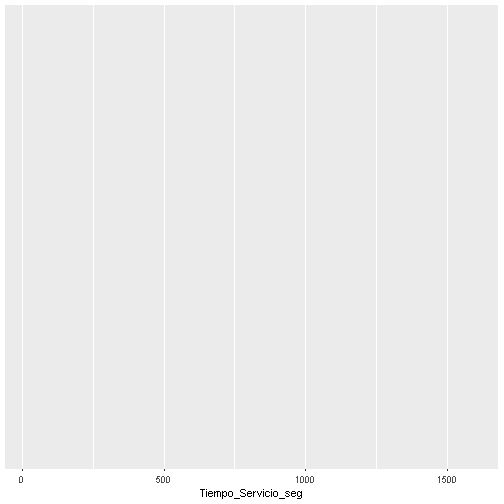


ggplot2 
========================================================
class: small-code
<small>
Luego se declara el objeto geométrico principal
</small>


```r
ggplot(data_banco, aes(x = Tiempo_Servicio_seg)) + geom_histogram()
```

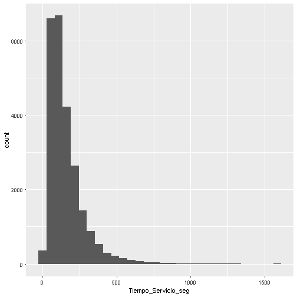


ggplot2 
========================================================
class: small-code
<small>
El objeto geométrico puede tener sus propias características, el histograma por ejemplo permite graficar frecuencia relativa en lugar de frecuencia absoluta
</small>


```r
ggplot(data_banco, aes(x = Tiempo_Servicio_seg)) + 
  geom_histogram(aes(y = ..density..))
```

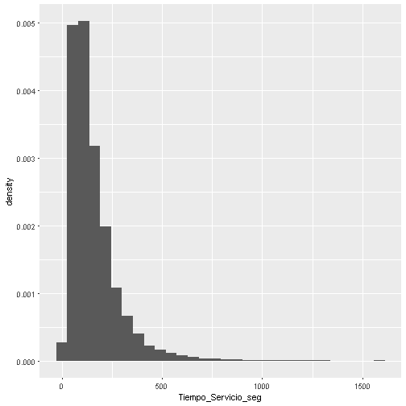


ggplot2 
========================================================
class: small-code
<small>
Que es lo mismo que hace.
</small>


```r
ggplot(data_banco, aes(x = Tiempo_Servicio_seg, y = ..density..)) + 
  geom_histogram()
```


ggplot2 
========================================================
class: small-code
<small>
La potencia de ggplot es que podemos **mapear** otras variables a las características estéticas, por ejemplo, la sucursal al relleno (fill) de las barras
</small>


```r
ggplot(data_banco, aes(x = Tiempo_Servicio_seg, fill= Sucursal)) + 
  geom_histogram(aes(y = ..density..), )
```

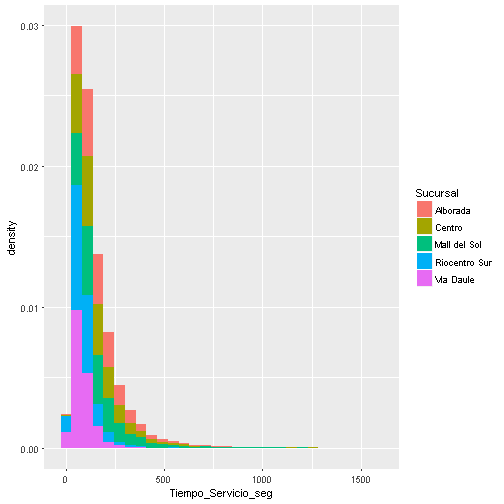


ggplot2 
========================================================
class: small-code
<small>
Mapeando al eje y la densidad, al relleno la sucursal y definidiendo como opción del histograma "position= "fill""
</small>


```r
ggplot(data_banco, aes(x = Tiempo_Servicio_seg, fill= Sucursal)) + 
  geom_histogram(aes(y = ..density..), position = "fill")
```

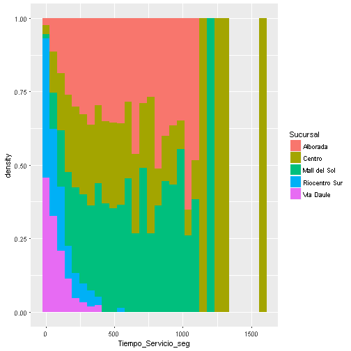


ggplot2 
========================================================
class: small-code
<small>
Cada geom en ggplot es un layer que se aumenta al gráfico, podemos entonces aumentar layers al gráfico.
</small>


```r
ggplot(data_banco, aes(x = Tiempo_Servicio_seg)) + 
  geom_histogram(aes(y = ..density..)) +
  geom_density(lwd=1)
```

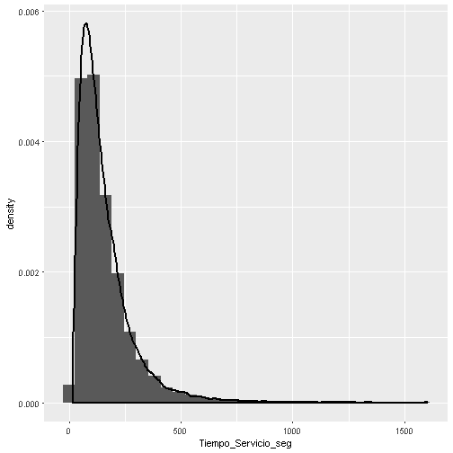


ggplot2 
========================================================
class: small-code
<small>
Histograma de frecuencia relativa + densidad + curva normal con la media y desviación de la muestra.
</small>


```r
ggplot(data_banco, aes(x = Tiempo_Servicio_seg)) + 
  geom_histogram(aes(y = ..density..)) +
  geom_density(lwd=1) +
  stat_function(fun = dnorm, colour = "red", lwd=1, 
                args = list(mean = mean(data_banco$Tiempo_Servicio_seg, na.rm = TRUE),
                            sd = sd(data_banco$Tiempo_Servicio_seg, na.rm = TRUE)))
```

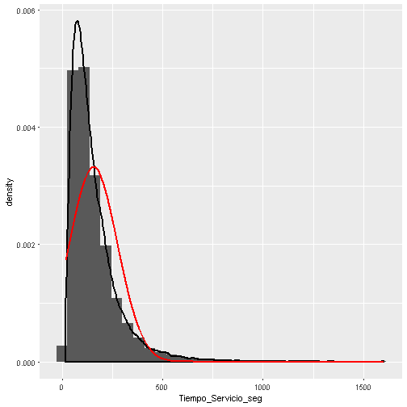


ggplot2 
========================================================
class: small-code
<small>
Nótese la diferencia de cuándo se usa fill= Sucursal, esa variable se mapea para ambos layers
</small>


```r
ggplot(data_banco, aes(x = Tiempo_Servicio_seg, fill= Sucursal)) + 
  geom_histogram(aes(y = ..density..)) +
  geom_density(lwd=1) 
```

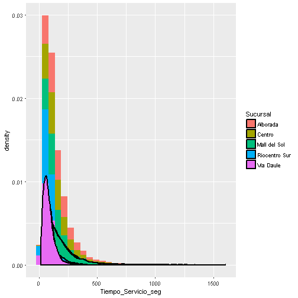


ggplot2 
========================================================
class: small-code
<small>
Ahora se pone el fill sólo en geom_histogram, nótese la altura de la densidad
</small>


```r
ggplot(data_banco, aes(x = Tiempo_Servicio_seg)) + 
  geom_histogram(aes(y = ..density.., fill= Sucursal)) +
  geom_density(lwd=1)
```

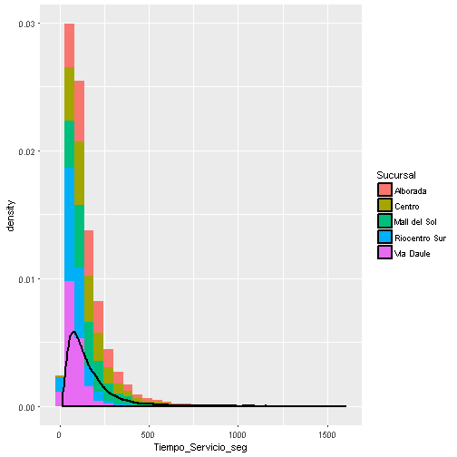


ggplot2 
========================================================
class: small-code
<small>
Modificamos la estética **y** para poder aumentar la altura de la densidad (que ya no sería estríctamente densidad)
</small>


```r
ggplot(data_banco, aes(x = Tiempo_Servicio_seg)) + 
  geom_histogram(aes(y = ..density.., fill= Sucursal)) +
  geom_density(aes(y= 4 * ..density..), lwd=0.5)
```

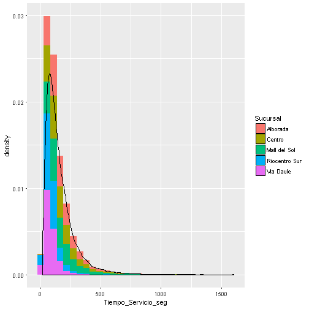


ggplot2 
========================================================
class: small-code
<small>
Jugando con las opciones ya conocidas
</small>


```r
ggplot(data_banco, aes(x = Tiempo_Servicio_seg)) + 
  geom_histogram(aes(y = ..density.., fill= Sucursal),  position = "fill") +
  geom_density(aes(y= 40 * ..density..), lwd=0.5)
```

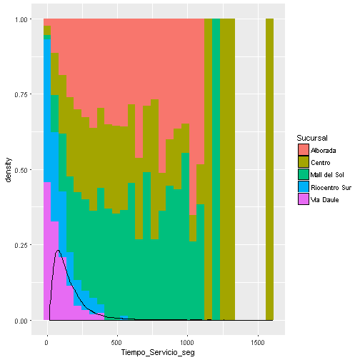


ggplot2 
========================================================
class: small-code
<small>
Ahora vamos a comparar los histogramas del Tiempo de Servicio según la transacción
</small>


```r
ggplot(data_banco, aes(x = Tiempo_Servicio_seg)) + 
  geom_histogram(aes(y = ..density.., fill= Transaccion),  position = "identity", alpha= 0.4) 
```


ggplot2 
========================================================
class: small-code
<small>
Nótese cómo varía el gráfico al variar el parámetro *position*
</small>


```r
ggplot(data_banco, aes(x = Tiempo_Servicio_seg)) + 
  geom_histogram(aes(y = ..density.., fill= Transaccion),  position = "dodge")
```

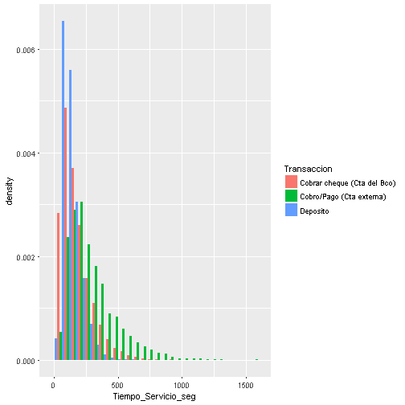


ggplot2 
========================================================
class: small-code
<small>
Agreguemos densidad primer intento
</small>


```r
ggplot(data_banco, aes(x = Tiempo_Servicio_seg, fill= Transaccion)) + 
  geom_histogram(aes(y = ..density..),  position = "dodge") + 
  geom_density(lwd=0.5)
```

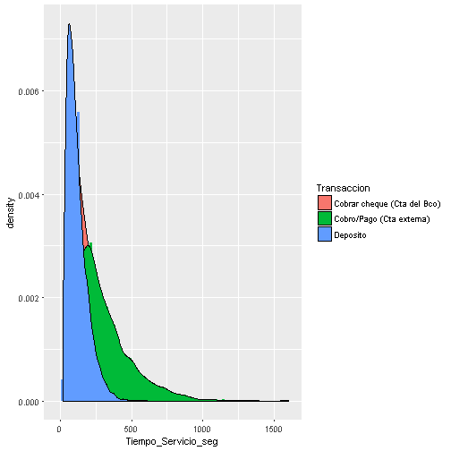


ggplot2 
========================================================
class: small-code
<small>
Usemos alpha en densidad
</small>


```r
ggplot(data_banco, aes(x = Tiempo_Servicio_seg, fill= Transaccion)) + 
  geom_histogram(aes(y = ..density..),  position = "dodge") + 
  geom_density(aes(color= Transaccion), lwd=0.5, alpha= 0.3)
```

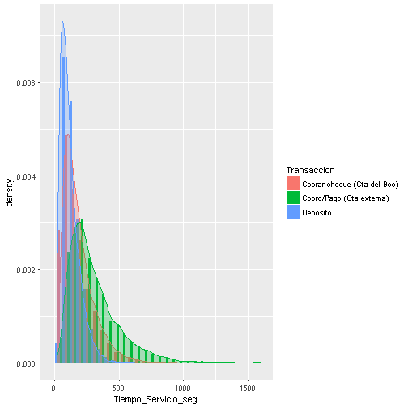


ggplot2 
========================================================
class: small-code
<small>
Juguemos con *fill* y *color*
</small>


```r
ggplot(data_banco, aes(x = Tiempo_Servicio_seg)) + 
  geom_histogram(aes(y = ..density.., fill= Transaccion),  position = "dodge", alpha= 0.7) + 
  geom_density(aes(color= Transaccion), lwd=1 )
```

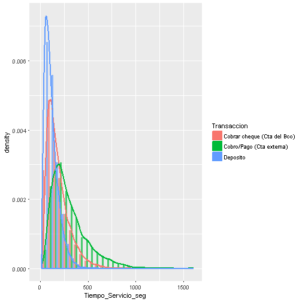


ggplot2 
========================================================
class: small-code
<small>
Quizá mejor es tener los histogramas separados, usamos facet
</small>


```r
ggplot(data_banco, aes(x = Tiempo_Servicio_seg)) + 
  geom_histogram(aes(y = ..density..)) + 
  geom_density(lwd=0.2, color= "red") +
  facet_grid(~Transaccion)
```

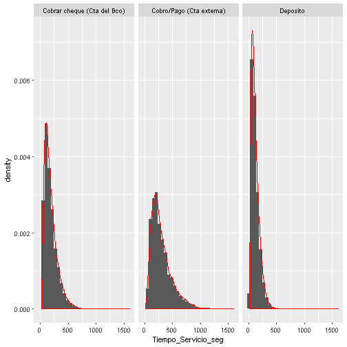


ggplot2 
========================================================
class: small-code
<small>
Parámetro en facet
</small>


```r
ggplot(data_banco, aes(x = Tiempo_Servicio_seg)) + 
  geom_histogram(aes(y = ..density..)) + 
  geom_density(lwd=0.2, color= "red") +
  facet_grid(~Transaccion, scales = "free_x")
```

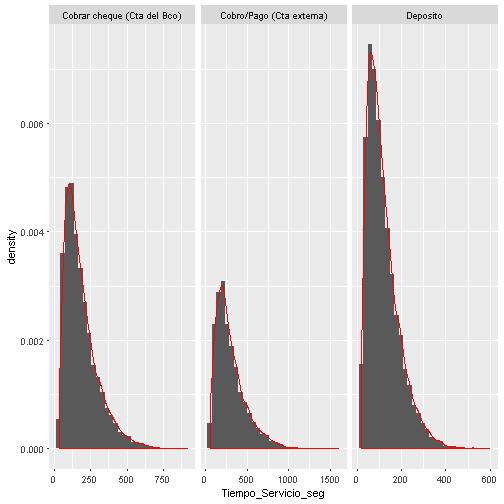


ggplot2 
========================================================
class: small-code
<small>
De forma vertical
</small>


```r
ggplot(data_banco, aes(x = Tiempo_Servicio_seg)) + 
  geom_histogram(aes(y = ..density..)) + 
  geom_density(lwd=0.2, color= "red") +
  facet_grid(Transaccion~.)
```

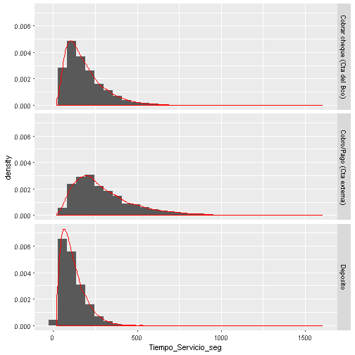


ggplot2 
========================================================
class: small-code
<small>
Parámetro en facet
</small>


```r
ggplot(data_banco, aes(x = Tiempo_Servicio_seg)) + 
  geom_histogram(aes(y = ..density..)) + 
  geom_density(lwd=0.2) +
  facet_grid(Transaccion~., scales = "free_y")
```

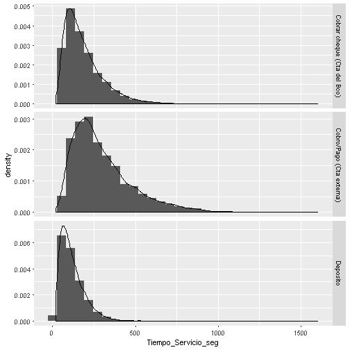


ggplot2 
========================================================
class: small-code
<small>
facet_wrap permite otras cosas
</small>


```r
ggplot(data_banco, aes(x = Tiempo_Servicio_seg)) + 
  geom_histogram(aes(y = ..density..)) + 
  geom_density(lwd=0.2, color= "red") +
  facet_wrap("Transaccion")
```


ggplot2 
========================================================
class: small-code
<small>
Puedo obligar a facet_wrap a que tenga 2 filas
</small>


```r
ggplot(data_banco, aes(x = Tiempo_Servicio_seg)) + 
  geom_histogram(aes(y = ..density..)) + 
  geom_density(lwd=0.2, color= "red") +
  facet_wrap("Transaccion", nrow = 2)
```

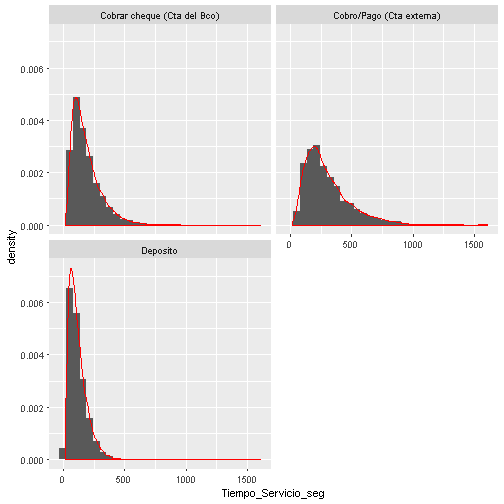


ggplot2 
========================================================
class: small-code
<small>
Usamos *fill* y *color* para transacción y facet_wrap para dividir por sucursal
</small>


```r
ggplot(data_banco, aes(x = Tiempo_Servicio_seg)) + 
  geom_histogram(aes(y = ..density.., fill= Transaccion),  position = "dodge", alpha= 0.7) + 
  geom_density(aes(color= Transaccion), lwd=0.2 ) + 
  facet_wrap("Sucursal")
```

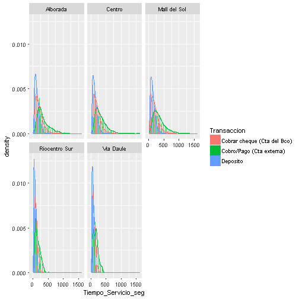


ggplot2 
========================================================
class: small-code
<small>
Agregar una distribución marginal
</small>


```r
ggplot(data_banco, aes(x = Tiempo_Servicio_seg)) + 
  geom_density(lwd=0.2 ) + 
  geom_rug(alpha=0.02)
```

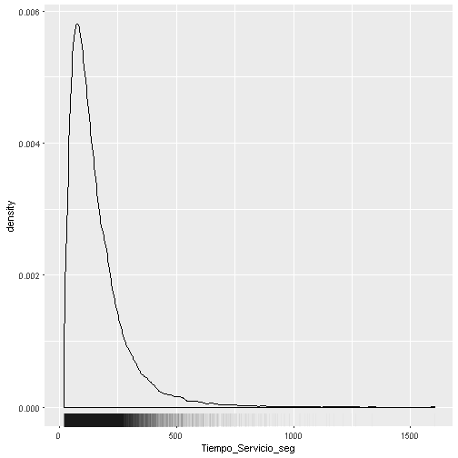


ggplot2 
========================================================
class: small-code
<small>
Agregar una línea de media
</small>


```r
ggplot(data_banco, aes(x = Tiempo_Servicio_seg)) + 
  geom_density(alpha=0.4, lwd=0.2, fill= "yellow" ) +
  geom_vline(aes(xintercept = mean(Tiempo_Servicio_seg))) 
```

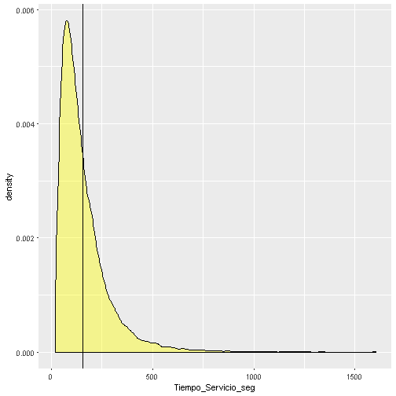


ggplot2 
========================================================
class: small-code
<small>
Agregar una línea de media
</small>


```r
ggplot(data_banco, aes(x = Tiempo_Servicio_seg)) + 
  geom_density(alpha=0.4, lwd=0.2, fill= "yellow" ) +
  geom_vline(aes(xintercept = mean(Tiempo_Servicio_seg)), color= "red") +
  geom_text(aes(x=mean(Tiempo_Servicio_seg) + 10, label="Media del tiempo de servicio", y=0.01), colour="red", angle=90)
```


ggplot2 
========================================================
class: small-code
<small>
Agregar una línea de media
</small>


```r
ggplot(data_banco, aes(x = Tiempo_Servicio_seg)) + 
  geom_density(alpha=0.4, lwd=0.2, fill= "yellow" ) +
  geom_vline(aes(xintercept = mean(Tiempo_Servicio_seg)), color= "red", linetype= "dashed", size= 1) +
  geom_text(aes(x=mean(Tiempo_Servicio_seg) + 7, label="Media del tiempo de servicio", y=0.015), colour="red", angle=90)
```

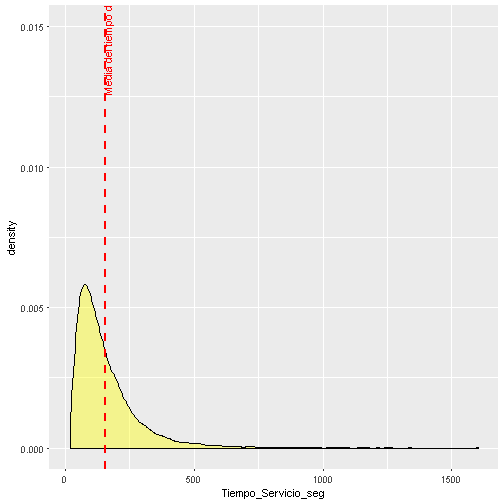


ggplot2 
========================================================
class: small-code
<small>
Separemos la densidad por Transacción usando *fill* (No se calcula la media)
</small>


```r
ggplot(data_banco, aes(x = Tiempo_Servicio_seg, fill= Transaccion)) + 
  geom_density(alpha=0.4, lwd=0.2) +
  geom_vline(aes(xintercept = mean(Tiempo_Servicio_seg)), color= "red", linetype= "dashed", size= 1) +
  geom_text(aes(x=mean(Tiempo_Servicio_seg) + 7, label="Media del tiempo de servicio", y=0.015), colour="red", angle=90)
```

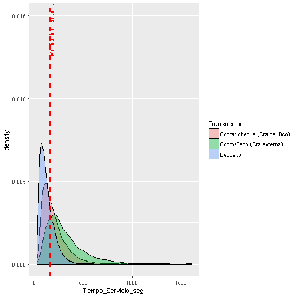

ggplot2 
========================================================
class: small-code
<small>
Se debe calcular la media aparte
</small>


```r
df_medias <- data_banco %>% group_by(Transaccion) %>% summarise(MEDIA= mean(Tiempo_Servicio_seg, na.rm= TRUE)  )
ggplot(data_banco, aes(x = Tiempo_Servicio_seg, fill= Transaccion)) + 
  geom_density(alpha=0.4, lwd=0.2) +
  geom_vline(data = df_medias, aes(xintercept = MEDIA), color= "red", linetype= "dashed", size= 1) +
  geom_text(data = df_medias, aes(x=MEDIA + 7, label="Media del tiempo de servicio", y=0.015), colour="red", angle=90)
```

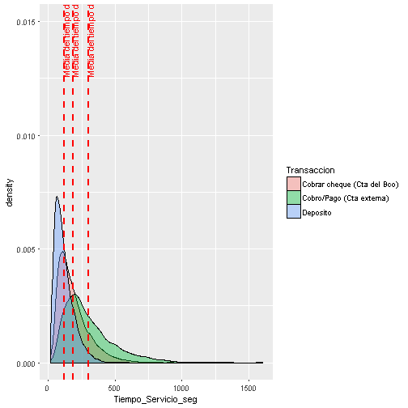


ggplot2 
========================================================
class: small-code
<small>
Para tener color por Transacción, mapeamos color dentro del aes()
</small>


```r
df_medias <- data_banco %>% group_by(Transaccion) %>% summarise(MEDIA= mean(Tiempo_Servicio_seg, na.rm= TRUE)  )
ggplot(data_banco, aes(x = Tiempo_Servicio_seg, fill= Transaccion)) + 
  geom_density(alpha=0.4, lwd=0.2) +
  geom_vline(data = df_medias, aes(xintercept = MEDIA, colour= Transaccion), linetype= "dashed", size= 1) +
  geom_text(data = df_medias, aes(x=MEDIA + 7, label="Media del tiempo de servicio", y=0.015, colour= Transaccion), , angle=90)
```

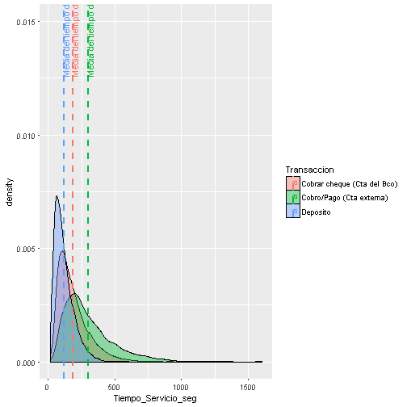


ggplot2 
========================================================
class: small-code
<small>
Ahora vamos a pintar de diferente color la barra con mayor 
</small>


```r
ggplot(data_banco, aes(x = Tiempo_Servicio_seg)) + 
  geom_histogram(aes(y    = ..count.., 
                     fill = cut(..count.., c(0, sort(..count.., TRUE)[1:2]))
                                  ))
```


ggplot2 
========================================================
class: small-code
<small>
Para entender el cut
</small>


```r
g <- ggplot(data_banco, aes(x = Tiempo_Servicio_seg)) + 
  geom_histogram(aes(y    = ..count..))

cut(ggplot_build(g)$data[[1]]$count, c(0, sort(ggplot_build(g)$data[[1]]$count, TRUE)[1:2]))
```

```
 [1] (0,6.6e+03]        (0,6.6e+03]        (6.6e+03,6.67e+03]
 [4] (0,6.6e+03]        (0,6.6e+03]        (0,6.6e+03]       
 [7] (0,6.6e+03]        (0,6.6e+03]        (0,6.6e+03]       
[10] (0,6.6e+03]        (0,6.6e+03]        (0,6.6e+03]       
[13] (0,6.6e+03]        (0,6.6e+03]        (0,6.6e+03]       
[16] (0,6.6e+03]        (0,6.6e+03]        (0,6.6e+03]       
[19] (0,6.6e+03]        (0,6.6e+03]        (0,6.6e+03]       
[22] (0,6.6e+03]        (0,6.6e+03]        (0,6.6e+03]       
[25] (0,6.6e+03]        <NA>               <NA>              
[28] <NA>               <NA>               (0,6.6e+03]       
Levels: (0,6.6e+03] (6.6e+03,6.67e+03]
```


ggplot2 
========================================================
class: small-code
<small>
Vamos a corregir los nombres y darle otros colores
</small>


```r
ggplot(data_banco, aes(x = Tiempo_Servicio_seg)) + 
  geom_histogram(aes(y    = ..count.., 
                     fill = cut(..count.., c(0, sort(..count.., TRUE)[1:2]))
                                  )) + 
  scale_fill_manual("", values = c("red", "green"), labels=c("Resto","Mayor Frecuencia")) 
```

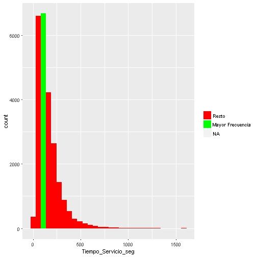


ggplot2 
========================================================
class: small-code
<small>
Título, labels, temas.
</small>


```r
ggplot(data_banco, aes(x = Tiempo_Servicio_seg)) + 
  geom_histogram(aes(y    = ..count.., 
                     fill = cut(..count.., c(0, sort(..count.., TRUE)[1:2]))
                                  )) + 
  scale_fill_manual("", values = c("red", "green"), labels=c("Resto","Mayor Frecuencia")) + 
  labs(title= "Histograma del Tiempo de servicio", subtitle = "Se resalta la mayor frecuencia", 
       x= "Tiempo de servicio en segundos", y="frecuencia") + 
  theme_bw()
```


ggplot2 
========================================================
class: small-code
<small>
Siendo mucho más detallista
</small>


```r
ggplot(data_banco, aes(x = Tiempo_Servicio_seg)) + 
  geom_histogram(aes(y    = ..count.., 
                     fill = cut(..count.., c(0, sort(..count.., TRUE)[1:2]))
                                  )) + 
  scale_fill_manual("", values = c("red", "green"), labels=c("Resto","Mayor Frecuencia")) + 
  labs(title= "Histograma del Tiempo de servicio", subtitle = "Se resalta la mayor frecuencia", 
       x= "Tiempo de servicio en segundos", y="frecuencia") + 
theme_bw() +
        theme(axis.line = element_line(size=1, colour = "black"),
              panel.grid.major = element_line(colour = "#d3d3d3"),
              panel.grid.minor = element_blank(),
              panel.border = element_blank(), panel.background = element_blank(),
              plot.title = element_text(size = 14, family = "Tahoma", face = "bold"),
              text=element_text(family="Tahoma"),
              axis.text.x=element_text(colour="black", size = 9),
              axis.text.y=element_text(colour="black", size = 9))
```


ggplot2 
========================================================
class: small-code
<small>
Siendo mucho más detallista
</small>

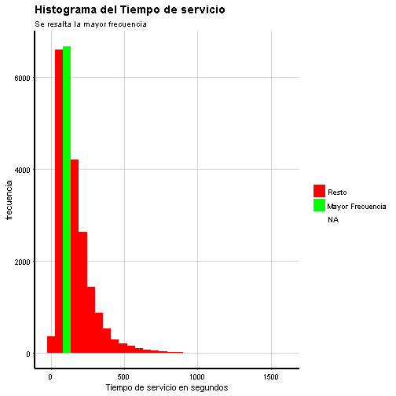


ggplot2 
========================================================
class: small-code
<small>
Ahora vamos a realizar un boxplot
</small>


```r
ggplot(data_banco, aes(x= Transaccion, y = Tiempo_Servicio_seg)) + 
  geom_boxplot( outlier.alpha = 0.1) 
```

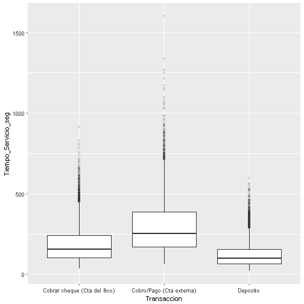


ggplot2 
========================================================
class: small-code
<small>
Graficando los puntos encima del boxplot
</small>


```r
ggplot(data_banco, aes(x= Transaccion, y = Tiempo_Servicio_seg)) + 
  geom_boxplot(outlier.alpha = 0.1)+ geom_jitter(alpha= 0.01)
```

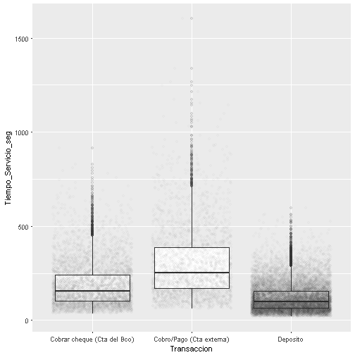


ggplot2 
========================================================
class: small-code
<small>
Para comparar mediana con rango intercuartil
</small>


```r
ggplot(data_banco, aes(x= Transaccion, y = Tiempo_Servicio_seg)) + 
  geom_boxplot(outlier.alpha = 0.05, notch = TRUE)
```

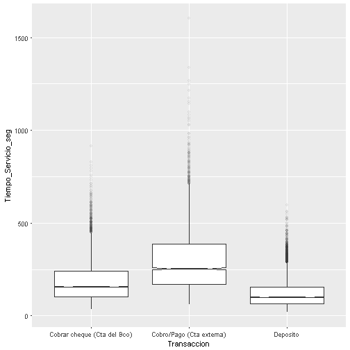


ggplot2 
========================================================
class: small-code
<small>
Agregar la media
</small>


```r
ggplot(data_banco, aes(x= Transaccion, y = Tiempo_Servicio_seg)) + 
  geom_boxplot(outlier.alpha = 0.05, notch = TRUE)+ 
  stat_summary(fun.y=mean, geom="point", shape=3, size=2, color= "red")
```

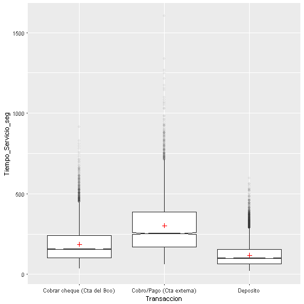


ggplot2 
========================================================
class: small-code
<small>
boxplot horizontal
</small>


```r
ggplot(data_banco, aes(x= Transaccion, y = Tiempo_Servicio_seg)) + 
  geom_boxplot(outlier.alpha = 0.05, notch = TRUE) + 
  coord_flip()
```

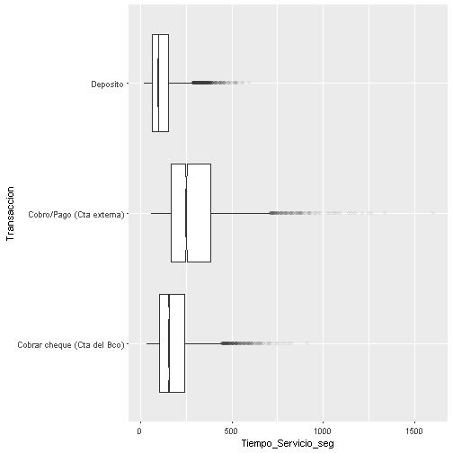


ggplot2 
========================================================
class: small-code
<small>
boxplot horizontal y mapeando a fill el uso del nuevo sistema
</small>


```r
ggplot(data_banco, aes(x= Transaccion, y = Tiempo_Servicio_seg, fill= Nuevo_Sistema )) + 
  geom_boxplot(outlier.alpha = 0.05, notch = TRUE) + 
  coord_flip()
```

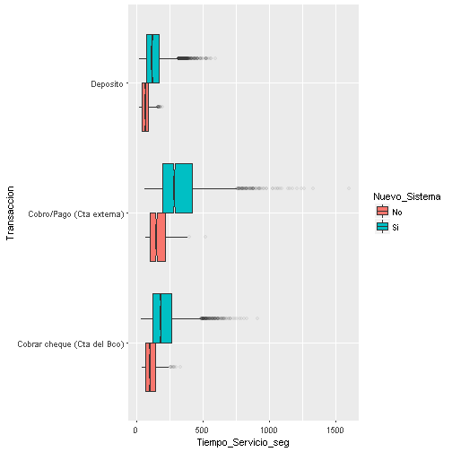


ggplot2 
========================================================
class: small-code
<small>
Y un facet_wrap de Sucursal
</small>


```r
ggplot(data_banco, aes(x= Transaccion, y = Tiempo_Servicio_seg, fill= Nuevo_Sistema )) +
  geom_boxplot(outlier.alpha = 0.05, notch = TRUE) + 
  coord_flip() + 
  facet_wrap("Satisfaccion")
```

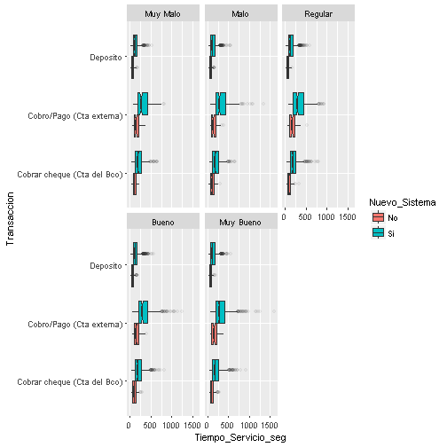


ggplot2 
========================================================
class: small-code
<small>
Reemplazando boxplot por geom_violin
</small>


```r
ggplot(data_banco, aes(x= Transaccion, y = Tiempo_Servicio_seg, fill= Nuevo_Sistema )) + 
  geom_violin() + 
  coord_flip() + 
  facet_wrap("Satisfaccion")
```

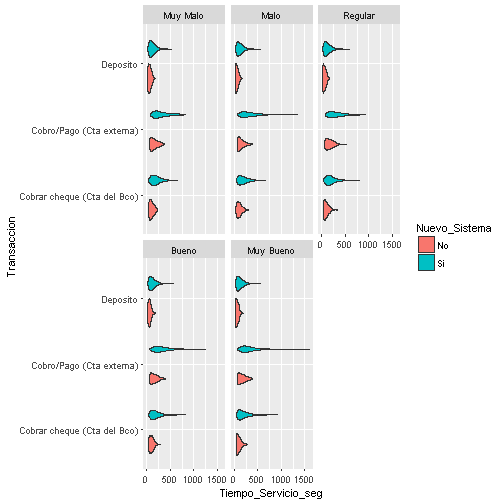


ggplot2 
========================================================
class: small-code
<small>
Boxplot para dos variables cuantitativas
</small>


```r
ggplot(data_banco, aes(x= Monto, y = Tiempo_Servicio_seg)) + 
  geom_boxplot( aes(group= cut_width(Monto, 500)), outlier.alpha = 0.05) 
```

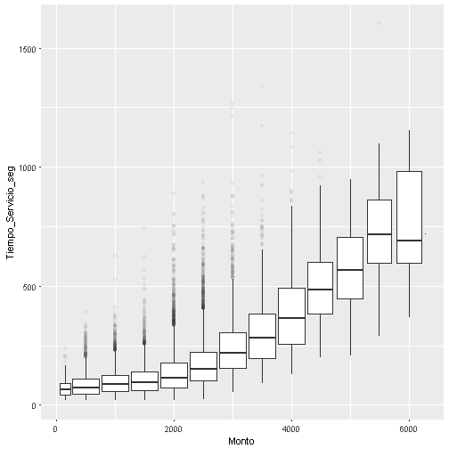


ggplot2 
========================================================
class: small-code
<small>
Agregamos un facet por Nuevo Sistema
</small>


```r
ggplot(data_banco, aes(x= Monto, y = Tiempo_Servicio_seg)) + 
  geom_boxplot( aes(group= cut_width(Monto, 500)), outlier.alpha = 0.05) +
  facet_grid(Nuevo_Sistema~.)
```

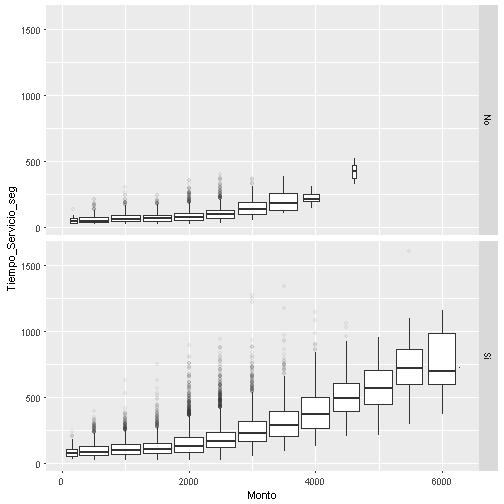


ggplot2 
========================================================
class: small-code
<small>
Agregamos un facet por Nuevo Sistema y Satisfaccion
</small>


```r
ggplot(data_banco, aes(x= Monto, y = Tiempo_Servicio_seg)) + 
  geom_boxplot( aes(group= cut_width(Monto, 500)), outlier.alpha = 0.05) +
  facet_grid(Nuevo_Sistema~Satisfaccion) 
```

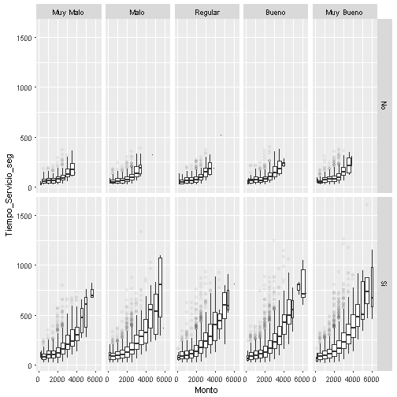


ggplot2 
========================================================
class: small-code
<small>
Graficar la relación entre dos variables cuantitativas con diagramas de dispersión
</small>


```r
ggplot(data_banco, aes(x= Monto, y = Tiempo_Servicio_seg)) + 
  geom_point( alpha=0.05) 
```

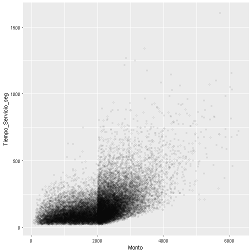


ggplot2 
========================================================
class: small-code
<small>
Podemos mapear el color a la variable Transaccion
</small>


```r
ggplot(data_banco, aes(x= Monto, y = Tiempo_Servicio_seg)) + 
  geom_point( aes(color= Transaccion), alpha=0.1) 
```

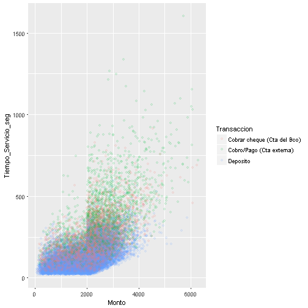


ggplot2 
========================================================
class: small-code
<small>
Podemos mapear el color a la variable Transaccion
</small>


```r
ggplot(data_banco, aes(x= Monto, y = Tiempo_Servicio_seg)) + 
  geom_point( aes(color= Transaccion), alpha=0.2) 
```

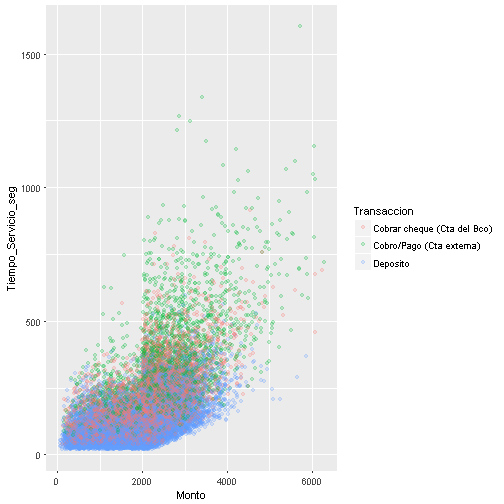


ggplot2 
========================================================
class: small-code
<small>
En un gráfico de dispersión podemos mapear la forma del punto
</small>


```r
ggplot(data_banco, aes(x= Monto, y = Tiempo_Servicio_seg)) + 
  geom_point( aes(color= Transaccion, shape= Nuevo_Sistema), alpha=0.2) 
```

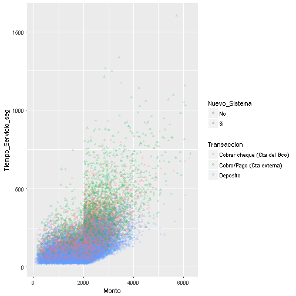


ggplot2 
========================================================
class: small-code
<small>
En un gráfico de dispersión podemos mapear la forma del punto
</small>


```r
ggplot(data_banco, aes(x= Monto, y = Tiempo_Servicio_seg)) + 
  geom_point( aes(color= Transaccion), alpha=0.2) +
  facet_grid(Nuevo_Sistema~.)
```


ggplot2 
========================================================
class: small-code
<small>
En un gráfico de dispersión podemos mapear la forma del punto
</small>


```r
ggplot(data_banco, aes(x= Monto, y = Tiempo_Servicio_seg)) + 
  geom_point( aes(color= Transaccion), alpha=0.2) +
  facet_grid(Nuevo_Sistema~.)
```

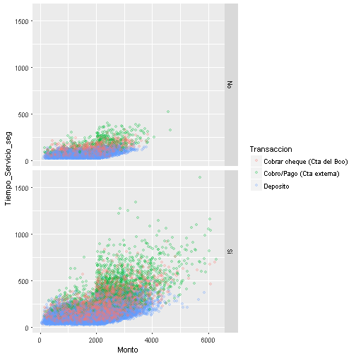


ggplot2 
========================================================
class: small-code
<small>
En base a la cantidad de información que se tiene se modifica geom_point a geom_hex
</small>


```r
ggplot(data_banco, aes(x= Monto, y = Tiempo_Servicio_seg)) + 
  geom_hex() + 
  facet_grid(Nuevo_Sistema~.)
```


ggplot2 
========================================================
class: small-code
<small>
geom_hex
</small>


```r
ggplot(data_banco, aes(x= Monto, y = Tiempo_Servicio_seg)) + 
  geom_hex(bins = 50) + 
  facet_grid(Nuevo_Sistema~.)
```

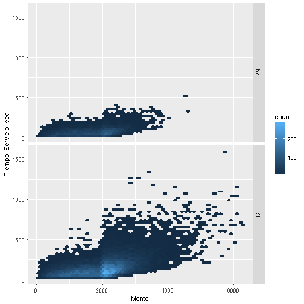


ggplot2 
========================================================
class: small-code
<small>
geom_hex
</small>


```r
ggplot(data_banco, aes(x= Monto, y = Tiempo_Servicio_seg)) + 
  geom_hex(binwidth = c(100, 20)) + 
  facet_grid(Nuevo_Sistema~.)
```

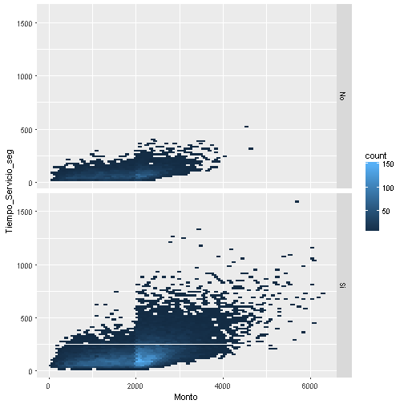


ggplot2 
========================================================
class: small-code
<small>
geom_hex
</small>


```r
ggplot(data_banco, aes(x= Monto, y = Tiempo_Servicio_seg, fill= Transaccion)) + 
  geom_hex(binwidth = c(100, 20), alpha= 0.3) + 
  facet_grid(Nuevo_Sistema~.)
```

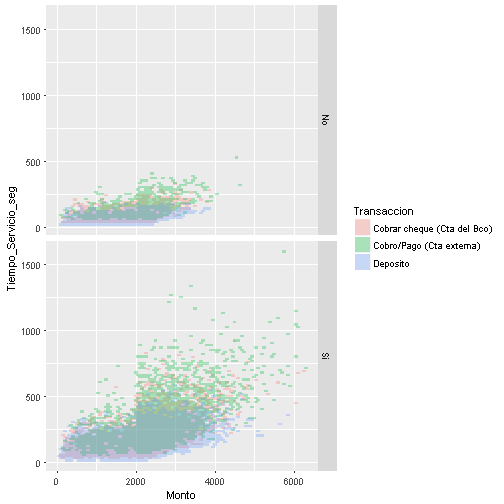

ggplot2 
========================================================
class: small-code
<small>
geom_hex
</small>


```r
ggplot(data_banco, aes(x= Monto, y = Tiempo_Servicio_seg)) + 
  geom_hex(bins = 50) + 
  facet_grid(Nuevo_Sistema~Transaccion)
```

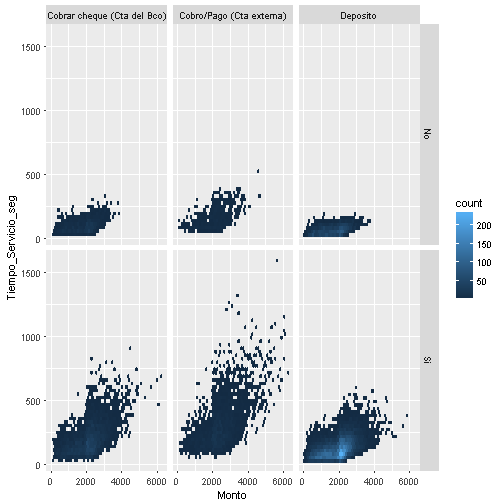


ggplot2 
========================================================
class: small-code
<small>
Agregamos un layer con densidad en 2D
</small>


```r
ggplot(data_banco, aes(x= Monto, y = Tiempo_Servicio_seg)) + 
  geom_hex(bins = 50, alpha= 0.8) + 
  geom_density_2d(alpha= 0.75, color= "red", linetype="dashed") +
  facet_grid(Nuevo_Sistema~Transaccion)
```

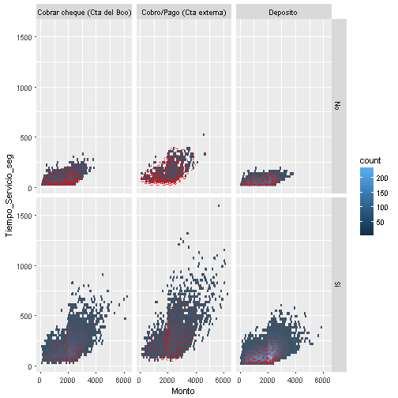


ggplot2 
========================================================
class: small-code
<small>
Agregamos un layer con densidad en 2D
</small>


```r
ggplot(data_banco, aes(x= Monto, y = Tiempo_Servicio_seg)) + 
  stat_density_2d(aes(fill = ..level..), geom="polygon")+
  facet_grid(Nuevo_Sistema~Transaccion)
```

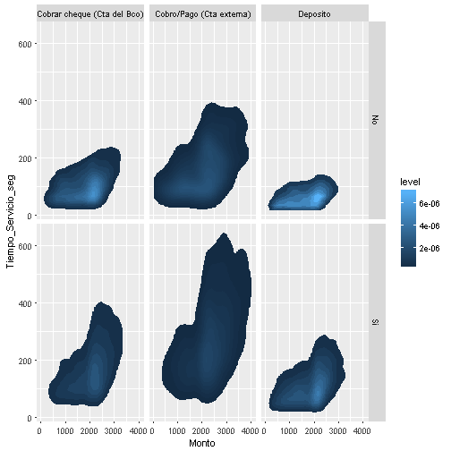


Data a usar
========================================================


```r
set.seed(123)
df_1 <- data.frame(
  ALMACEN= rep(c("Mall del Sol", "Riocentro"), each= 6),
  PRODUCTO= paste("Prod", LETTERS[1:6], sep="_"),
  PERIODO= rep(seq.Date(from=as.Date("2015-01-01"), to=as.Date("2017-06-01"), by="month"), each=12),
  VTA= runif(n = 360, min = 1000, max= 7000),
  MARGEN= rnorm(n = 360, mean = 30, sd= 6)/100,
  PPTO= runif(n = 360, min = 1000, max= 7000),
  stringsAsFactors = FALSE
)
df_1 %<>% mutate(VTA_COSTO=VTA*(1-MARGEN))
df_1 <- tbl_df(df_1)
```


ggplot2 
========================================================
class: small-code
<small> 
Gráfico de linea de la venta. En este caso da error por la repetiión de los periodos
</small>


```r
ggplot(df_1, aes(x= PERIODO, y = VTA)) + 
  geom_line()
```

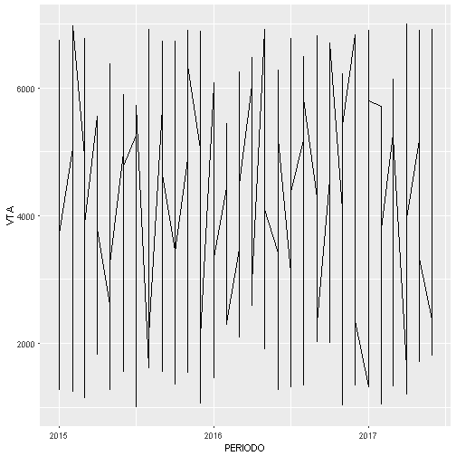


ggplot2 
========================================================
class: small-code
<small> 
Gráfico de linea de la venta, como tenemos la venta por varios grupos, usamos stat_summary y le declaramos como opción **geom="line"**
</small>


```r
ggplot(df_1, aes(x= PERIODO, y = VTA)) + 
  stat_summary(fun.y = sum, geom= "line")
```

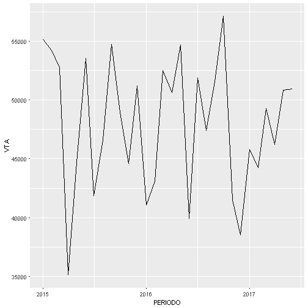


ggplot2 
========================================================
class: small-code
<small> 
Ahora, podríamos usar también geom_line pero mapeando el color al Producto y haciendo un condicionamiento por almacén
</small>


```r
ggplot(df_1, aes(x= PERIODO, y = VTA)) + 
  geom_line( aes(color= PRODUCTO)) + 
  stat_summary(fun.y = sum, geom= "line") +
  facet_grid(~ALMACEN)
```

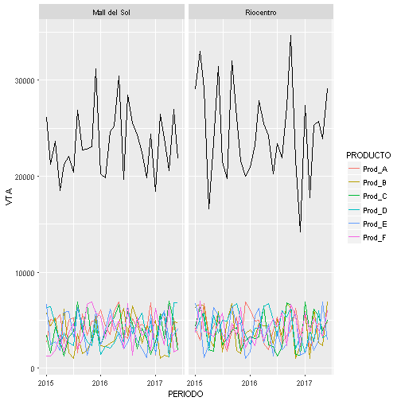


ggplot2 
========================================================
class: small-code
<small> 
O viceversa
</small>


```r
ggplot(df_1, aes(x= PERIODO, y = VTA)) + 
  geom_line( aes(color= ALMACEN)) + 
  stat_summary(fun.y = sum, geom= "line") +
  facet_wrap(~PRODUCTO)
```

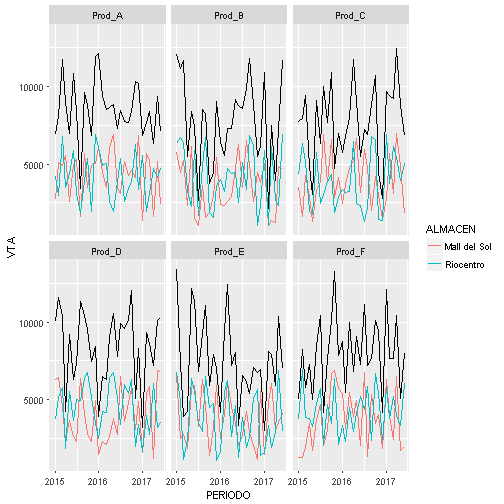


ggplot2 
========================================================
class: small-code
<small> 
O bien podemos usar dplyr antes de graficar
</small>


```r
df_1 %>%
  group_by(ALMACEN, PERIODO) %>%
  summarise(
    VTA= sum(VTA, na.rm= TRUE),
    PPTO= sum(PPTO, na.rm= TRUE),
  ) %>%
ggplot(., aes(x= PERIODO, y = VTA)) + 
  geom_line( aes(color= ALMACEN)) + 
  stat_summary(fun.y = sum, geom= "line") 
```


ggplot2 
========================================================
class: small-code
<small> 
O bien podemos usar dplyr antes de graficar
</small>

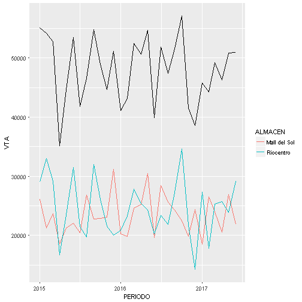


ggplot2 
========================================================
class: small-code
<small> 
Y si quiero comparar año vs año el comportamiento mensual?
</small>


```r
df_1 %>%
  mutate(    
    ANIO= year(PERIODO),
    MES= month(PERIODO)
    ) %>%
  group_by(ALMACEN, ANIO, MES) %>%
  summarise(
    VTA= sum(VTA, na.rm= TRUE),
    PPTO= sum(PPTO, na.rm= TRUE),
  ) %>%
ggplot(., aes(x= MES, y = VTA)) + 
  geom_line( aes(color= as.factor(ANIO)), lwd=1) + 
  facet_grid(~ALMACEN) +
  scale_color_manual(values=c("darkgray", "blue", "black"))
```


ggplot2 
========================================================
class: small-code
<small> 
Y si quiero comparar año vs año el comportamiento mensual?
</small>

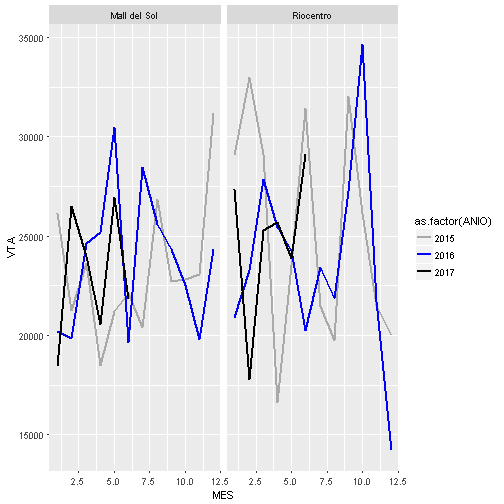


ggplot2 
========================================================
class: small-code
<small> 
Y si quiero comparar año vs año el comportamiento mensual?
</small>


```r
df_1 %>%
  mutate(    
    ANIO= year(PERIODO),
    MES= month(PERIODO)
    ) %>%
  group_by(ALMACEN, ANIO, MES) %>%
  summarise(
    VTA= sum(VTA, na.rm= TRUE),
    PPTO= sum(PPTO, na.rm= TRUE),
  ) %>%
ggplot(., aes(x= MES, y = VTA)) + 
  geom_line( aes(color= as.factor(ANIO), linetype= ALMACEN), lwd=1) + 
  scale_color_manual(values=c("darkgray", "blue", "black"))
```


ggplot2 
========================================================
class: small-code
<small> 
Y si quiero comparar año vs año el comportamiento mensual?
</small>

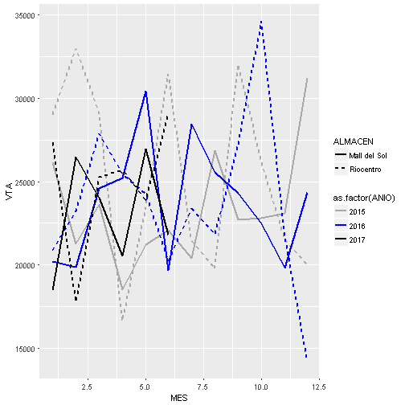


ggplot2
========================================================
class: small-code
<small> 
Explorar gráficamente el nivel de satisfacción en función de la sucursal del Banco.
</small> 

```r
## Grafico de barras de Sucursal vs Satisfaccion
ggplot(data = data_banco, aes(x= Sucursal, fill= Satisfaccion)) + 
  geom_bar( ) 
```

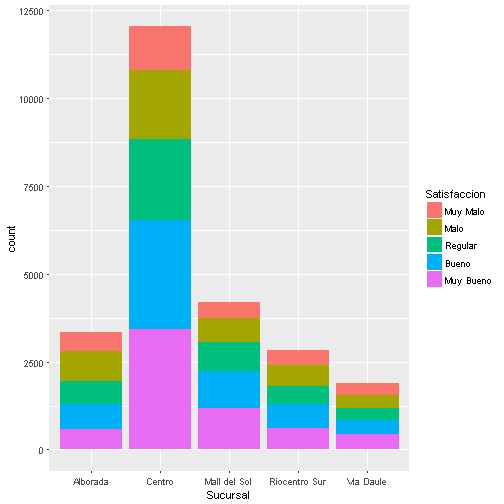


ggplot2
========================================================
class: small-code
<small> 
Explorar gráficamente el nivel de satisfacción en función de la sucursal del Banco.
</small> 

```r
## Grafico de barras de Sucursal vs Satisfaccion
ggplot(data = data_banco, aes(x= Sucursal, fill= Satisfaccion)) + 
  geom_bar( position = "fill" ) 
```

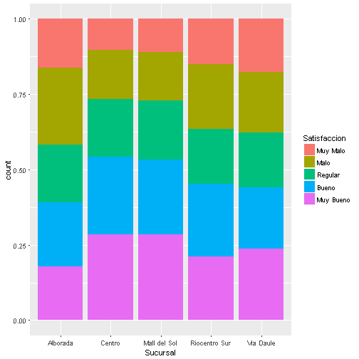


ggplot2
========================================================
class: small-code
<small> 
Explorar gráficamente el nivel de satisfacción en función de la sucursal del Banco.
</small> 

```r
## Grafico de barras de Sucursal vs Satisfaccion
ggplot(data = data_banco, aes(x= Sucursal, fill= Satisfaccion)) + 
  geom_bar( ) +
  facet_wrap("Transaccion")
```


ggplot2
========================================================
class: small-code
<small> 
Ejercicio: Llegar a este gráfico
</small> 

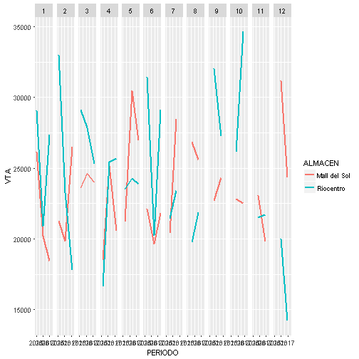
