<style>
.small-code pre code {
  font-size: 1em;
}
</style>


PROGRAMACIÓN Y DATA SCIENCE CON R - INTERMEDIO
========================================================
author: Nestor Montaño
date: Noviembre.2017
autosize: true
transition: rotate
<small> 
Vicerrectorado de Formación Académica y Profesional    
Universidad de Guayaquil
</small>


Regresión
========================================================
type: sub-section


R - cargar librerías
========================================================


```r
library(openxlsx)
library(MASS)
library(dplyr)
library(tidyr)
library(magrittr)
library(readr)
library(ggplot2)
library(hexbin)
library(lubridate)
library(GGally)
library(modelr)
library(lmtest)
library(car)
library(sandwich)
library(boot)
library(leaps)
```


Venta vs publicidad
========================================================

La empresa textil DePrati S.A. tiene un 2% de presupuesto para publicidad, por lo que semanalmente pauta en medios. Se tiene la información desglosada de dólares invertidos en cada tipo de medio, la semana correspondiente y la venta semanal.    

**La próxima semana se va a gastar 2000 en publicidad, estime cuánto se va a vender**


Importar data
========================================================


```r
# Leer el archivo de excel y asignarlo al objeto data_banco
data_venta_publicidad <- read.xlsx(xlsxFile = "Data/Venta_vs_Publicidad.xlsx", detectDates = TRUE)  
str(data_venta_publicidad)
```

```
'data.frame':	79 obs. of  8 variables:
 $ SEMANAS         : Date, format: "2015-01-05" "2015-01-12" ...
 $ VENTA           : num  151034 186849 133808 135690 199173 ...
 $ PUBLICIDAD_TOTAL: num  1200 1750 1450 1700 1900 1550 1150 2400 650 2000 ...
 $ TV              : num  300 612 450 544 722 ...
 $ RADIO           : num  276 473 493 289 361 ...
 $ PERIODICO       : num  624 473 218 408 209 ...
 $ REDES           : num  0 192 290 459 608 ...
 $ USA_FAMOSO      : chr  "NO" "NO" "NO" "NO" ...
```


Convertir a tibbles (un dataframe mejorado): 			
========================================================
class: small-code


```r
# Convertir el data_venta_publicidad a un tibble
data_venta_publicidad <- tbl_df( data_venta_publicidad) 
```


Explorar la data
========================================================
class: small-code
Vamos a explorar la data utilizando un gráfico de dispersión


```r
data_venta_publicidad %>%
  ggplot(., aes(PUBLICIDAD_TOTAL, VENTA)) + 
  geom_point() 
```

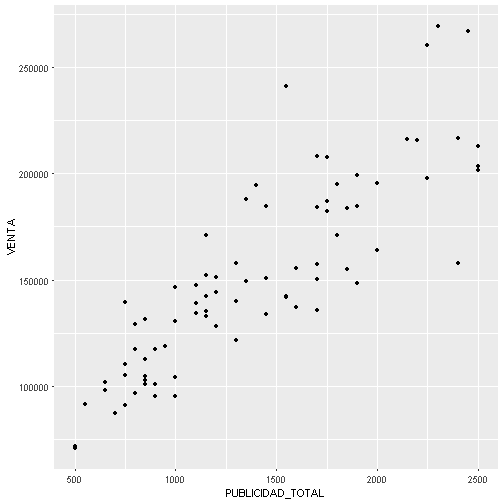


Explorar la data
========================================================
class: small-code
También una matriz de correlaciones


```r
data_venta_publicidad %>%   select_if(is.numeric) %>% as.data.frame %>% ggscatmat
```


Regresión lineal simple
========================================================

La idea de la regresión lineal simple es encontrar los valores de $\beta_0$ y $\beta_1$ que minimice los errores en la recta  

$$y = \beta_0 + \beta_1 x + \epsilon$$


- `y` es continua
- $\epsilon$ son normalmente distribuidos
- $\epsilon$ no presentan autocorrelación
- $\epsilon$ deben ser homocedásticos (varianza constante)


Regresión lineal simple
========================================================

Realizar una regresion simple

```r
## Realizar una regresion simple
mod_1 <- lm(VENTA ~ PUBLICIDAD_TOTAL, data = data_venta_publicidad)
```


Regresión lineal simple
========================================================
class: small-code

```r
summary(mod_1)
```

```

Call:
lm(formula = VENTA ~ PUBLICIDAD_TOTAL, data = data_venta_publicidad)

Residuals:
   Min     1Q Median     3Q    Max 
-63848 -16427  -1816  11946  78273 

Coefficients:
                  Estimate Std. Error t value Pr(>|t|)    
(Intercept)      54810.319   7280.662   7.528 8.19e-11 ***
PUBLICIDAD_TOTAL    69.611      4.849  14.354  < 2e-16 ***
---
Signif. codes:  0 '***' 0.001 '**' 0.01 '*' 0.05 '.' 0.1 ' ' 1

Residual standard error: 23720 on 77 degrees of freedom
Multiple R-squared:  0.728,	Adjusted R-squared:  0.7244 
F-statistic:   206 on 1 and 77 DF,  p-value: < 2.2e-16
```


Regresión lineal simple
========================================================


Regresión lineal simple
========================================================
 
**Interpretaciones**   

El modelo obtenido es: $ 54810.32 + 69.61*Publicidad$   

Es decir, por cada dólar que incrementa el gasto en publicidad, la venta aumenta 69.61, partiendo de una base de 54810.   
Se puede ver que el coeficiente de determinación $R^{2}$ *Ajustado* es igual a 0.724 lo cual indica que el modelo explica el 72.4% de la varianza de la variable Ventas, lo cual se podría decir que es un "buen" ajuste.


Regresión lineal simple
========================================================

**Interpretaciones**   

En los resultados del summary se puede observar el valor del estadístico *T* que permite realizar el contraste $H_{0}: \beta_{i}=0$ en este caso ambos valores p son cercanos a cero, es decir hay suficiente evidencia estadística para rechazar la hipótesis nula lo que indica los $\beta_{i}$ son estadísticamente significativos.   

Por último, se tiene el estadístico *F* de la prueba $H_{0}$: El modelo lineal NO explica bien la respuesta, el valor p asociado es casi cero lo cual indica que hay suficiente evidencia estadística para rechazar la hipótesis nula, lo que nos permite concluir que hay un buen ajuste en el modelo resultante


Regresión lineal simple
========================================================
class: small-code
Graficar las predicciones


```r
## Crea una tabla de datos base para predecir
grid <- data_venta_publicidad %>% 
data_grid(PUBLICIDAD_TOTAL) 

## Agrega predicciones
grid <- grid %>% 
add_predictions(mod_1, var = 'PREDIC') 

## Graficar
data_venta_publicidad %>%
ggplot(., aes(x= PUBLICIDAD_TOTAL)) + 
geom_point(aes(y= VENTA)) + 
geom_line(aes(y= PREDIC), data = grid, colour = "red", size = 1) +
ggtitle("Datos + predicción")
```


Regresión lineal simple
========================================================

Graficar las predicciones

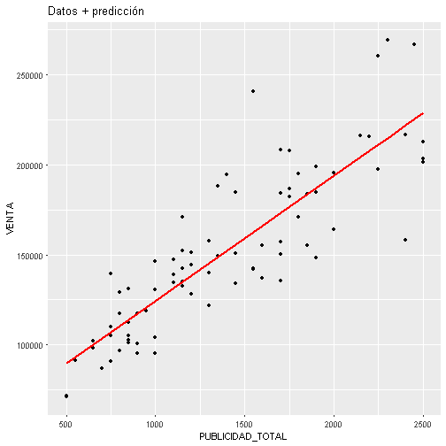


Regresión lineal simple
========================================================
class: small-code
Procedemos a analizar los residuos


```r
## Agregar residuales a datos
data_venta_publicidad <- data_venta_publicidad %>% 
add_residuals(mod_1, var = 'RESIDUALES')

## Explorar los residuales
head(data_venta_publicidad, 5)
```

```
# A tibble: 5 x 9
     SEMANAS    VENTA PUBLICIDAD_TOTAL    TV RADIO PERIODICO REDES
      <date>    <dbl>            <dbl> <dbl> <dbl>     <dbl> <dbl>
1 2015-01-05 151034.0             1200 300.0 276.0     624.0   0.0
2 2015-01-12 186848.5             1750 612.5 472.5     472.5 192.5
3 2015-01-19 133808.0             1450 449.5 493.0     217.5 290.0
4 2015-01-26 135690.0             1700 544.0 289.0     408.0 459.0
5 2015-02-02 199173.0             1900 722.0 361.0     209.0 608.0
# ... with 2 more variables: USA_FAMOSO <chr>, RESIDUALES <dbl>
```


Regresión lineal simple
========================================================
class: small-code
Procedemos a analizar los residuos


```r
## Explorar los residuales
ggplot(data_venta_publicidad, aes(RESIDUALES)) + 
geom_freqpoly(binwidth = 5000)
```

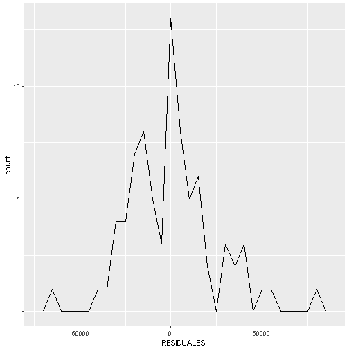


Regresión lineal simple
========================================================
class: small-code
Procedemos a analizar los residuos


```r
## Gráfico qq
mod_1 %>% 
ggplot(., aes(qqnorm(.stdresid)[[1]], .stdresid)) + 
geom_point(na.rm = TRUE) + 
geom_abline() + 
xlab("Theoretical Quantiles") + 
ylab("Standardized Residuals") + 
ggtitle("Normal Q-Q")
```

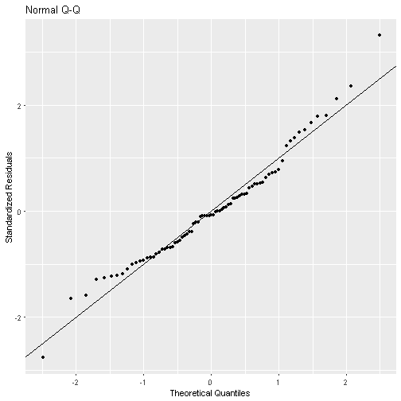


Regresión lineal simple
========================================================
class: small-code
**Análisis de los residuos: Prueba de Normalidad**   

$H_{0}$: Los residuos se ajustan a una distribución normal vs    
$H_{1}$: Los residuos NO se ajustan a una distribución normal


```r
# Si tuviésemos pocos datos
shapiro.test(data_venta_publicidad$RESIDUALES)
```

```

	Shapiro-Wilk normality test

data:  data_venta_publicidad$RESIDUALES
W = 0.97165, p-value = 0.07564
```

```r
# Test KS
ks.test(data_venta_publicidad$RESIDUALES, "pnorm")
```

```

	One-sample Kolmogorov-Smirnov test

data:  data_venta_publicidad$RESIDUALES
D = 0.53165, p-value = 2.22e-16
alternative hypothesis: two-sided
```


Regresión lineal simple
========================================================
class: small-code

Podemos utilizar los residuos studentizados


```r
data_venta_publicidad$STUDRESIDUAL <- studres(mod_1) 
# Si tuviésemos pocos datos
shapiro.test(data_venta_publicidad$STUDRESIDUAL)
```

```

	Shapiro-Wilk normality test

data:  data_venta_publicidad$STUDRESIDUAL
W = 0.9662, p-value = 0.03436
```

```r
# Test KS
ks.test(data_venta_publicidad$STUDRESIDUAL, "pnorm")
```

```

	One-sample Kolmogorov-Smirnov test

data:  data_venta_publicidad$STUDRESIDUAL
D = 0.080661, p-value = 0.6529
alternative hypothesis: two-sided
```


Regresión lineal simple
========================================================
class: small-code
**Análisis de los residuos: Homocedasticidad**   

Exploramos gráficamente la varianza


```r
## Explorar la varianza
ggplot(data_venta_publicidad, aes(PUBLICIDAD_TOTAL, RESIDUALES)) + 
geom_ref_line(h = 0) +
geom_point() + 
ggtitle("Residuos")
```


Regresión lineal simple
========================================================
class: small-code
**Análisis de los residuos: Homocedasticidad**   

$H_{0}$: La varianza es constante vs    
$H_{1}$:  La varianza no es constante


```r
## Prueba de homocedasticidad
bptest( mod_1)
```

```

	studentized Breusch-Pagan test

data:  mod_1
BP = 8.2099, df = 1, p-value = 0.004166
```


Regresión lineal simple
========================================================
class: small-code
**Análisis de los residuos: Homocedasticidad**   

Para corregir el problema de Heterocedasticidad se puede ver qué outliers pueden estar causándola o también encontrar el patrón de la varianza del modelo para según ese patrón encontrar una transformación a aplicar


Regresión lineal simple
========================================================
class: small-code
**Análisis de los residuos: Autocorrelacion**   

En el gráfico de la función de autocorrelación no parece haber correlación


```r
## Grafico ACF
acf( residuals( mod_1))
```


Regresión lineal simple
========================================================
class: small-code
**Análisis de los residuos: Autocorrelacion**   
Test de Durbin–Watson    

$H_{0}$: La autocorrelación de los residuos es 0 vs    
$H_{1}$: La autocorrelación de los residuos es diferente de  0


```r
## Test de Durbin–Watson    
dwtest( mod_1, alternative = 'two.sided')
```

```

	Durbin-Watson test

data:  mod_1
DW = 1.9458, p-value = 0.8262
alternative hypothesis: true autocorrelation is not 0
```


Regresión lineal simple
========================================================

La próxima semana se va a gastar 2000 en publicidad, estime cuánto se va a vender


```r
## transformando el predictor
mod_1a <- lm(VENTA ~ log(PUBLICIDAD_TOTAL), data = data_venta_publicidad)
```


Regresión lineal simple
========================================================
class: small-code

```r
summary(mod_1a)
```

```

Call:
lm(formula = VENTA ~ log(PUBLICIDAD_TOTAL), data = data_venta_publicidad)

Residuals:
   Min     1Q Median     3Q    Max 
-51393 -12716  -1499  10745  71769 

Coefficients:
                      Estimate Std. Error t value Pr(>|t|)    
(Intercept)            -506391      46092  -10.99   <2e-16 ***
log(PUBLICIDAD_TOTAL)    91969       6427   14.31   <2e-16 ***
---
Signif. codes:  0 '***' 0.001 '**' 0.01 '*' 0.05 '.' 0.1 ' ' 1

Residual standard error: 23780 on 77 degrees of freedom
Multiple R-squared:  0.7267,	Adjusted R-squared:  0.7232 
F-statistic: 204.8 on 1 and 77 DF,  p-value: < 2.2e-16
```


Regresión lineal simple
========================================================

Graficar las predicciones


```r
## Crea una tabla de datos base para predecir
grid <- data_venta_publicidad %>% 
  data_grid(PUBLICIDAD_TOTAL) 

## Agrega predicciones
grid <- grid %>% 
  add_predictions(mod_1a, var = 'PREDIC') 

## Graficar
data_venta_publicidad %>%
  ggplot(., aes(x= PUBLICIDAD_TOTAL)) + 
  geom_point(aes(y= VENTA)) + 
  geom_line(aes(y= PREDIC), data = grid, colour = "red", size = 1) +
  ggtitle("Datos + predicción")
```


Regresión lineal simple
========================================================

Graficar las predicciones


Regresión lineal simple
========================================================
class: small-code
Procedemos a analizar los residuos


```r
## Agregar residuales a datos
data_venta_publicidad <- data_venta_publicidad %>% 
  add_residuals(mod_1a, var = 'RESIDUALES')

## Explorar los residuales
head(data_venta_publicidad, 5)
```

```
# A tibble: 5 x 10
     SEMANAS    VENTA PUBLICIDAD_TOTAL    TV RADIO PERIODICO REDES
      <date>    <dbl>            <dbl> <dbl> <dbl>     <dbl> <dbl>
1 2015-01-05 151034.0             1200 300.0 276.0     624.0   0.0
2 2015-01-12 186848.5             1750 612.5 472.5     472.5 192.5
3 2015-01-19 133808.0             1450 449.5 493.0     217.5 290.0
4 2015-01-26 135690.0             1700 544.0 289.0     408.0 459.0
5 2015-02-02 199173.0             1900 722.0 361.0     209.0 608.0
# ... with 3 more variables: USA_FAMOSO <chr>, RESIDUALES <dbl>,
#   STUDRESIDUAL <dbl>
```


Regresión lineal simple
========================================================
class: small-code
Procedemos a analizar los residuos


```r
## Explorar los residuales
ggplot(data_venta_publicidad, aes(RESIDUALES)) + 
  geom_freqpoly(binwidth = 5000)
```

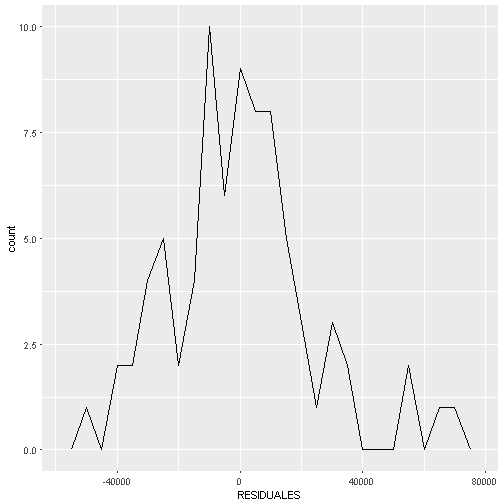


Regresión lineal simple
========================================================
class: small-code
Procedemos a analizar los residuos


```r
## Gráfico qq
mod_1a %>% 
  ggplot(., aes(qqnorm(.stdresid)[[1]], .stdresid)) + 
  geom_point(na.rm = TRUE) + 
  geom_abline() + 
  xlab("Theoretical Quantiles") + 
  ylab("Standardized Residuals") + 
  ggtitle("Normal Q-Q")
```

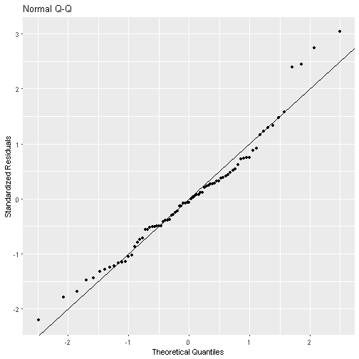


Regresión lineal simple
========================================================
class: small-code
**Análisis de los residuos: Prueba de Normalidad**   

$H_{0}$: Los residuos se ajustan a una distribución normal vs    
$H_{1}$: Los residuos NO se ajustan a una distribución normal


```r
# Si tuviésemos pocos datos
shapiro.test(data_venta_publicidad$RESIDUALES)
```

```

	Shapiro-Wilk normality test

data:  data_venta_publicidad$RESIDUALES
W = 0.96754, p-value = 0.04165
```

```r
# Test KS
ks.test(data_venta_publicidad$RESIDUALES, "pnorm")
```

```

	One-sample Kolmogorov-Smirnov test

data:  data_venta_publicidad$RESIDUALES
D = 0.51899, p-value = 2.22e-16
alternative hypothesis: two-sided
```


Regresión lineal simple
========================================================
class: small-code

Podemos utilizar los residuos studentizados, 


```r
data_venta_publicidad$STUDRESIDUAL <- studres(mod_1a) 
# Si tuviésemos pocos datos
shapiro.test(data_venta_publicidad$STUDRESIDUAL)
```

```

	Shapiro-Wilk normality test

data:  data_venta_publicidad$STUDRESIDUAL
W = 0.9618, p-value = 0.0184
```

```r
# Test KS
ks.test(data_venta_publicidad$STUDRESIDUAL, "pnorm")
```

```

	One-sample Kolmogorov-Smirnov test

data:  data_venta_publicidad$STUDRESIDUAL
D = 0.079754, p-value = 0.6665
alternative hypothesis: two-sided
```


Regresión lineal simple
========================================================
class: small-code
**Análisis de los residuos: Homocedasticidad**   

Exploramos gráficamente la varianza


```r
## Explorar la varianza
ggplot(data_venta_publicidad, aes(PUBLICIDAD_TOTAL, RESIDUALES)) + 
  geom_ref_line(h = 0) +
  geom_point() + 
  ggtitle("Residuos")
```

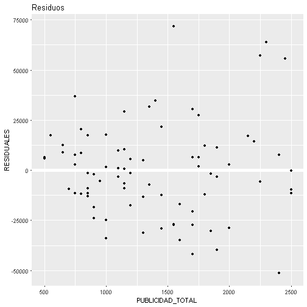


Regresión lineal simple
========================================================
class: small-code
**Análisis de los residuos: Homocedasticidad**   

$H_{0}$: La varianza es constante vs    
$H_{1}$:  La varianza no es constante


```r
## Prueba de homocedasticidad
bptest( mod_1a)
```

```

	studentized Breusch-Pagan test

data:  mod_1a
BP = 8.4837, df = 1, p-value = 0.003583
```


Regresión lineal simple
========================================================
class: small-code
**Análisis de los residuos: Autocorrelacion**   

En el gráfico de la función de autocorrelación no parece haber correlación


```r
## Grafico ACF
acf( residuals( mod_1a))
```

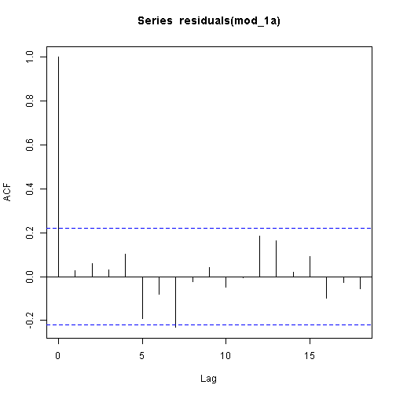


Regresión lineal simple
========================================================
class: small-code
**Análisis de los residuos: Autocorrelacion**   
Test de Durbin–Watson    

$H_{0}$: La autocorrelación de los residuos es 0 vs    
$H_{1}$: La autocorrelación de los residuos es diferente de  0


```r
## Test de Durbin–Watson    
dwtest( mod_1a, alternative = 'two.sided')
```

```

	Durbin-Watson test

data:  mod_1a
DW = 1.8759, p-value = 0.5962
alternative hypothesis: true autocorrelation is not 0
```


Regresión lineal simple
========================================================
class: small-code
La próxima semana se va a gastar 2000 en publicidad, estime cuánto se va a vender


```r
## Predecir con el primer modelo
predict(mod_1, newdata = data.frame(PUBLICIDAD_TOTAL= 2000))
```

```
       1 
194031.5 
```

```r
grid %>% filter(PUBLICIDAD_TOTAL== 2000)
```

```
# A tibble: 1 x 2
  PUBLICIDAD_TOTAL   PREDIC
             <dbl>    <dbl>
1             2000 192652.8
```

```r
## Predecir con el modelo transformado
predict(mod_1a, newdata = data.frame(PUBLICIDAD_TOTAL= 2000))
```

```
       1 
192652.8 
```

```r
grid %>% filter(PUBLICIDAD_TOTAL== 2000)
```

```
# A tibble: 1 x 2
  PUBLICIDAD_TOTAL   PREDIC
             <dbl>    <dbl>
1             2000 192652.8
```


Regresión lineal múltiple
========================================================

La idea de la regresión lineal es encontrar los valores de $\beta_{i}$ que minimice los errores en la recta   
$$y = \beta_{0} + \beta_{1} x_{1}  + \beta_{2} x_{2} + ...  + \beta_{n} x_{n} + \epsilon$$    

- `y` es continua
- $\epsilon$ son normalmente distribuidos
- $\epsilon$ no presentan autocorrelación
- $\epsilon$ deben ser homocedásticos (varianza constante)
- **No debe existir multicolinearidad**


Regresión lineal múltiple
========================================================

Realizar una regresión lineal múltiple


```r
## Regresion lineal multiple
mod_2 <- lm(VENTA ~ TV + RADIO + PERIODICO + REDES,
		data = data_venta_publicidad, x= TRUE)
```


Regresión lineal múltiple
========================================================
class: small-code
Realizar una regresión lineal múltiple


```r
## Regresion lineal multiple
summary(mod_2)
```

```

Call:
lm(formula = VENTA ~ TV + RADIO + PERIODICO + REDES, data = data_venta_publicidad, 
    x = TRUE)

Residuals:
   Min     1Q Median     3Q    Max 
-60526 -13890  -3079  12494  72214 

Coefficients:
            Estimate Std. Error t value Pr(>|t|)    
(Intercept) 54902.77    7111.82   7.720 4.38e-11 ***
TV             71.73      21.90   3.275 0.001611 ** 
RADIO         107.39      20.50   5.240 1.46e-06 ***
PERIODICO      26.53      16.47   1.611 0.111418    
REDES          60.74      15.31   3.969 0.000166 ***
---
Signif. codes:  0 '***' 0.001 '**' 0.01 '*' 0.05 '.' 0.1 ' ' 1

Residual standard error: 22800 on 74 degrees of freedom
Multiple R-squared:  0.7585,	Adjusted R-squared:  0.7455 
F-statistic: 58.11 on 4 and 74 DF,  p-value: < 2.2e-16
```


Regresión lineal múltiple
========================================================
class: small-code
Se utilizan las mismas pruebas que en regresion lineal simple, pero se debe agregar la de *Multicolinealidad*


```r
# Ver matriz de correlacion
data_venta_publicidad %>% select_if(is.numeric) %>% as.data.frame %>% ggscatmat
```


Regresión lineal múltiple
========================================================
class: small-code
Evaluar *Multicolinealidad*


```r
#  Raiz de VIF > 2
vif(mod_2) # variance inflation factors 
```

```
       TV     RADIO PERIODICO     REDES 
 2.859283  2.400952  1.555826  1.166888 
```

```r
sqrt(vif(mod_2)) > 2 
```

```
       TV     RADIO PERIODICO     REDES 
    FALSE     FALSE     FALSE     FALSE 
```


Regresión lineal múltiple
========================================================
class: small-code
Evaluar *Multicolinealidad*


```r
## Eigen valores pequeños de X'X
x <- mod_2$x
lambda <- eigen(t(x)%*%x)$values
lambda
```

```
[1] 4.875542e+07 2.934799e+06 1.434122e+06 6.779002e+05 1.027626e+01
```

```r
## Número de condición Kappa 
## (kappa < 100 => No multic)
## (kappa entre 100 y 1000 => multic moderada)
## (kappa > 1000 => multic severa)
kappa(mod_2)
```

```
[1] 1130.339
```


Escoger modelos
========================================================
class: small-code
Una de las formas de escoger un modelo es usando una anova

**Test anova**    
$H_{0}$: Ambos modelos tienen el mismo ajuste    
$H_{1}$: Los modelos NO tienen el mismo ajuste 


```r
## Anova (siempre colocar el modelo con más variables al inicio)
anova(mod_2, mod_1)
```

```
Analysis of Variance Table

Model 1: VENTA ~ TV + RADIO + PERIODICO + REDES
Model 2: VENTA ~ PUBLICIDAD_TOTAL
  Res.Df        RSS Df   Sum of Sq      F  Pr(>F)  
1     74 3.8462e+10                                
2     77 4.3327e+10 -3 -4865137322 3.1202 0.03103 *
---
Signif. codes:  0 '***' 0.001 '**' 0.01 '*' 0.05 '.' 0.1 ' ' 1
```


Regresión lineal múltiple - Selección de variables
========================================================

Se puede hacer la selección de variables en función del AIC


```r
# Procedemos a una selecci¶on autom¶atica de variables
modelo_completo <- lm(VENTA ~ PUBLICIDAD_TOTAL + TV + RADIO + PERIODICO + REDES,
		data = data_venta_publicidad, x= TRUE)
```


Regresión lineal múltiple - Selección de variables
========================================================
class: small-code
Se puede hacer la selección de variables en función del AIC


```r
# Procedemos a una seleccion automatica de variables
modelo_aic <- step(modelo_completo)
```

```
Start:  AIC=1590.28
VENTA ~ PUBLICIDAD_TOTAL + TV + RADIO + PERIODICO + REDES


Step:  AIC=1590.28
VENTA ~ PUBLICIDAD_TOTAL + TV + RADIO + PERIODICO

                   Df  Sum of Sq        RSS    AIC
- TV                1   66942660 3.8529e+10 1588.4
<none>                           3.8462e+10 1590.3
- PERIODICO         1 1628847998 4.0091e+10 1591.5
- RADIO             1 1907249609 4.0369e+10 1592.1
- PUBLICIDAD_TOTAL  1 8185666698 4.6647e+10 1603.5

Step:  AIC=1588.41
VENTA ~ PUBLICIDAD_TOTAL + RADIO + PERIODICO

                   Df  Sum of Sq        RSS    AIC
<none>                           3.8529e+10 1588.4
- RADIO             1 1.8899e+09 4.0419e+10 1590.2
- PERIODICO         1 1.9276e+09 4.0456e+10 1590.3
- PUBLICIDAD_TOTAL  1 2.0441e+10 5.8970e+10 1620.0
```


Regresión lineal múltiple - Selección de variables
========================================================
class: small-code
Se puede hacer la selección de variables en función del AIC


```r
summary(modelo_aic)
```

```

Call:
lm(formula = VENTA ~ PUBLICIDAD_TOTAL + RADIO + PERIODICO, data = data_venta_publicidad, 
    x = TRUE)

Residuals:
   Min     1Q Median     3Q    Max 
-61875 -13310  -3736  12773  71084 

Coefficients:
                 Estimate Std. Error t value Pr(>|t|)    
(Intercept)      55290.84    6988.19   7.912 1.75e-11 ***
PUBLICIDAD_TOTAL    64.80      10.27   6.308 1.78e-08 ***
RADIO               46.42      24.20   1.918   0.0589 .  
PERIODICO          -35.98      18.57  -1.937   0.0565 .  
---
Signif. codes:  0 '***' 0.001 '**' 0.01 '*' 0.05 '.' 0.1 ' ' 1

Residual standard error: 22670 on 75 degrees of freedom
Multiple R-squared:  0.7581,	Adjusted R-squared:  0.7484 
F-statistic: 78.34 on 3 and 75 DF,  p-value: < 2.2e-16
```


Regresión lineal múltiple - Selección de variables
========================================================
class: small-code
Funcion regsubsets


```r
mod_sel1 <- regsubsets(VENTA ~ PUBLICIDAD_TOTAL + TV + RADIO + PERIODICO + REDES,
		data = data_venta_publicidad)

summary(mod_sel1)
```

```
Subset selection object
Call: regsubsets.formula(VENTA ~ PUBLICIDAD_TOTAL + TV + RADIO + PERIODICO + 
    REDES, data = data_venta_publicidad)
5 Variables  (and intercept)
                 Forced in Forced out
PUBLICIDAD_TOTAL     FALSE      FALSE
TV                   FALSE      FALSE
RADIO                FALSE      FALSE
PERIODICO            FALSE      FALSE
REDES                FALSE      FALSE
1 subsets of each size up to 4
Selection Algorithm: exhaustive
         PUBLICIDAD_TOTAL TV  RADIO PERIODICO REDES
1  ( 1 ) "*"              " " " "   " "       " "  
2  ( 1 ) "*"              " " " "   "*"       " "  
3  ( 1 ) "*"              " " "*"   "*"       " "  
4  ( 1 ) "*"              "*" "*"   "*"       " "  
```


Regresión lineal múltiple - Selección de variables
========================================================
class: small-code
Funcion regsubsets


```r
mod_sel2 <- regsubsets(VENTA ~ PUBLICIDAD_TOTAL + TV + RADIO + PERIODICO + REDES,
		data = data_venta_publicidad, method = "forward")
summary(mod_sel2)
```

```
Subset selection object
Call: regsubsets.formula(VENTA ~ PUBLICIDAD_TOTAL + TV + RADIO + PERIODICO + 
    REDES, data = data_venta_publicidad, method = "forward")
5 Variables  (and intercept)
                 Forced in Forced out
PUBLICIDAD_TOTAL     FALSE      FALSE
TV                   FALSE      FALSE
RADIO                FALSE      FALSE
PERIODICO            FALSE      FALSE
REDES                FALSE      FALSE
1 subsets of each size up to 4
Selection Algorithm: forward
         PUBLICIDAD_TOTAL TV  RADIO PERIODICO REDES
1  ( 1 ) "*"              " " " "   " "       " "  
2  ( 1 ) "*"              " " " "   "*"       " "  
3  ( 1 ) "*"              " " "*"   "*"       " "  
4  ( 1 ) "*"              "*" "*"   "*"       " "  
```


Regresión lineal múltiple - Selección de variables
========================================================
class: small-code
Funcion regsubsets


```r
mod_sel3 <- regsubsets(VENTA ~ PUBLICIDAD_TOTAL + TV + RADIO + PERIODICO + REDES,
		data = data_venta_publicidad, nbest=3)
summary(mod_sel3)
```

```
Subset selection object
Call: regsubsets.formula(VENTA ~ PUBLICIDAD_TOTAL + TV + RADIO + PERIODICO + 
    REDES, data = data_venta_publicidad, nbest = 3)
5 Variables  (and intercept)
                 Forced in Forced out
PUBLICIDAD_TOTAL     FALSE      FALSE
TV                   FALSE      FALSE
RADIO                FALSE      FALSE
PERIODICO            FALSE      FALSE
REDES                FALSE      FALSE
3 subsets of each size up to 4
Selection Algorithm: exhaustive
         PUBLICIDAD_TOTAL TV  RADIO PERIODICO REDES
1  ( 1 ) "*"              " " " "   " "       " "  
1  ( 2 ) " "              "*" " "   " "       " "  
1  ( 3 ) " "              " " "*"   " "       " "  
2  ( 1 ) "*"              " " " "   "*"       " "  
2  ( 2 ) "*"              " " "*"   " "       " "  
2  ( 3 ) "*"              "*" " "   " "       " "  
3  ( 1 ) "*"              " " "*"   "*"       " "  
3  ( 2 ) "*"              " " " "   "*"       "*"  
3  ( 3 ) "*"              " " "*"   " "       "*"  
4  ( 1 ) "*"              "*" " "   "*"       "*"  
4  ( 2 ) "*"              "*" "*"   " "       "*"  
4  ( 3 ) "*"              "*" "*"   "*"       " "  
```


Regresión lineal múltiple - Selección de variables
========================================================
class: small-code
Funcion regsubsets retorna el mejor (o en nuestro ejemplo los dos mejores) según la cantidad de variables escogidas


```r
mod_sel3_summary <- summary(mod_sel3)
as.data.frame(mod_sel3_summary$outmat)
```

```
         PUBLICIDAD_TOTAL TV RADIO PERIODICO REDES
1  ( 1 )                *                         
1  ( 2 )                   *                      
1  ( 3 )                         *                
2  ( 1 )                *                  *      
2  ( 2 )                *        *                
2  ( 3 )                *  *                      
3  ( 1 )                *        *         *      
3  ( 2 )                *                  *     *
3  ( 3 )                *        *               *
4  ( 1 )                *  *               *     *
4  ( 2 )                *  *     *               *
4  ( 3 )                *  *     *         *      
```


Regresión lineal múltiple - Selección de variables
========================================================
class: small-code
Funcion regsubsets retorna el mejor (o en nuestro ejemplo los dos mejores) según la cantidad de variables escogidas


```r
cbind(mod_sel3_summary$which,
mod_sel3_summary$adjr2)
```

```
  (Intercept) PUBLICIDAD_TOTAL TV RADIO PERIODICO REDES          
1           1                1  0     0         0     0 0.7244274
1           1                0  1     0         0     0 0.6186374
1           1                0  0     1         0     0 0.6099620
2           1                1  0     0         1     0 0.7395426
2           1                1  0     1         0     0 0.7392995
2           1                1  1     0         0     0 0.7235323
3           1                1  0     1         1     0 0.7484106
3           1                1  0     0         1     1 0.7459522
3           1                1  0     1         0     1 0.7419711
4           1                1  1     0         1     1 0.7454538
4           1                1  1     1         0     1 0.7454538
4           1                1  1     1         1     0 0.7454538
```


Regresión lineal múltiple - Selección de variables
========================================================
class: small-code
Funcion regsubsets - Ver qué modelo ajusta mejor


```r
which.max(mod_sel3_summary$adjr2)
```

```
[1] 7
```

```r
mod_sel3_summary$which[which.max(mod_sel3_summary$adjr2), ]
```

```
     (Intercept) PUBLICIDAD_TOTAL               TV            RADIO 
            TRUE             TRUE            FALSE             TRUE 
       PERIODICO            REDES 
            TRUE            FALSE 
```


Regresión lineal múltiple - Selección de variables
========================================================
class: small-code
Funcion regsubsets - ver gráficamente cual modelo es mejor


```r
plot(mod_sel3, scale = "adjr2", main = "Adjusted R^2")
```

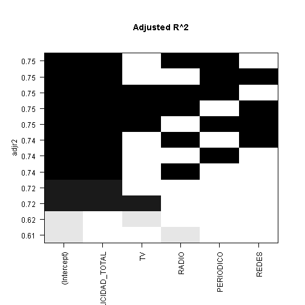


Regresión lineal múltiple - Selección de variables
========================================================
class: small-code
Funcion regsubsets

```r
coef(mod_sel3, 1:7)
```

```
[[1]]
     (Intercept) PUBLICIDAD_TOTAL 
     54810.31938         69.61057 

[[2]]
(Intercept)          TV 
 64284.8322    179.0512 

[[3]]
(Intercept)       RADIO 
 81773.2090    181.5774 

[[4]]
     (Intercept) PUBLICIDAD_TOTAL        PERIODICO 
     54139.20460         80.17822        -43.26333 

[[5]]
     (Intercept) PUBLICIDAD_TOTAL            RADIO 
     56063.40201         53.19882         55.99761 

[[6]]
     (Intercept) PUBLICIDAD_TOTAL               TV 
     53787.35931         60.97046         26.71031 

[[7]]
     (Intercept) PUBLICIDAD_TOTAL            RADIO        PERIODICO 
     55290.83881         64.79587         46.41600        -35.98115 
```

```r
vcov(mod_sel3, 7)
```

```
                  (Intercept) PUBLICIDAD_TOTAL       RADIO  PERIODICO
(Intercept)      48834789.395      -36058.7066 14530.22839 7408.22906
PUBLICIDAD_TOTAL   -36058.707         105.5148  -194.07984 -111.20597
RADIO               14530.228        -194.0798   585.63305   91.87961
PERIODICO            7408.229        -111.2060    91.87961  345.02885
```


Regresión lineal múltiple 
========================================================
class: small-code
Evaluando Multicolinearidad del modelo final (revise la correlación entre Publicidad total y venta)


```r
mod_4 <- lm(VENTA ~ PUBLICIDAD_TOTAL + RADIO + PERIODICO, 
            data = data_venta_publicidad, x = TRUE)
#  Raiz de VIF > 2
vif(mod_4) # variance inflation factors 
```

```
PUBLICIDAD_TOTAL            RADIO        PERIODICO 
        4.914427         3.386512         2.002409 
```

```r
sqrt(vif(mod_4)) > 2 
```

```
PUBLICIDAD_TOTAL            RADIO        PERIODICO 
            TRUE            FALSE            FALSE 
```


Regresión lineal múltiple
========================================================
class: small-code
Evaluar *Multicolinealidad*


```r
## Eigen valores pequeños de X'X
x <- mod_4$x
lambda <- eigen(t(x)%*%x)$values
lambda
```

```
[1] 2.018659e+08 1.613443e+06 7.519687e+05 1.051947e+01
```

```r
## Número de condición Kappa 
## (kappa < 100 => No multic)
## (kappa entre 100 y 1000 => multic moderada)
## (kappa > 1000 => multic severa)
kappa(mod_4)
```

```
[1] 3731.91
```


Regresión lineal múltiple
========================================================

Para resolver la Multicolinealidad hay diversos métodos, desde eliminar la variable que influye (si se tienen otras que explican bien) hasta crear nuevas variables utilizando componentes principales.


Regresión lineal múltiple - Con variables categóricas
========================================================
class: small-code
Vamos a incluir la variable que indica si la promoción usó un famoso o no


```r
data_venta_publicidad %>%
  ggplot(., aes(VENTA, PUBLICIDAD_TOTAL)) + 
  geom_point( aes(colour= USA_FAMOSO))
```

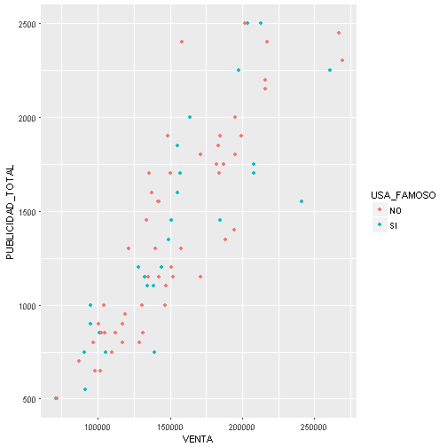


Regresión lineal múltiple - Con variables categóricas
========================================================
class: small-code
Vamos a incluir la variable que indica si la promoción usó un famoso o no

```r
data_venta_publicidad %>%
  dplyr::select( -SEMANAS) %>%  # Por un problema con select del MASS
  as.data.frame() %>%
  ggpairs(.) 
```

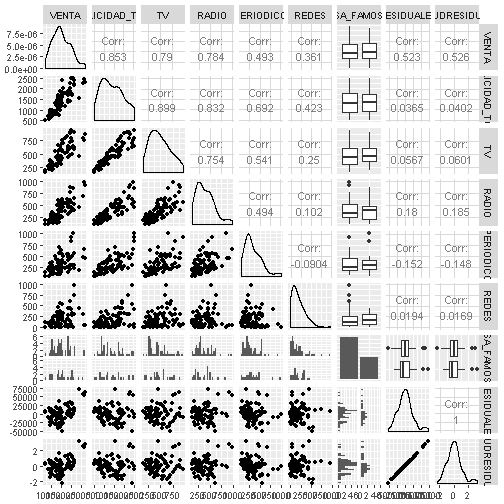


Regresión lineal múltiple - Con variables categóricas
========================================================
class: small-code


```r
## Modelo con sólo la variable Usa Famoso
mod_cat_1 <- lm(VENTA ~ USA_FAMOSO, data = data_venta_publicidad)
summary(mod_cat_1)
```

```

Call:
lm(formula = VENTA ~ USA_FAMOSO, data = data_venta_publicidad)

Residuals:
   Min     1Q Median     3Q    Max 
-81566 -33803  -5344  32596 117599 

Coefficients:
             Estimate Std. Error t value Pr(>|t|)    
(Intercept)    151866       6307  24.080   <2e-16 ***
USA_FAMOSOSI      523      10788   0.048    0.961    
---
Signif. codes:  0 '***' 0.001 '**' 0.01 '*' 0.05 '.' 0.1 ' ' 1

Residual standard error: 45480 on 77 degrees of freedom
Multiple R-squared:  3.052e-05,	Adjusted R-squared:  -0.01296 
F-statistic: 0.00235 on 1 and 77 DF,  p-value: 0.9615
```


Regresión lineal múltiple - Con variables categóricas
========================================================
class: small-code

```r
## Modelo estima los efectos independientemente
mod_cat_2 <- lm(VENTA ~ PUBLICIDAD_TOTAL + USA_FAMOSO, data = data_venta_publicidad)
summary(mod_cat_2)
```

```

Call:
lm(formula = VENTA ~ PUBLICIDAD_TOTAL + USA_FAMOSO, data = data_venta_publicidad)

Residuals:
   Min     1Q Median     3Q    Max 
-63650 -16519  -1733  12144  77891 

Coefficients:
                  Estimate Std. Error t value Pr(>|t|)    
(Intercept)      54611.596   7580.448   7.204 3.61e-10 ***
PUBLICIDAD_TOTAL    69.611      4.881  14.262  < 2e-16 ***
USA_FAMOSOSI       580.007   5663.335   0.102    0.919    
---
Signif. codes:  0 '***' 0.001 '**' 0.01 '*' 0.05 '.' 0.1 ' ' 1

Residual standard error: 23870 on 76 degrees of freedom
Multiple R-squared:  0.728,	Adjusted R-squared:  0.7208 
F-statistic: 101.7 on 2 and 76 DF,  p-value: < 2.2e-16
```


Regresión lineal múltiple - Con variables categóricas
========================================================
class: small-code

```r
## Modelo estima los efectos independientemente y además la interacción
mod_cat_3 <- lm(VENTA ~ PUBLICIDAD_TOTAL * USA_FAMOSO, data = data_venta_publicidad)
summary(mod_cat_3)
```

```

Call:
lm(formula = VENTA ~ PUBLICIDAD_TOTAL * USA_FAMOSO, data = data_venta_publicidad)

Residuals:
   Min     1Q Median     3Q    Max 
-62406 -17226   -778  12628  77554 

Coefficients:
                               Estimate Std. Error t value Pr(>|t|)    
(Intercept)                   56344.308   9203.734   6.122  3.9e-08 ***
PUBLICIDAD_TOTAL                 68.371      6.141  11.133  < 2e-16 ***
USA_FAMOSOSI                  -4219.565  15371.875  -0.274    0.784    
PUBLICIDAD_TOTAL:USA_FAMOSOSI     3.437     10.223   0.336    0.738    
---
Signif. codes:  0 '***' 0.001 '**' 0.01 '*' 0.05 '.' 0.1 ' ' 1

Residual standard error: 24020 on 75 degrees of freedom
Multiple R-squared:  0.7284,	Adjusted R-squared:  0.7175 
F-statistic: 67.05 on 3 and 75 DF,  p-value: < 2.2e-16
```


Regresión lineal múltiple - Con variables categóricas
========================================================
class: small-code
Entendiendo la Interacción


```r
## Grid para predicciones
grid <- data_venta_publicidad %>% 
  data_grid(PUBLICIDAD_TOTAL, USA_FAMOSO) %>% 
  gather_predictions(mod_cat_2, mod_cat_3)
grid
```

```
# A tibble: 128 x 4
       model PUBLICIDAD_TOTAL USA_FAMOSO      pred
       <chr>            <dbl>      <chr>     <dbl>
 1 mod_cat_2              500         NO  89417.06
 2 mod_cat_2              500         SI  89997.06
 3 mod_cat_2              550         NO  92897.60
 4 mod_cat_2              550         SI  93477.61
 5 mod_cat_2              650         NO  99858.70
 6 mod_cat_2              650         SI 100438.70
 7 mod_cat_2              700         NO 103339.24
 8 mod_cat_2              700         SI 103919.25
 9 mod_cat_2              750         NO 106819.79
10 mod_cat_2              750         SI 107399.79
# ... with 118 more rows
```


Regresión lineal múltiple - Con variables categóricas
========================================================
class: small-code
Entendiendo la Interacción - Notar que el sin interacción la inclinación de la recta es igual para si usa o no famoso, en el modelo *con interacción* no se cumple aquello.


```r
## Ver la diferencia entre un modelo sin interacción y con interacción
ggplot(data_venta_publicidad, aes(PUBLICIDAD_TOTAL, VENTA, colour = USA_FAMOSO)) + 
  geom_point() + 
  geom_line(data = grid, aes(y = pred)) + 
  facet_wrap(~ model)
```

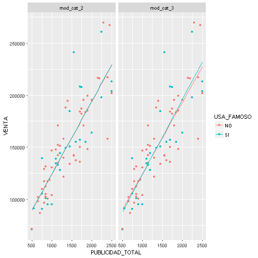


Regresión lineal múltiple - Con variables categóricas
========================================================
class: small-code
Entendiendo la Interacción.- El modelo con interacciones se interpreta así:

Cuando NO se usa el Famoso el modelo resultante es  
$$56344.308 + 68.371 * Publicidad$$

Cuando SÍ se usa el Famoso el modelo resultante es  
$$56344.308 + 68.371 * Publicidad - 4219.565 + 3.437 * Publicidad$$


Regresión logística
========================================================

En la regresión logística tenemos una variable binaria que debe ser explicada en función de otras, el resultado de la regresión logística se interpreta como una propensión

$$Z_{i} = ln{\left(P_{i} \over 1-P_{i} \right)} = \beta_{0} + \beta_{1} x_{1} + . . + \beta_{n} x_{n} $$   

Es decir, se puede calcular la probabilidad de un estado así   

$$P_{i} = 1 - {\left( 1 \over 1 + e^z_{i}\right)}$$


Regresión logística
========================================================

Se tiene los resultados de un estudio acerca de si un paciente sometido a cirugía con anestesia general experimentó dolor de garganta al despertar (0 = no, 1 = sí), la duración de la cirugía en minutos (D) y el tipo de dispositivo utilizado para asegurar la vía aérea (T) (0 = vía aérea con máscara laríngea, 1 = tubo traqueal)


Regresión logística
========================================================
class: small-code

```r
# Leer datos
datos <- read.xlsx(xlsxFile = 'Data/patientSurgeryWaking.xlsx')
datos$TIPO <- factor(datos$TIPO, levels = 0:1, labels = c('máscara laríngea', 'tubo traqueal'))
# Ver estructura del data.frame
str( datos)
```

```
'data.frame':	35 obs. of  4 variables:
 $ Patient: num  1 2 3 4 5 6 7 8 9 10 ...
 $ DUR    : num  45 15 40 83 90 25 35 65 95 35 ...
 $ TIPO   : Factor w/ 2 levels "máscara laríngea",..: 1 1 1 2 2 2 1 1 1 1 ...
 $ Y      : num  0 0 1 1 1 1 1 1 1 1 ...
```


Regresión logística
========================================================
class: small-code

```r
# Leer datos
summary( datos)
```

```
    Patient          DUR                       TIPO          Y         
 Min.   : 1.0   Min.   : 15.00   máscara laríngea:18   Min.   :0.0000  
 1st Qu.: 9.5   1st Qu.: 25.00   tubo traqueal   :17   1st Qu.:0.0000  
 Median :18.0   Median : 40.00                         Median :1.0000  
 Mean   :18.0   Mean   : 45.97                         Mean   :0.6286  
 3rd Qu.:26.5   3rd Qu.: 63.00                         3rd Qu.:1.0000  
 Max.   :35.0   Max.   :135.00                         Max.   :1.0000  
```


Regresión logística
========================================================
class: small-code
Se realizan gráficos que nos permita entender el comportamiento de las variables 


Regresión logística
========================================================

Gráficamente no se ve mayor peso de cirugías que reportan dolor en función del tipo de dispositivo utilizado, parece que la variable que mayor relación presenta es la duración de la cirugía, se procede a revisar los resultados como porcentajes


Regresión logística
========================================================
class: small-code
<small>Y se puede ver que a mayor duración mayor es el porcentaje de cirugías que reportan dolor, es más, alrededor de los 70 minutos en adelante todas las cirugías presentan dolor. </small>

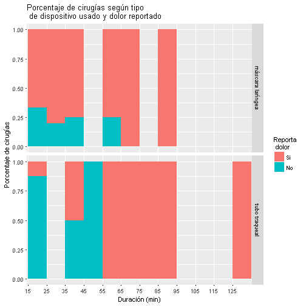


Regresión logística
========================================================
class: small-code

Se utiliza I(DUR-15) puesto que se recomienda que las variables numéricas empiecen en `0`


```r
# Hacer modelo de regresion logistica
m1 <- glm(Y ~ I(DUR-15) + TIPO, binomial, datos)
# Vemos el modelo
summary(m1)
```

```

Call:
glm(formula = Y ~ I(DUR - 15) + TIPO, family = binomial, data = datos)

Deviance Residuals: 
    Min       1Q   Median       3Q      Max  
-2.3802  -0.5358   0.3047   0.7308   1.7821  

Coefficients:
                  Estimate Std. Error z value Pr(>|z|)   
(Intercept)       -0.38717    0.79906  -0.485  0.62801   
I(DUR - 15)        0.06868    0.02641   2.600  0.00931 **
TIPOtubo traqueal -1.65895    0.92285  -1.798  0.07224 . 
---
Signif. codes:  0 '***' 0.001 '**' 0.01 '*' 0.05 '.' 0.1 ' ' 1

(Dispersion parameter for binomial family taken to be 1)

    Null deviance: 46.180  on 34  degrees of freedom
Residual deviance: 30.138  on 32  degrees of freedom
AIC: 36.138

Number of Fisher Scoring iterations: 5
```


Regresión logística
========================================================
class: small-code
Se construye un  modelo de regresión logistica donde se trata de explicar la probabilidad de reportar dolor de garganta en función de la duración de la cirugía en minutos y el tipo de dispositivo, esto es

$$log(\frac{p}{1-p})= \beta_{0} + \beta_{1} Duración + \beta_{2} TipoDispositivo$$    

El modelo resultante es:    

$$log(\frac{p}{1-p})= -0.38717 + 0.06868 * (Duración - 15) - 1.65895 * DispositivoTraqueal$$

Donde $p$ es la probabilidad de que se reporte dolor de garganta.
  
  
  
  


Regresión logística
========================================================

Al evaluar la significancia de la variable *DispositivoTraqueal* se obtiene un $p= 0.07224$ que nos indica que el $\beta_{2}= -1.65895$ correspondinete a la variable Tipo de Dispositivo no es estadísticamente significante a nivel de 0.05, sin embargo su valor p lo ubica relativamente cerca al valor de 0.05, por lo que se probará el modelo sin dicho parámetro


Regresión logística
========================================================
class: small-code
Con el comando drop1 revisamos si el AIC se ve afectado al eliminar una variable, en este caso el test nos dice que si quitamos la variable tipo el AIC no se ve casi afectado


```r
drop1(m1, test = 'LRT')
```

```
Single term deletions

Model:
Y ~ I(DUR - 15) + TIPO
            Df Deviance    AIC     LRT  Pr(>Chi)    
<none>           30.138 36.138                      
I(DUR - 15)  1   42.578 46.578 12.4396 0.0004203 ***
TIPO         1   33.651 37.651  3.5134 0.0608744 .  
---
Signif. codes:  0 '***' 0.001 '**' 0.01 '*' 0.05 '.' 0.1 ' ' 1
```


Regresión logística
========================================================
class: small-code
Actualizamos el modelo quitando TIPO


```r
m2 <- update(m1, .~.-TIPO)
summary(m2)
```

```

Call:
glm(formula = Y ~ I(DUR - 15), family = binomial, data = datos)

Deviance Residuals: 
    Min       1Q   Median       3Q      Max  
-2.0964  -0.7392   0.3020   0.8711   1.3753  

Coefficients:
            Estimate Std. Error z value Pr(>|z|)   
(Intercept) -1.15784    0.65820  -1.759  0.07856 . 
I(DUR - 15)  0.07038    0.02667   2.639  0.00831 **
---
Signif. codes:  0 '***' 0.001 '**' 0.01 '*' 0.05 '.' 0.1 ' ' 1

(Dispersion parameter for binomial family taken to be 1)

    Null deviance: 46.180  on 34  degrees of freedom
Residual deviance: 33.651  on 33  degrees of freedom
AIC: 37.651

Number of Fisher Scoring iterations: 5
```


Regresión logística
========================================================

El modelo resultante es:   

$$log(\frac{p}{1-p})= -1.15784 + 0.07038 * (Duración - 15)$$   

Según el modelo resultante, con una duración de 15 min la propensión de reportar dolor de garganta es $\epsilon^{-1.15784} =$ 0.3142, es decir que a con 15 minutos la propensión a reportar dolor de garganta es apenas el 31% de la probabilidad de no reportarlo, en particular a esta duración se tiene una probabilidad 0.239 de reportar dolor de garganta (siendo 0.761 la de no reportarlo).   


  
Regresión logística
========================================================
class: small-code
El modelo nos indica que a medida que se aumenta un minuto de duración de la cirugía la propensión de reportar dolor de garganta aumenta un $\epsilon^{0.07038}-1 =$  7.29%. 


```r
# Probabilidad
predict(m2, data.frame(DUR= 15), type = "response")
```

```
        1 
0.2390599 
```

```r
predict(m2, data.frame(DUR= 16), type = "response") 
```

```
        1 
0.2520973 
```

```r
# Propensión
predict(m2, data.frame(DUR= 15), type = "response")/(1-predict(m2, data.frame(DUR= 15), type = "response")) * 1.0729
```

```
        1 
0.3370665 
```

```r
predict(m2, data.frame(DUR= 16), type = "response")/(1-predict(m2, data.frame(DUR= 16), type = "response"))
```

```
        1 
0.3370724 
```


  
Final
========================================================


Existe una gran cantidad de técnicas para modelar, todos ellos pueden ser utilizados en R.  
- Modelos lineales generalizados
- Modelos aditivos generalizados
- Modelos lineales penalizados 
- Modelos lineales robustos
- Árboles de decision


Fin
========================================================
type: sub-section
